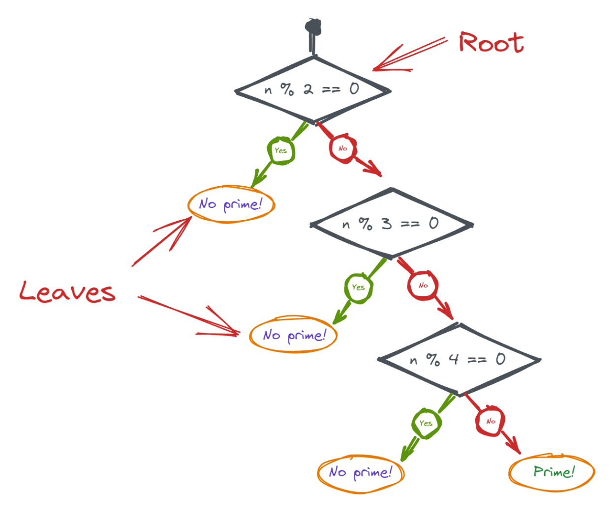
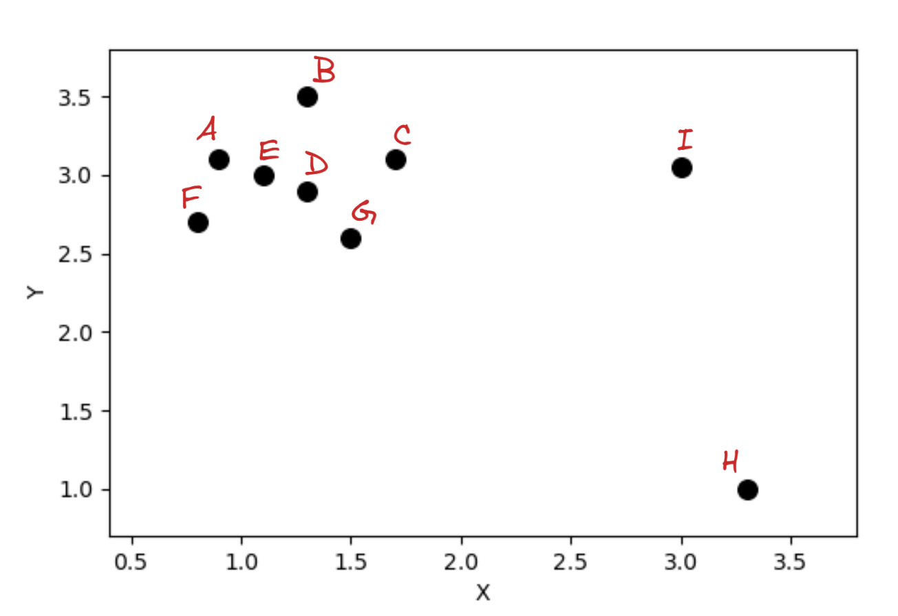
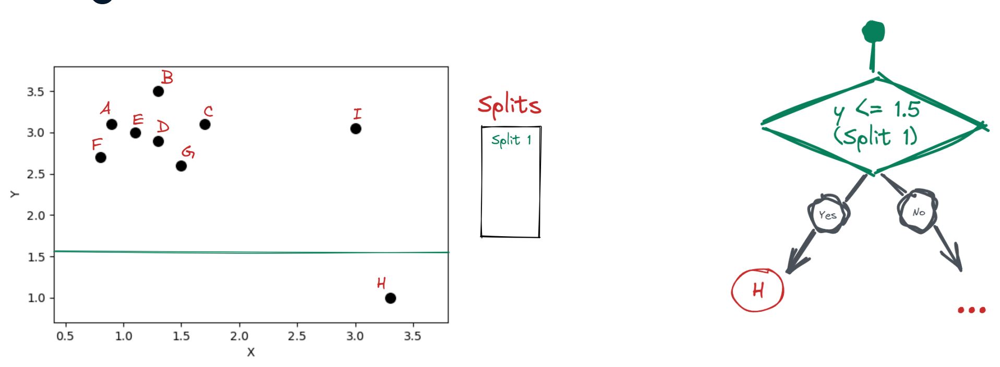
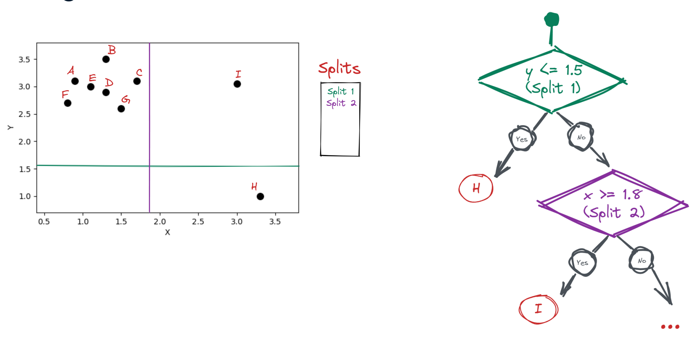
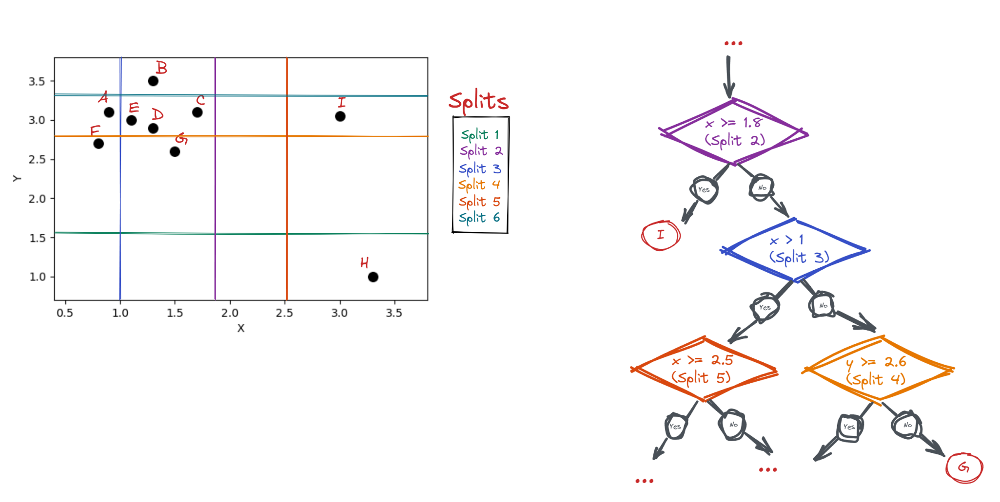

# Isolation Forest
Un **Isolation Forest** utiliza un conjunto de árboles de decisión llamados "árboles de aislamiento" para "aislar" las anomalías. Para entender cómo funcionan, veamos un árbol que comprueba si 5 es primo. En el nodo raíz preguntamos si cinco es divisible por dos. En caso afirmativo, no tenemos que verificar más. En caso negativo, seguimos haciendo preguntas de sí o no para los números inferiores a cinco. Los nodos en los que no se producen más ramificaciones o divisiones se denominan hojas. Este árbol de decisión tiene tres niveles o una profundidad de tres. Cada vez que ocurre una nueva división, se agrega un nuevo nivel de profundidad al árbol.

<figure style="align: center;">
    
    <figcaption>Árbol de decisión</figcaption>
</figure>

Los árboles de aislamiento, o iTrees, son versiones aleatorias de árboles de decisión. En lugar de hacer preguntas específicas, la división ocurre al azar. En otras palabras, para clasificar un punto de datos multidimensional en un valor interno o atípico, un iTree selecciona una característica aleatoria del punto de datos y selecciona una división aleatoria entre los valores mínimo y máximo de esa característica en cada nivel de profundidad. Dado que los valores atípicos dejan una gran "brecha" entre los valores internos, es más probable que la división aleatoria ocurra dentro de esa brecha, lo que resulta en el aislamiento de los valores atípicos al principio de la construcción del árbol.

Para ilustrar esto, veamos el ejemplo de la siguiente figura. Los puntos A a G son valores interiores, mientras que H e I son claramente valores atípicos.

<figure style="align: center;">
    
    <figcaption>Valores atípicos en 2D</figcaption>
</figure>

Ajustemos un único iTree a estos datos. En la primera división, seleccionamos aleatoriamente la característica y elegimos aleatoriamente un valor de división de 1 punto 5. Esta única división ya aísla a H como un valor atípico.

<figure style="align: center;">
    
    <figcaption>Isolation Tree</figcaption>
</figure>

Otra división aleatoria para x con un valor de 1 punto 8 aísla a I como otro valor atípico.

<figure style="align: center;">
    
    <figcaption>Isolation Tree</figcaption>
</figure>

Para aislar el resto, necesitamos más divisiones; aquí hay cuatro más, que separan los puntos A, B, F y G. Para separar C, D, E, necesitaríamos aún más divisiones.

<figure style="align: center;">
    
    <figcaption>Isolation Tree</figcaption>
</figure>

Por lo tanto, los puntos que requieren menos divisiones o que están cerca del nodo raíz se convertirán en valores atípicos. Un Isolation Forest utiliza una colección de dichos iTrees y promedia sus resultados. El número exacto de árboles lo determinaremos nosotros.

## Hiperparámetros de un Isolation Forest
A continuación veremos los hiperparámetros más importantes de un Isolation Forest: contamination, n_estimators, max_samples y max_features.

Después del entrenamiento, IForest genera puntuaciones de anomalías sin procesar para cada punto de datos. En esta etapa, no sabemos cuáles son valores internos o atípicos. Para realizar la clasificación, elegimos un umbral donde las puntuaciones de anomalías sin procesar se traducen en valores atípicos o atípicos. Este umbral se llama **contaminación**. Por ejemplo, una contaminación del 10 % significa que estamos eligiendo las observaciones con el 10 % superior de puntuaciones de anomalía como valores atípicos. Establecer la contaminación correcta es fundamental para confiar en las predicciones de un algoritmo de detección de valores atípicos multivariado. Una contaminación baja da como resultado anomalías no detectadas, mientras que una contaminación alta puede provocar que los valores internos se marquen como anomalías. La contaminación no es un parámetro especial de algoritmo IForest, siendo usado en otros modelos de detección de anomalías.

Cuando queremos especificar el número exacto de iTrees en IForest, usamos el parámetro **n_estimators**. El valor predeterminado es 100, que suele ser suficiente para conjuntos de datos pequeños. Usamos más árboles para conjuntos de datos de alta dimensión para tener suficiente poder predictivo para aprender todos los patrones relevantes en los datos.

Cada uno de estos árboles se entrena en una submuestra del conjunto de datos y una submuestra de características, controladas por los parámetros **max_samples** y **max_features**, que aceptan valores entre cero y uno. Por ejemplo, un IForest con 0.6 max_samples y 0.9 max_features entrena sus iTrees en el 60% de las filas y el 90% de las características del conjunto de datos. Para cada iTree, se seleccionará un 60% diferente de las filas y un 90% diferente de las características. Este submuestreo frecuente reduce el riesgo de sobreajuste.

## Rendimiento de un iForest
Los algoritmos de aprendizaje supervisado se basan en métricas como RMSE para comprobar si los hiperparámetros elegidos son efectivos. Los clasificadores de valores atípicos no pueden usar este tipo de métricas porque la detección de valores atípicos es un problema de aprendizaje no supervisado. No tenemos etiquetas de valores internos/atípicos de antemano para medir la efectividad de los clasificadores de valores atípicos. No existe una manera fácil de saber si una contaminación del 7% es mejor que una contaminación del 15% o si aumentar el número de estimadores a mejores resultados. La única forma de comprobar si el conjunto de hiperparámetros elegido es efectivo es combinando el clasificador de valores atípicos con un modelo de aprendizaje supervisado y midiendo el rendimiento final con métricas como RMSE, pérdida de registros o precisión. 