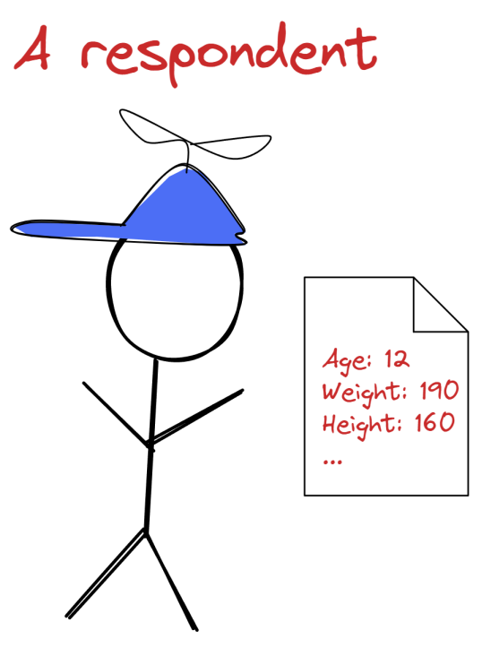

# Introducción
La detección de anomalías es un problema omnipresente en la ciencia de datos y el aprendizaje automático, ya que la mayoría de los conjuntos de datos del mundo real tienen anomalías. La detección de anomalías implica clasificar los datos en dos categorías: valores internos, o lo que consideramos puntos de datos normales, y valores atípicos, que son observaciones raras que difieren estadísticamente y parecen inconsistentes del resto de los datos.

Estadísticamente hablando, un valor atípico es un punto de datos que tiene características de diferencia anormales y estadísticamente significativas con respecto al resto de los datos. Hay que tener en cuenta que cualquiera que sea el método utilizado para encontrar valores atípicos, la determinación final de si un punto de datos es un valor atípico suele depender del observador.

La detección de anomalías tiene aplicaciones en muchas industrias:

- Seguridad informática: búsqueda de brechas y ataques de seguridad.
- Medicina: detección de tumores o células cancerosas.
- Finanzas y banca: detección de fraudes.

En es tipo de situaciones, se pueden utilizar técnicas de detección de anomalías para investigar si los valores extremos afectan negativamente los análisis y modelos estadísticos.

La media y la varianza son dos de las estadísticas resumidas más comunes, por lo que es importante apreciar cómo pueden verse afectadas por los valores atípicos. El siguiente ejemplo muestra una serie de 10 números, donde 1289 puede identificarse claramente como un valor atípico.

$$ 24, 46, 30, 28, 1289, 25, 21, 31, 48, 47 $$

Si calculamos la media y varianzas con y sin el valor atípico obtenemos los siguientes resultados:

Media (sin valor atípico) = 33.33

Varianza (sin valor atípico) = 114.5

Media = 158.9

Varianza = 157771.65

Los datos con el valor atípico mostrado tienen una media cinco veces mayor y una varianza casi 1400 veces mayor que los datos sin el valor atípico.

Las anomalías también pueden generar ruido en los datos de entrenamiento. Los modelos de aprendizaje automático pueden tratarlos como un subgrupo separado de los datos debido a su rareza y singularidad. Esto puede desviar la atención de los patrones reales de los datos, lo que puede perjudicar el rendimiento del modelo.

La detección de valores atípicos no debe confundirse con la detección de novedades. La detección de valores atípicos encuentra valores atípicos sólo en los datos de entrenamiento. Por el contrario, en la detección de novedades, queremos saber si las observaciones en el conjunto de prueba tienen la misma distribución que los datos con los que entrenamos. En otras palabras, las novedades sólo existen en el conjunto de prueba. Si bien tanto la detección de valores atípicos como la de novedades son parte de la detección de anomalías, en este apartado nos centraremos en la detección de valores atípicos.

En el siguiente [enlace](https://manoli-iborra.github.io/BigData/apuntes15.html) puedes acceder a técnicas de detección de valores atípicos mediante técnicas estadísticas. En este apartado trataremos distintos algoritmos de aprendizaje no supervisado para la detección de valores atípicos multivariados, que son más comunes en los datos del mundo real que los valores atípicos univariados.Definimos valores atípicos multivariados como puntos de datos con dos o más atributos, que cuando se examinan individualmente no son necesariamente anómalos, pero son diferentes del resto cuando se consideran todos sus atributos al mismo tiempo.

La siguiente figura muestra un ejemplo de valores atípicos multivariados.

<figure style="align: center;">
    
    <figcaption>Valor atípico multivariado</figcaption>
</figure>

Estamos analizando datos de atención médica recopilados de personas de 10 a 20 años y encontramos que un encuestado tiene 12 años, mide 160 cm de altura y pesa 190 libras. Cuando analizamos su edad, peso y altura individualmente, estos parecen estar dentro del rango de características humanas típicas. Sólo nos damos cuenta de que los niños de 12 años que miden 160 cm de altura no suelen pesar 190 libras cuando consideramos las tres características simultáneamente. Este niño de 12 años en particular es un caso atípico en múltiples variables.
