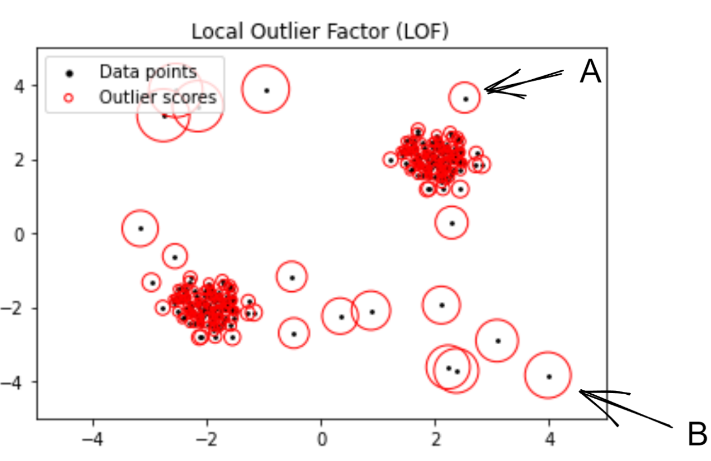
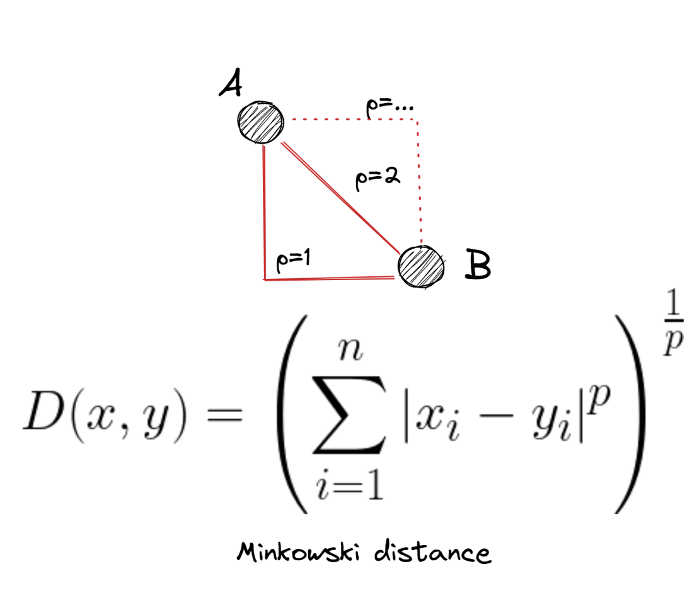

# Local Outlier Factor
El algoritmo valores atípicos locales (**Local Outlier Factor**, LOF) es un algoritmo popular basado en densidad. LOF funciona bien con conjuntos de datos de dimensiones moderadamente altas y es uno de los clasificadores de valores atípicos más rápidos.

LOF clasifica los puntos de datos en valores típicos y atípicos utilizando una puntuación de factor de valor atípico local. La puntuación LOF se basa en el concepto de densidad local, donde la localidad se define eligiendo k vecinos más cercanos. La densidad misma se calcula entre un punto de datos y sus distancias a sus vecinos elegidos. Los puntos de datos con densidades similares formarán un grupo, mientras que las muestras con densidades sustancialmente más bajas que su vecindario local se clasifican como valores atípicos.

El concepto local es muy importante. La puntuación LOF de una muestra no se compara con el resto del conjunto de datos, sino sólo con su vecindad local.

En la siguiente figura podemos ver un conjunto de datos normalizado bidimensional, con dos grupos de puntos de datos y una docena de valores atípicos. Los tamaños de los círculos representan cómo se comparan las muestras anómalas con su vecindario local. Cuanto mayor sea su puntuación LOF, más grandes serán los círculos. 

<figure style="align: center;">
    
    <figcaption>Local Outlier Factor</figcaption>
</figure>

El punto A es un valor atípico pero el tamaño del círculo no es grande. Esto se debe a que está mucho más cerca de su vecindad local en comparación con el punto B. El punto B está lejos y, por lo tanto, tiene mucha más desviación y menos densidad, lo que hace que su círculo sea más grande. Gracias a este enfoque local, LOF puede detectar valores atípicos que se habrían pasado por alto en otra área del conjunto de datos.

## Hiperparámetros de LOC
El hiperparámetro más importante de LOF es **n_neighbors**. Una buena práctica es elegir 20 vecinos siempre que el número de valores atípicos sea inferior al 10 % del número total de instancias (contaminación). Si hay más del 10%, n_vecinos debe aumentarse en consecuencia. 

Otro hiperparámetro importante es **p**, que determina cómo se calcula la distancia de una instancia respecto su vecindad. *p = 2* es el valor por defecto y corresponde a la distancia euclídea. *p = 1* correspondería a la distancia Manhattan. La **distancia Minkowski** permite generalizar *p* a otros valores, correspondiéndose la formúla a la que se muestra en la siguiente figura.

<figure style="align: center;">
    
    <figcaption>Distancia Minkowski</figcaption>
</figure>

## Rendimiento de LOF
LOF usa una puntuación de factor atípico local, que se calcula realizando cálculos adicionales en la métrica de distancia y usando conceptos como la distancia de accesibilidad local. Si bien las puntuaciones LOF alrededor de 1 generalmente denotan valores internos, no existe una regla clara sobre qué rango de valores representan valores atípicos. Estos valores dependen en gran medida del conjunto de datos.
