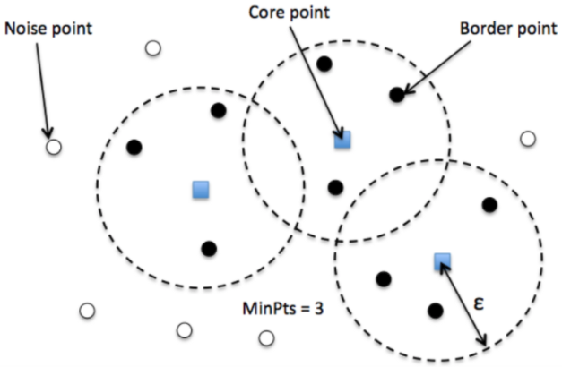
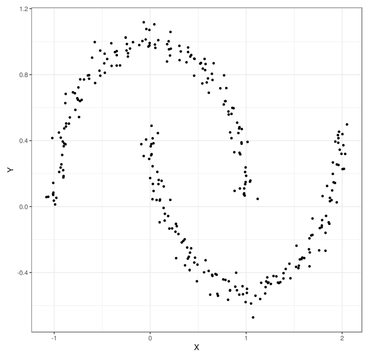
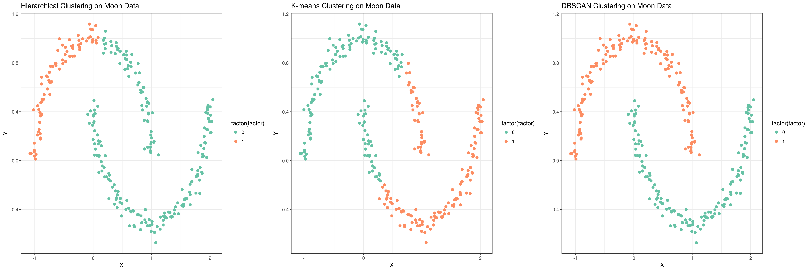

# Agrupamiento basado en regiones de alta densidad
El algoritmo **DBSCAN** (*Density-Based Spatial Clustering of Applications with Noise*) no hace suposiciones sobre clústeres esféricos como k-means, ni particiona el conjunto de datos en jerarquías. El clustering basado en dendidad asigna etiquetas de clústeres basadas en regiones densas de puntos. En DBSCAN, la noción de densidad se define como el número de puntos dentro de un radio determinado, $\epsilon$.

Según el algoritmo DBSCAN, se asigna una etiqueta especial a cada ejemplo (punto de datos) utilizando los siguientes criterios:

- Un punto se considera un punto central si al menos un número determinado (MinPts) de puntos vecinos se encuentra dentro del radio especificado, $\epsilon$.
- Un punto fronterizo es un punto que tiene menos vecinos que MinPts dentro de $\epsilon$, pero que se encuentra dentro del radio $\epsilon$ de un punto central.
- Todos los otros puntos que no son ni centrales ni fronterizos se consideran puntos de ruido.

La siguiente figura muestra los distintos tipos de puntos:

<figure style="align: center;">
    
    <figcaption>Puntos centrales, fronterizos y de ruido</figcaption>
</figure>

Tras etiquetar los puntos como centrales, de frontera o de ruido, el algoritmo DBSCAN puede resumirse en dos sencillos pasos:

1. Forma un clúster separado para cada punto central o grupo conectado de puntos centrales. (Los puntos centrales están conectados si no están más lejos que $\epsilon$.)
2. Asigna cada punto fronterizo al clúster de su correspondiente punto central.

## Comparativa entre algoritmos de clustering
Como se ha dicho anteriormente el algoritmo DBSCAN tiene un gran funcionamiento ante clústers que no presentan una forma esférica. Esto se refleja en el siguiente conjunto de datos que presenta una forma de media luna.

<figure style="align: center;">
    
    <figcaption>Conjunto de datos en forma de media luna</figcaption>
</figure>

La siguiente figura compara los clústeres encontrados en dicho conjunto de datos mediante los algoritmos de clustering jerárquico, k-means y DBSCAN. Como se puede observer el clúster encontrado por el algoritmo DBSCAN es más adecuado.

<figure style="align: center;">
    
    <figcaption>Clustering jerárquico, k-means y DBSCAN en conjunto de datos en forma de media luna</figcaption>
</figure>