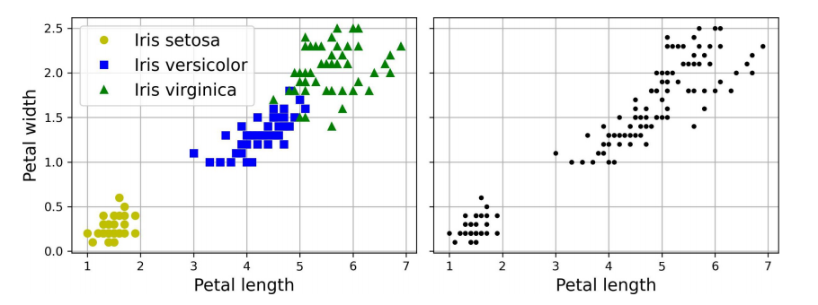

# Introducción
El *clustering* o agrupamiento es la tarea de identificar instancias similares y asignarlas a grupos de instancias similares.

Al igual que en la clasificación, cada instancia se asigna a un grupo. Sin embargo, a diferencia de la clasificación, el agrupamiento es una tarea no supervisado. 

La siguiente figura muestra a la izquierda el conjunto iri, donda la especie de cada instancia (es decir, su clase) se representa con un marcador diferente. Es un conjunto de datos etiquetado, para el que son adecuados algoritmos de clasificación como clasificadores de regresión logística, SVM o *random forest*. A la derecha, está el mismo conjunto de datos, pero sin las etiquetas, así que ya no puedes utilizar un algoritmo de clasificación. Aquí es donde entran en acción los algoritmos de agrupamiento: muchos de ellos pueden detectar con facilidad el grupo inferior izquierdo. También es bastante fácil verlo con nuestros propios ojos, pero no es tan obvio que el grupo superior derecho está compuesto por dos subgrupos distintos. Dicho esto, el conjunto de datos tiene dos características adicionales (longitud y anchura del sépalo) que no se representan aquí, y los algoritmos de agrupamiento pueden aprovechar bien todas las características, así que, en realidad, identifican los tres grupos bastante bien.

<figure style="align: center;">
    
    <figcaption>Clasificación (izquierda) frente a clustering (derecha)</figcaption>
</figure>