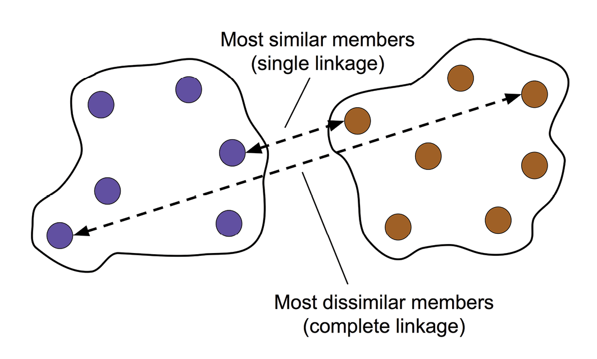
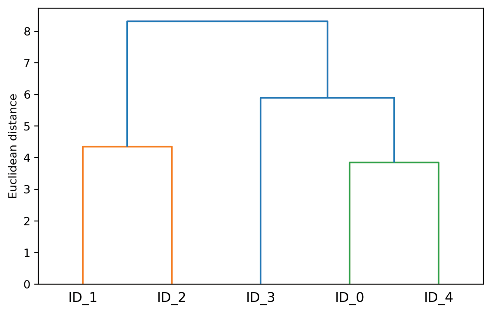

# Agrupamiento jerárquico
Una de las ventajas del algoritmo de **clustering jerárquico** es que nos permite representar **dendrogramas** (visualizaciones de un clustering jerárquico binario), que pueden ayudar a la interpretación de los resultados creando taxonomías coherentes. Otra ventaja es no necesitamos especificar el número de clústeres por adelantado.

Los dos enfoques principales del clustering jerárquico son el **aglomerativo** y el **divisivo**. En el clustering jerárquico divisivo, comenzamos con un clúster que abarca todo el conjunto de datos, y lo dividimos iterativamente en clústeres más pequeños, hasta que cada clúster solo contiene una instancia. Aquí nos centraremos en el clustering aglomerativo, que adopta el enfoque opuesto. Comenzamos con cada instancia en un clúster individual y fusionamos los pares de clústeres más cercanos hasta que solo queda un clúster.

## Agrupamiento jerárquico aglomerativo
Los dos algoritmos estándar del clustering jerárquico aglomerativo son el enlace **sencillo** y el enlace **completo**. En el caso del enlace sencillo, se calculan las distancias entre los miembros más similares de cada par de clústeres y se fusionan los dos clústeres cuya distancia entre los miembros más similares sea la menor. El enfoque de enlace completo es similar al del enlace sencillo, pero en lugar de comparar los miembros más similares de cada par de clústeres, comparamos los miembros más disímiles para realizar la fusión.

La siguiente figura muestra la diferencia entre ambos tipo de enlaces:

<figure style="align: center;">
    
    <figcaption>Enlace sencillo y completo</figcaption>
</figure>

Existen otros tipos de enlaces, como son el enlace **promedio** y el enlace de **Ward**. En el enlace promedio, se fusionan los pares de clústeres basándose en las distancias medias mínimas entre todos los miembros del grupo en los dos clústeres. En el enlace de Ward, se fusionan los dos clústeres que conducen al mínimo incremento de la inercia total en el clúster.

El algoritmo de clustering aglomerativo utilizando un enfoque de enlace completo tendría los siguientes pasos:

1. Cálculo de la matriz de distancias por pares de todos los ejemplos.
2. Representación de cada punto de datos como un clúster único.
3. Fusión de los dos clústeres más cercanos basándose en la distancia entre los miembros más disímiles (distantes).
4. Actualización de la matriz de enlace de los clústeres.
5. Repetición de los pasos 2-4 hasta que quede un solo clúster.

El dendrograma permite visualizar de forma gráfica este proceso de creación del clúster jerárquico.

<figure style="align: center;">
    
    <figcaption>Dendrograma</figcaption>
</figure>