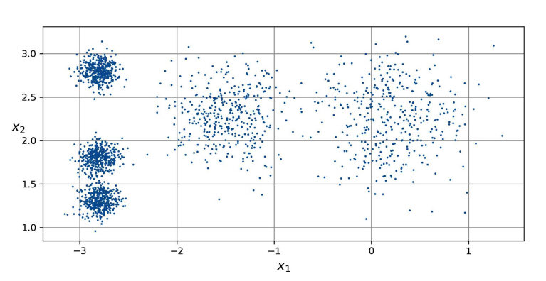
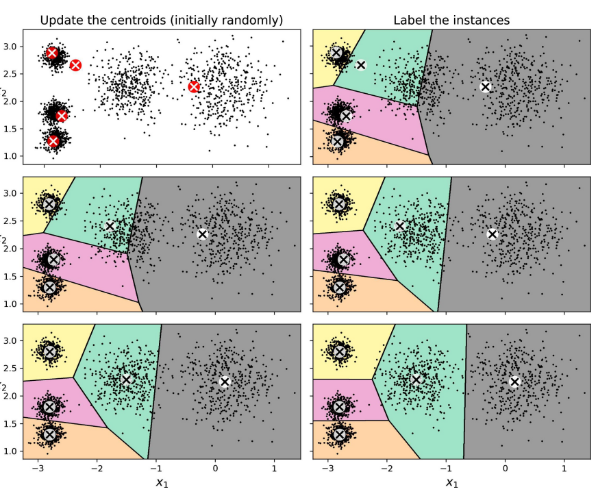
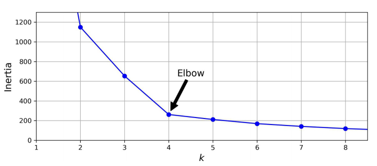
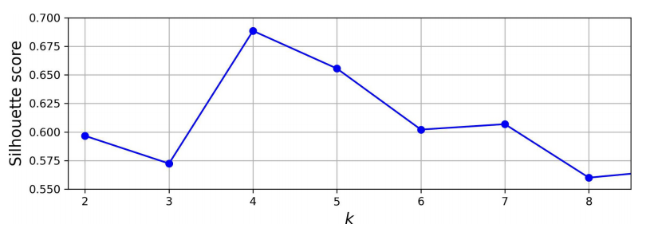
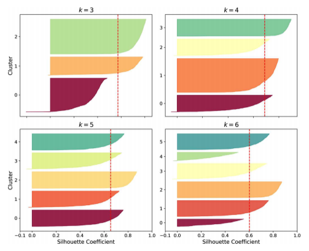

# Agrupamiento basado en prototipos

## Algoritmo k-means
En este apartado veremos uno de los algoritmos de clustering más populares, **k-means**. Este algoritmo permite encontrar grupos de objetos similares que están más relacionados entre sí que con los objetos de otros grupos.

El algoritmo k-means es extraordinariamente fácil de implementar, y también es computacionalmente muy eficiente en comparación con otros algoritmos de clustering. Este algoritmo pertenece a la categoría de clustering basada en prototipos.

El **clustering basado en prototipos** significa que cada cluster está representado bien por un prototipo que suele ser el **centroide** (media) de puntos similares. Aunque k-meas es muy bueno para identificar clústeres con forma esférica, uno de los inconvenientes de este algoritmo de agrupamiento es que tenemos que especificar el número de clústeres, *k*, a priori. Una elección inadecuada de *k* puede dar a un mal rendimiento del clustering.

La siguiente figura muestra la representación de un conjunto de ejemplos sin categorizar.

<figure style="align: center;">
    
    <figcaption>Conjunto de datos sin etiquetar</figcaption>
</figure>

El algoritmo de k-means funciona de la siguiente manera:

1. Elegir aleatoriamente *k* centroides de las instancias como centros de clústeres iniciales.
2. Asignar cada instancia al centroide más cercano.
3. Mover los centroides al centro de las instancias que le fueron asignados.
4. Repetir los pasos 2 y 3 hasta que las asignaciones de los clústeres no cambien o se alcance una tolerancia definida por el usuario o se llegue a un número máximo de iteraciones.

La siguiente figura muestra el funcionamiento del algoritmo.

<figure style="align: center;">
    
    <figcaption>Algoritmo k-means</figcaption>
</figure>

Existen variantes del algoritmo, como **k-means++**, la cual intenta situar los centroides iniciales lejos unos de otros. Esto conduce a resultados mejores y más consistentes que el clásico k-means.

Es importante notar que es muy conveniente realizar un escalado de características previo, para que todas estas se midan en la misma escala, normalizando o estandarizando las mismas.

## Número óptimo de clústeres
Uno de los principales retos del aprendizaje no supervisado es que no conocemos las etiquetas de clase reales en nuestro conjunto de datos. Por ello, no podemos utilizar métricas de rendimiento como las que utilizamos en el aprendizaje supervisado.

Para cuantificar la calidad del clustering, necesitamos utilizar métricas intrínsecas, como su **inercia**. La inercia es la suma de las distancias cuadráticas entre las instancias y sus centroides más próximos. A mayor inercia peor calidad tendrá el clúster.

Podemos utilizar una herramienta gráfica, el llamado **método del codo**, para estimar el número óptimo de clústeres, *k*, para una tarea determinada. Podemos decir que si *k* aumenta, la inercia disminuirá. La idea es identificar el valor de *k* en el que la reducción de la inercia comienza a reducir la velocidad de su disminución.

La siguiente figura muestra un ejemplo donde se determina que el codo toma un valor de *k=4*.

<figure style="align: center;">
    
    <figcaption>Detección del valor óptimo de k mediante la identificación del codo</figcaption>
</figure>

Existe otra métrica llamada **puntuación de silueta** que proporciona algo más de información que la inercia.

Por ejemplo la siguiente figura, muestra para el anterior ejemplo, que aunque el valor de *k=4* es óptimo, un valor *k=5* también daría un cluster de buena calidad.

<figure style="align: center;">
    
    <figcaption>Detección del valor óptimo de k mediante la identificación del codo</figcaption>
</figure>

Los **diagramas de silueta** visualizan el coeficiente de silueta de cada instancia, ordenado por el grupo al que se asigna y por el valor de coeficiente. Cada diagrama contiene una forma de cuchillo por grupo. La altura de la forma indica el número de instancias en el grupo y la anchura representa los coeficientes de silueta ordenados de las instancias en el grupo (cuanto más ancho, mejor). 

Las líneas discontínuas verticales representan la puntuación media de la silueta para cada número de grupos. Cuando la mayoría de las instancias de un grupo tienen un coeficiente más bajo que esta puntuación (es decir, si muchas de las instancias terminan antes de llegar a la línea discontínua y acaban a su izquierda), entonces el grupo es bastante malo, puesto que eso significa que sus instancias están demasiado cerca de otros grupos.

La siguiente figura muestra el diagrama de silueta del anterior ejemplo.

<figure style="align: center;">
    
    <figcaption>Diagramas de silueta para distintos valores de k</figcaption>
</figure>

En la anterior figura podemos ver que cuando *k=3* o 6, obtenemos grupos bastante malos, pero, cuando *k=4* o 5, los grupos están bastante bien: la mayoría de las instancias se extienden más allá de la línea discontinua, a la derecha y más cerca de 1.0. Cuando *k=4*, el grupo del índice 1 (el segundo empezando por abajo) es bastante grande. Cuando *k=5*, todos los grupos tienen tamaños similares. Por tanto, aunque la puntuación de la silueta global de *k=4* es un poco más grande que la de *k=5*, parece buena idea utilizar *k=5* para obtener grupos de tamaños similares.