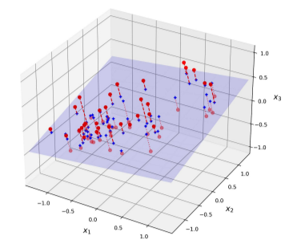
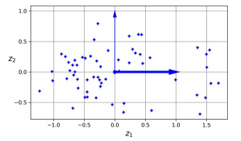
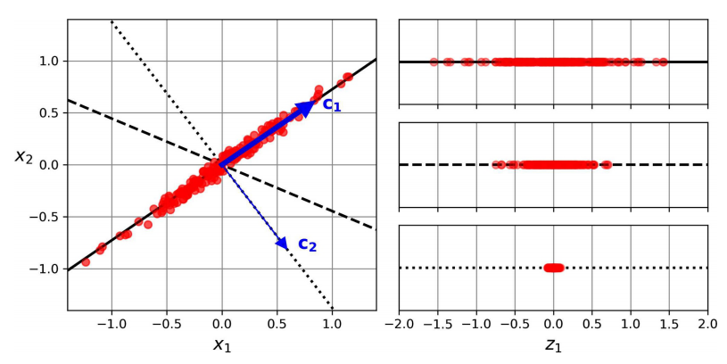

# Proyección
En la mayoría de problemas del mundo real, las instancias de entrenamiento no se extienden de manera uniforme a través de todas las dimensiones. Muchas características son casi constantes, mientras que otras están altamente correlacionadas. Como resultado, todas las instancias de entrenamiento quedan dentro (o cerca) de un subespacio con muchas menos dimensiones del espacio de alta dimensión.

La siguiente figura muestra un conjunto de datos 3D representado por esferas pequeñas.

<figure style="align: center;">
    
    <figcaption>Conjunto de datos 3D que queda cerca de un subespacio 2D</figcaption>
</figure>

En la anterior figura todas las instancias de entrenamiento quedan cerca de un plano: se trata de un espacio con menos dimensiones (2D) del espacio de dimensiones más altas (3D). Si proyectamos cada instancia de entrenamiento perpendicularmente en este subespacio (como representan las líneas discontinuas cortas que conectan las instancias al plano), obtenemos el nuevo conjunto de datos 2D que se muestra en la siguiente figura. Los ejes corresponden a nuevas características $ z_1 $ y $ z_2 $: son las coordenadas de las proyecciones en el plano.

<figure style="align: center;">
    
    <figcaption>Nuevo conjunto de datos 2D después de la proyección</figcaption>
</figure>

A la derecha está el resultado de la proyección del conjunto de datos en cada uno de estos ejes. Como puedes ver, la proyección en la línea contínua se preserva la varianza máxima (superior), mientras que la proyección en la línea de puntos preserva muy poca varianza (inferior) y la proyección en la línea discontinua preserva una cantidad intermedia de varianza (centro).

De esta manera se selecciona el eje que preserva la máxima cantidad de varianza, ya que lo más probable es que pierda menos información que las otras proyecciones. Otra manera de justificar esta elección es que se trata del eje que minimiza la distancia cuadrática media entre el conjunto de datos original y su proyección en ese eje.

## PCA
El análisis de componentes principales (*Principal Component Analysis*, PCA) es, con diferencia, el algoritmo de reducción de dimensionalidad más popular. En primer lugar, identifica el hiperplano que queda más cerca de los datos y, a continuación, proyecta en él los datos.

Antes de poder proyectar el conjunto de entrenamiento en un hiperplano con menos dimensiones, primero se tiene que elegir el hiperplano adecuado. Por ejemplo, en la parte izquierda de la siguiente figura se representa un conjunto de datos 2D simple, junto con tres ejes diferentes (es decir, hiperplanos 1D).

<figure style="align: center;">
    
    <figcaption>Nuevo conjunto de datos 2D después de la proyección</figcaption>
</figure>