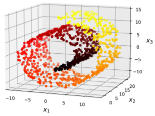
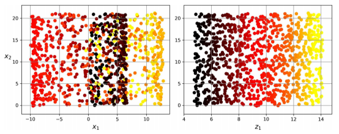
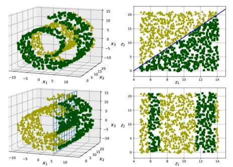

# Aprendizaje de variedades
La proyección no siempre es el mejor enfoque para la reducción de dimensionalidad. En muchos casos, el subespacio puede retorcerse, como en el conjunto de datos con la estructura *Swiss roll* (con forma de brazo de gitano) que se representa en la siguiente figura.

<figure style="align: center;">
    
    <figcaption>Conjunto de datos con la estructura Swiss roll</figcaption>
</figure>

Proyectar en un plano sin más (por ejemplo, eliminando $ x_3 $) apretujaría diferentes capas del brazo de gitano, como se muesetra en el lado izquierdo de la siguiente figura. Es probable que lo que más convenga en este caso sea desenrollar el brazo de gitano para obtener el conjunto 2D del lado derecho de la figura.

<figure style="align: center;">
    
    <figcaption>Conjunto de datos con la estructura Swiss roll</figcaption>
</figure>

La estructura *Swiss roll* es un ejemplo de variedad 2D. De manera simplificada, una variedad 2D es una forma 2D que puede doblarse y retorcerse en un espacio con más dimensiones. A nivel más general, una variedad de $ d $ dimensiones es una parte de un espacio de $ n $ dimensiones (donde $ d < n $) que se parece a un hiperplano de $ d $ dimensiones a nivel local.

Muchos algoritmos de reducción de dimensionalidad actúan modelando la variedad en la que quedan las instancias de entrenamiento; esto se denomina **aprendizaje de variedades**. En muchas ocasiones la mayoría de conjuntos de datos de alta dimensión del mundo real quedan cerca de una variedad con muchas menos dimensiones.

No siempre la tarea que tenemos que realizar (por ejemplo, clasificación o regresión) es más simple si se expresa en un espacio con menos dimensiones. Por ejemplo, en la fila superior de la siguiente figura, la estructura *Swiss roll* se divide en dos clases: en el espacio 3D (a la izquierda), el límite de decisión sería bastante complejo, pero en el espacio de variedades desenrollado 2D (a la derecha), el límite de decisión es una línea recta.

<figure style="align: center;">
    
    <figcaption>Conjunto de datos con la estructura Swiss roll</figcaption>
</figure>

En cambio en el ejemplo de la fila inferior, el límite de decisión se ubica en $ x_1 = 5 $ . Este límite de decisión parece muy simple en el espacio 3D original (un plano vertical), pero parece más complejo en la variedad desenrollada (una colección de cuatro segmentos independientes).

En resumen, reducir la dimensionalidad del conjunto de entrenamiento antes de entrenar el modelo suele acelerar el entrenamiento, pero puede que no siempre lleve a una solución mejor o más simple; todo depende del conjunto de datos.

