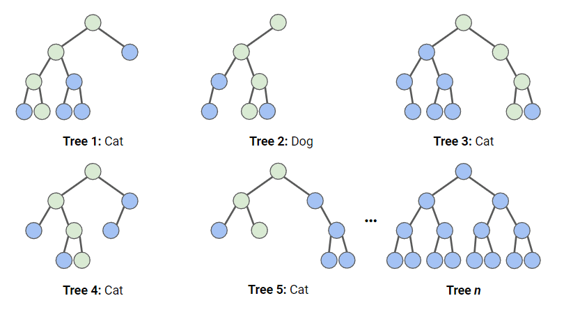
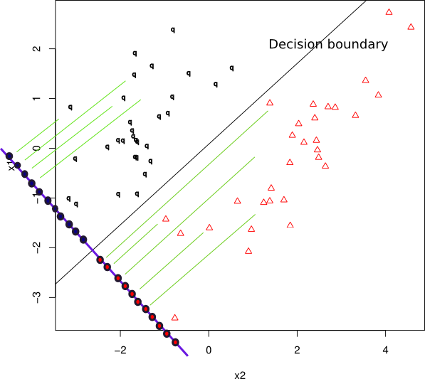
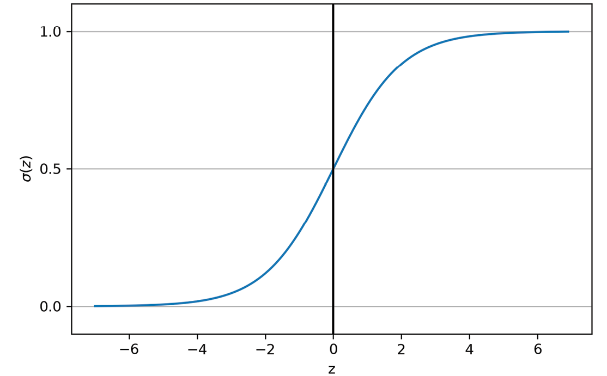

# Algoritmos de clasificación
Una tarea de **clasificación** se emplea para predecir una categoría, con un conjunto finito de valores posibles. En el caso de dos posibilidades se trata de **clasificación binaria**; y si se quiere predecir más de dos categorías, se trata de **clasificación multiclase**. 

La **frontera de decisión** (*decision boundary*) separa las diferentes clases predichas. Si un algoritmo clasificador aprende una frontera de decisión de tipo lineal, se dice que es un **clasificador lineal** (*lineal classifier*).

Las siguientes imágenes muestra un clasificador lineal frente a un no lineal para una tarea de clasificación binaria (2 clases), que utiliza 2 características. 

Existen clases en la que no es posible utilizar clasificadores lineales con éxito, ya que no son linealmente separables. La siguiente imagen ejemplifica esto:

En el caso del dataset Iris tenemos 3 categorías posibles, por lo que tendríamos un clasificador multiclase.

En los anteriores ejemplos se muestran clasificadores que utilizan 2 características, lo que permite representarlos en un plano (ancho por alto). En estos las fronteras de decisión de los clasificadores lineales se visualizan como líneas rectas. 
Esto se puede generalizar para clasificadores que utilicen más 2 características. Con 5 características, el espacio de valores de X es en 5 dimensiones. En este caso, la frontera de decisión sería un hiperplano en 4 dimensiones que separaría el espacio en 2 mitades.

La siguiente imagen muestra un clasificador binario con 3 características:

A continuación, se detallarán algunos algoritmos de clasificación.

## K vecinos más próximos
El algoritmo de **k vecinos más próximos** (*k-nearest neighbors*, **k-NN**), es un algoritmo supervisado basando en instancias, sin que sea necesario que haya una concordancia exacta con los datos del conjunto de entrenamiento, de forma que el algoritmo clasifica el nuevo elemento en el conjunto que le corresponde buscando en las observaciones más cercanas. Para ello, calcula las distancias a los elementos y las ordena de menor a mayor para asignar el grupo que tenga una frecuencia más alta con las distancias menores.

Este método es muy sensible al parámetro *k*, que indica el número de vecinos seleccionado y la métrica de distancia utilizada. El valor de *k* se fija tras realizar varias pruebas o mediante una validación cruzada. La siguiente imagen muestra cómo cambia la frontera de decisión conforme se cambia el parámetro *k*.

Como mayor inconveniente, este método necesita todo el conjunto de datos de entrenamiento para cada elemento nuevo a clasificar, por lo que requiere gran cantidad de memoria y consumo de procesamiento. Por este motivo, es recomendable para conjuntos pequeños.

## Árboles de decisión
Los **árboles de decisión** (*Decision Tree*, **DT**) son algoritmos para hacer clasificaciones realizando particiones sucesivas, mediante la técnica denominada **segmentación jerárquica**, agrupando observaciones similares. Analizan situaciones que presentan varias posibilidades de decisión y toman la que consideran mejor.

El método, cuando se encuentra ante una decisión, utiliza la información del conjunto de datos de entrenamiento para buscar una correlación entre el elemento nuevo y los conocidos y así poder elegir la opción correcta. 
Los árboles de decisión están formados por los siguientes componentes:

- **Nodos**: son las variables de entrada y plantean las opciones de decisión, siendo el primer elemento del árbol el nodo raíz.
- **Ramas**: indican los valores que pueden tomar las variables de entrada y unen los nodos entre sí.
- **Hojas**: muestran los valores de las variables de salida, es decir, el resultado de la decisión.

Algunos de los algoritmos de árboles de decisión más utilizados son los siguientes:

- El algoritmo de **árboles de clasificación y regresión** (**CART**) genera árboles de decisión binarios, por lo que cada nodo se divide en dos ramas.
  

- Los algoritmos **C5.0**, que es una evolución del **C4.5** que a su vez los es de **ID3**, forman una familia de algoritmos de los más utilizados en tareas de clasificación.
- El algoritmo de **bosque aleatorio** (*Random Forest*, **RF**) combina varios árboles con distinta cantidad *k* de características y la salida de cada uno de ellos proporciona un voto, siendo la opción más votada la elegida como la respuesta del modelo.
  

Este método no es apropiado para conjuntos de datos pequeños y requiere mucho tiempo durante la fase de entrenamiento.

## Algoritmo clasificador bayesiano ingenuo
El algoritmo clasificador **bayesiano ingenuo** (*Naïve Bayes*) es una técnica de clasificación probabilística que está fundamentada en el teorema de Bayes y está basada en la idea de que el mejor modelo es el más probable, asumiendo que la ocurrencia de una determinada característica es independiente de que sucedan las otras particularidades. Este es el motivo por el que se le llama ingenuo.

Solo requiere un pequeño conjunto de datos de entrenamiento para realizar la estimación de los parámetros necesarios: medias y varianzas.

Es un algoritmo simple y efectivo que se utiliza frecuentemente en la clasificación de texto.

## Análisis discriminante
El **análisis discriminante lineal** (*Lineal Discriminant Analysis*, **LDA**) calcula unas funciones lineales a partir de los atributos de su perfil, donde la función que alcanza mayor valor define el grupo al que pertenece el nuevo elemento de forma más probable. Cada elemento solamente puede pertenecer a un único grupo.

## Regresión logística
Asigna una probabilidad entre 0 y 1 de que una instancia pertenezca a una categoría. En el caso de una clasificación binaria una instancia se clasificaría a una categoría cuando esta probabilidad sea >= 0.5.

Se representa mediante una curva formada con forma de S, llamada función sigmoidea, que es una función matemática que se utiliza para asignar los valores predichos a las probabilidades.

## Máquinas de vector soporte
Las **máquinas de vector soporte** (*Support Vector Machines*, **SVM**) separan un grupo dado de datos de entrenamiento etiquetados binarios mediante un hiperplano que está a una distancia máxima de ellos (conocido como el **hiperplano de margen máximo**). De esta forma, elementos que son etiquetados con una categoría estarán a un lado del hiperplano y los casos que se encuentren en la otra categoría se situarán al otro lado. Al vector formado por los puntos más cercanos al hiperplano se le llama **vector de soporte**.

