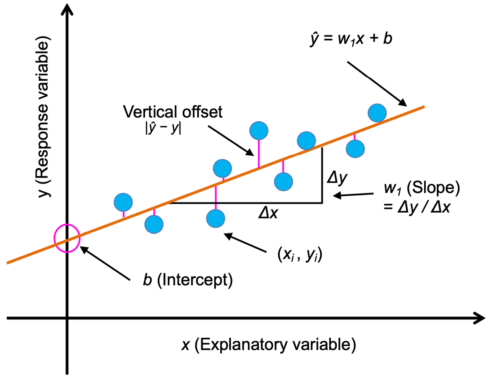
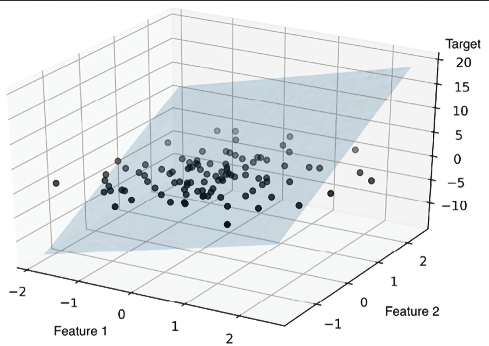
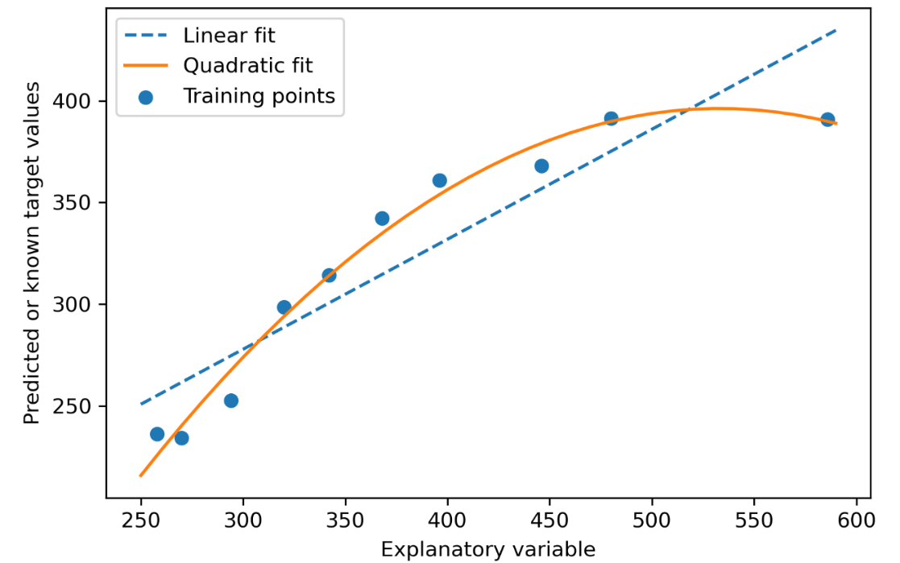

# Algoritmos de regresión
Los modelos de regresión se utilizan para pronosticar variables objetivo en una escala continua, lo que los hace atractivos para abordar muchas cuestiones de la ciencia. También tiene aplicaciones en la industria, como son la comprensión de las relaciones entre variables, la evaluación de tendencias o la realización de previsiones. Un ejemplo es el pronóstico de las ventas de una empresa en los meses futuros.

## Regresión lineal
La **regresión lineal simple** (univariante) es modelar la relación entre una única característica (variable explicativa, x) y un objetivo de valor continuo (variable de respuesta, y). La ecuación de un modelo lineal con una sola variable explicativa se define como sigue:
$$ y = w_1 x + b $$

, siendo $ b $, la intersección con el eje $ y $, y $ w_i $ el coeficiente de peso de la variable explicativa.

Basándonos en la ecuación lineal que hemos definido anteriormente, la regresión lineal puede entenderse como la búsqueda de la línea recta que mejor se ajusta a los ejemplos de entrenamiento.

Podemos generalizar el modelo de regresión lineal a múltiples variables explicativas, denominándose este proceso **regresión lineal múltiple**.
$$ y = w_1 x_1 + ... + w_m x_m + b $$

A continuación se muestra una imagen de una regresión lineal múltiple con 2 característica y 1 valor objetivo.

## Regresión polinómica
Se puede utilizar un modelo de **regresión polinómica** añadiendo términos polinómicos:
$$ y = w_1 x + w_2 x^2 + … + w_d x^d + b $$

A continuación se muestra una imagen de una regresión polinómica simple con 1 característica y 1 valor objetivo.

# Uso de algoritmos de clasificación en tareas de regresión
Los algoritmos vistos en el apartado de clasificación pueden utilizarse, con ligeras modificaciones, a algoritmos de regresión para la predicción de valores continuos, las **máquinas de vector de soporte aplicadas a la regresión** (**SVR**), el método de **vecinos más cercanos** (**k-NN**), **árboles de decisión** (**DTR**) y **bosques aleatorios** (**RFR**).

