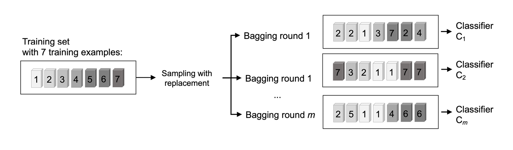
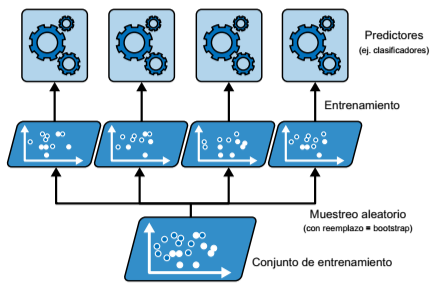
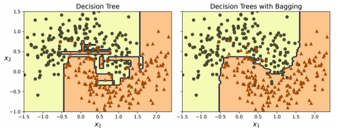

# *Bagging* y *Pasting*
Otro enfoque es utilizar el mismo algoritmo de entrenamiento para todos los predictores, pero entrenarlos en subconjuntos aleatorios distintos del conjunto de entrenamiento. Cuando se realiza un muestreo con reemplazo este método se llama ***bagging***. Cuando el muestreo se realiza sin reemplazo se denomina ***pasting***. Un ejemplo de muestreo con reemplazo es cuando se coge una carta al azar de una baraja, la anotas y vuelves a ponerla en la baraha antes de coger la siguiente, por lo que podría muestrearse la misma carta varias veces.

Dicho de otro modo, tanto el *bagging* como el *pasting* permiten entrenar instancias para que se muestreen varias veces a través de múltiples predictores, pero solo el *bagging* permite entrenar instancias para que se muestreen varias veces para el mismo predictor.

Como se puede observar en la siguiente imagen, todos los predictores pueden entrenarse en paralelo, mediante diferentes núcleos de CPU o, incluso, en diferentes servidores. De manera similar, pueden hacerse predicciones en paralelo.

Esta es una de las razones por lo que el *bagging* y el *pasting* son métodos tan populares: escalan muy bien.

Cada predictor individual tiene un sesgo más alto que si se entrenase con el conjunto de datos individual, pero la agregación reduce tanto el ses como la varianza. Por lo general, el resultado neto es que el ensamble tiene un sesgo similar, pero una varianza más baja que un solo predictor entrenado con el conjunto de datos original. La siguiente imagen ejemplifica este punto.

## *Random forests*
Un ***random forest*** es un ensamble de árboles de decisión, entrenado, por lo general, mediante el método *bagging*.

El algoritmo *random forest* introduce una aleatoriedad extra cuando hace crecer los árboles; en vez de buscar la mejor característica cuando divide un nodo, busca la mejor característica entre un subconjunto aleatorio de características. El algoritmo tiene como resultado una diversidad de árboles mayor, lo cual compensa un sesgo más alto por una varianza más baja, produciendo, habitualmente un modelo mejor a nivel general.

Asimismo, los *random forests* permiten medir la importancia relativa de cada característica. Se mide dicha importancia fijándose en cuánto reducen la impureza, de media, los nodos de árboles que utilizan esa característica, a través de todos los árboles del bosque.
