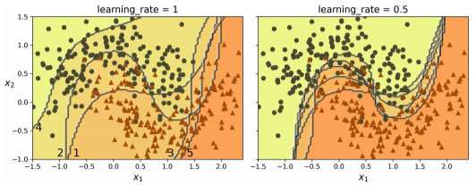
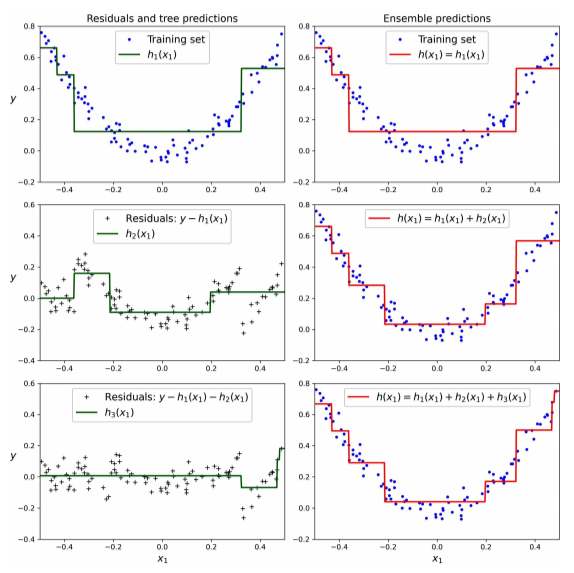

# *Boosting*
El ***boosting*** se refiere a cualquier método de ensamblaje que pueda combinar varios aprendices débiles para formar un aprendiz fuerte. La idea general de la mayoría de los métodos de *boosting* es entrenar predictores de manera secuencial, de forma que cada uno de ellos intente corregir a su predecesor.

Esta técnica de aprendizaje secuencial tiene un inconveniente importante: el entrenamiento no puede usarse en paralelo, puesto que cada predictor solo puede entrenarse después que el predictor anterior se haya entrenado y evaluado. Como resultado no escala tan bien como el *bagging* o el *pasting*.

Hay muchos métodos de *boosting* pero los más populares son, con diferencia, AdaBoost y *gradient boosting*.

## AdaBoost
Una manera de que un predictor nuevo corrija a su predecesor es prestar un poco más de atención a las instancias de entrenamiento que el predecesor subajusta. Esto da lugar a que los predictores nuevos se centren cada vez más en los casos difíciles.

El algoritmo de **AdaBoost** entrena primero un clasificador base (por ejemplo, un árbol de decisión) y lo utiliza para hacer predicciones en el conjunto de entrenamiento. Después, el algoritmo incrementa el peso relativo de las instancias de entrenamiento mal clasificadas. A continuación, entrena un segundo clasificador, utilizando los pesos actualizados y vuelve a hacer predicciones en el conjunto de entrenamiento, actualiza los pesos de las instancias, y así sucesivamente.

La siguiente imagen muestra los límites de decisión de cinco predictores consecutivos. El primer clasificador se equivoca con muchas instancias, así que sus pesos se potencian. Por tanto, el segundo clasificador hace un trabajo un poco mejor con esas instancias, y así sucesivamente. El gráfico de la derecha representa la misma secuencia de predictores, pero la tasa de aprendizaje está dividida por la mitad (es decir, los pesos de instancias que se han clasificado mal se potencian mucho menos en cada iteración).

Una vez que todos los predictores se han entrenado, el ensamble hace predicciones de manera muy similar al *bagging* o el *pasting*, salvo porque los predictores tienen diferentes pesos, dependiendo de su exactitud general en el conjunto de entrenamiento ponderado.

## *Gradient boosting*
Al igual que AdaBoost, ***gradient boosting*** funciona añadiendo predictores a un ensamble de manera secuencial, de modo que cada uno de ellos corrige a su predecesor. Sin embargo, en vez de ajustar la instancia en cada iteración, como hace AdaBoost, este método intenta ajustar el nuevo predictor a los errores residuales cometidos por el predictor anterior.

La siguiente figura muestra un ejemplo que utiliza árboles de decisión como predictores básicos. Las predicciones de estos tres árboles se muestran en la columna izquierda y la predicción del ensamble en la derecha. En la primera fila, el ensamble tiene solo un árbol, así que las predicciones son exactamente las mismas que las del primer árbol. En la segunda fila se entrena un árbol nuevo con los errores residuales del primero. A la derecha se muestra que las predicciones del ensamble son iguales a la suma de las predicciones de los dos primeros árboles. Del mismo modo, en la tercera fila, se entrena un árbol con los errores residuales del segundo árbol. Se puede observar que las predicciones del ensamble mejoran gradualmente a medida que añadimos árboles.

La siguiente figura muestra dos ensambles entrenados con hiperparámetros diferentes: el de la izquierda no tiene suficientes árboles para ajustar el conjunto de entrenamiento, mientras que el de la derecha tiene la cantidad adecuada. Si añadiésemos más árboles, el ensamble empezaría a sobreajustar el conjunto de entrenamiento.

