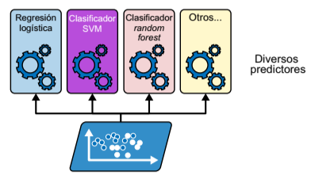
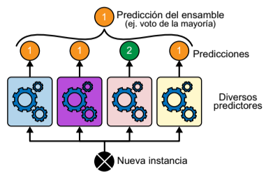

# Métodos por votación
Supongamos que hemos entrenado varios clasificadores y cada uno ha conseguido una exactitud de alrededor del 80%. Podríamos tener un clasificador de regresión logística, un clasificador SVM, un clasificador *random forest*, un clasificador de *k* vecinos más cercanos y quizás algunos más.

Una manera muy sencilla de crear un clasificador aún mejor es sumar las predicciones de los clasificadores: la clase que obtiene más votos es la predicción del ensamble. Este clasificador por voto de la mayoría se llama clasificador ***hard voting***.

De manera un tanto sorprendente, este clasificador de votación consigue, a menudo, una exactitud mayor que el mejor clasificador del ensamble. De hecho, incluso aunque un clasificador sea un aprendiz débil (lo que significa que el resultado es solo un poco mejor que una suposición aleatoria), el ensamble puede ser un aprendiz fuerte (consiguiendo una exactitud elevada), siempre y cuando haya un número suficiente de aprendices débiles en el ensamble y estos sean lo bastante diversos.

Los métodos de ensamblaje funcionan mejor cuando los predictores son tan independientes unos respecto a otros como sea posible. Una manera de conseguir clasificadores diversos es entrenarlos utilizando algoritmos muy distintos. Eso incrementa las posibilidades de que cometan tipos de errores muy diferentes, lo que mejora la exactitud del ensamble.

Si todos los clasificadores son capaces de estimar las probabilidades de clase, se puede establecer que se prediga la clase con la probabilidad de clase más alta, promediada sobre todos los clasificadores individuales. Esto se denomina ***soft voting***. A menudo, consigue un rendimiento más alto que el *hard voting* porque da más peso a los votos que son más seguros.

Todo esto se puede aplicar de manera análoga a problemas de regresión. Para ello el ensamble utilizará el promedio obtenido por cada uno de los predictores, para calcular el valor final de la regresión.