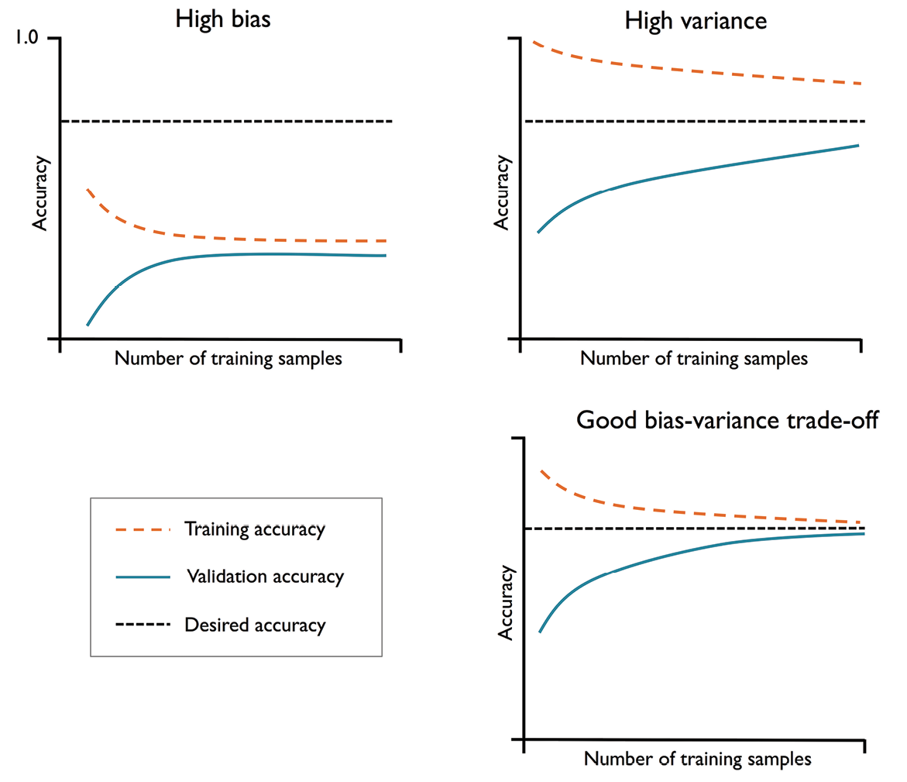

# Curvas de aprendizaje y validación
Las curvas de aprendizaje y de validación son dos herramientas de diagnóstico muy sencillas pero potentes, que pueden ayudarnos a mejorar el rendimiento de los algoritmos de aprendizaje.

Las **curvas de aprendizaje** nos ayudarán a diagnosticar si un algoritmo de aprendizaje tiene un problema de sobreajuste. En estos casos se dice también que el algoritmo presenta una alta **varianza** (*variance*). También nos permitirá detectar casos de subajuste, donde se dice que el algoritmo presenta un alto **sesgo** (*bias*).

Las **curvas de validación** nos ayudarán a resolver problemas habituales de los algoritmos de aprendizaje.

## Diagnóstico de problemas de sesgo y varianza con curvas de aprendizaje
Si un modelo es demasiado complejo para un conjunto de datos de entrenamiento determinado (por ejemplo un árbol de decisión muy profundo), el modelo tiende a sobreajustarse a los datos de entrenamiento y no generaliza bien los datos no vistos. A menudo, puede ser útil recoger más ejemplos de entrenamiento para reducir el grado de sobreajuste.

Sin embargo, en la práctica, esto puede ser muy caro o, simplemente, puede no ser factible recoger más datos. Al representar las precisiones de entrenamiento y validación del modelo en función del tamaño del conjunto de datos de entrenamiento, podemos detectar fácilmente si el modelo sufre una alta varianza o un alto sesgo, y si la recogida de más datos podría ayudar a resolver este problema.

La anterior figura muestra en la parte superior izquierda un modelo con un alto sesgo. Este modelo tiene una exactitud baja tanto en el entrenamiento como en la validación cruzada, lo que indica que no se ajusta a los datos de entrenamiento. Las formas habituales de abordar este problema son aumentar el número de carácteristicas del modelo (por ejemplo, recopilando o construyendo características adicionales) o disminuir el grado de regularización (mediante el ajuste de un hiperparámetro).

En la parte superior derecha de la figura se muestra un modelo que sufre una alta varianza, lo que se indica por la gran diferencia entre la exactitud de entrenamiento y la de validación cruzada. Para solucionar este problema de sobreajuste, podemos recoger más datos de entrenamiento, reducir la complejidad del modelo o aumentar el grado regularización. Para los modelos no regularizados puede ser útil reducir el número de características.

# Diagnístico de problemas de sesgo y varianza con curvas de validación
Las curvas de validación son una herramienta útil para mejorar el rendimiento de un modelo al abordar cuestiones sobre el sobreajuste o el subajuste. Están relacionadas con las curvas de aprendizaje, pero en lugar de representar las exactitudes de entrenamiento y prueba en función del tamaño de la muestra, variamos los valores de los hiperparámetros del modelo.