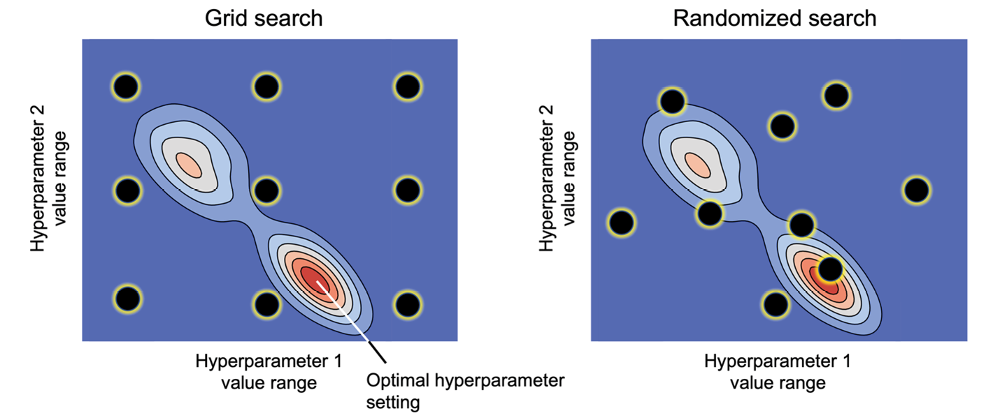

# Búsqueda en la red
La búsqueda en red, al igual que las curvas de validación, permiten mejorar el rendimiento del modelo ajustando sus hiperparámetros.

Estudiaremos dos métodos de búsqueda en red: el método de búsqueda en cuadrícula y el de búsqueda aleatoria.

El enfoque de **búsqueda en cuadrícula** se trata de un paradigma de búsqueda exhaustiva por fuerza bruta, en el que especificamos una lista de valores para diferentes hiperparámetros, y el ordenador evalúa el rendimiento del modelo para cada combinación para obtener la combinación óptima de valores de este conjunto.

Dado que la búsqueda en cuadrícula es una búsqueda exhaustiva, garantiza que encontrará la configuración óptima de hiperparámetros si está contenida en la cuadrícula de parámetros especificada por el usuario. Sin embargo, la especificación de grandes cuadrículas de hiperparámetros hace que la búsqueda en cuadrícula, en la práctica, sea muy costosa. Un enfoque alternativo para el muestreo de diferentes combinaciones de parámetros es la búsqueda aleatoria.

En la **búsqueda aleatoria**, extraemos al azar configuraciones de hiperparámetros de distribuciones. A diferencia de la búsqueda en cuadrícula, la búsqueda aleatoria no realiza una búsqueda exhaustiva en el espacio de hiperparámetros. Sin embargo, nos permite explorar una gama más amplia de configuraciones de valores de hiperparámetros de una manera más eficaz en cuanto a costes y tiempo.

La siguiente figura muestra una cuadrícula determinada de nueve ajustes de hiperparámetros que se buscan mediante los métodos de búsqueda en cuadrícula y búsqueda aleatoria.

