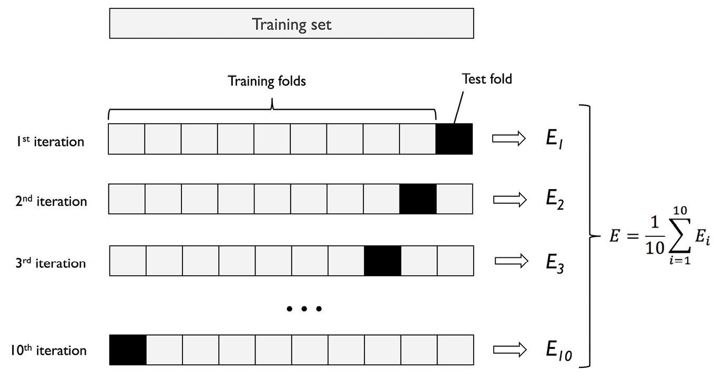

# Validación cruzada con k grupos
Una desventaja del método de retención es que la estimación del rendimiento puede ser muy sensible a la forma en que dividimos el conjunto de datos de entrenamiento en subconjuntos de entrenamiento y de validación; la estimación variará para diferentes ejemplos de los datos. 

En la **validación cruzada con k grupos** *k-fold cross validation* dividimos aleatoriamente el conjunto de datos de entrenamiento en *k* grupos sin sustitución. En este caso, se utilizan *k -1* grupos, llamados **grupos de entrenamiento**, para el entrenamiento del modelo, y un grupo, llamado **grupo de prueba**, para la evaluación del rendimiento. Este procedimiento se repite *k* veces, de modo que se obtienen *k* modelos y estimaciones de rendimiento.

A continuación, calculamos el rendimiento medio de los modelos basándonos en las diferentes iteraciones de prueba independientes para obtener una estimación del rendimiento que sea menos sensible a la subpartición de los datos de entrenamiento en comparación con el método de retención. Normalmente, utilizamos la validación cruzada para el ajuste del modelo, es decir, para encontrar los valores óptims de los hiperparámetros que producen un rendimiento de generalización satisfactorio.

Una vez que hayamos encontrado valores satisfactorios de los hiperparámetros, podemos volver a entrenar el modelo con el conjunto de datos de entrenamiento completo y obtener una estimación final del rendimiento utilizando el conjunto de datos de prueba independiente. La razón para ajustar un modelo a todo el conjunto de datos de entrenamiento después de la validación cruzada es que, en primer lugar, normalmente estamos interesados en un único modelo final, al que tras proporcionarle más ejemplos de entrenamiento, tendrá como resultado un modelo más preciso y robusto.

## Validación cruzada dejando uno fuera
Un caso especial de validación cruzada de k grupos es el método de **validación cruzada dejando uno fuera** (*Leave One Out Cross Validation*, LOOCV).

En LOOCV se hace que el número de iteraciones sea igual al número de ejemplos de entrenamiento (*k = n*), para que solo se utilice un ejemplo de entrenamiento para las pruebas durante cada iteración. Es un enfoque recomendado para trabajar con conjunto de datos muy pequeños.

## Validación cruzada estratificada
En la **validación cruzada estratificada**, las proporciones de las etiquetas de clase se conservan en cada subconjunto para garantizar que cada subconjunto sea representativo de las proporciones de clase en el conjunto de entrenamiento. Este enfoque puede producir mejores estimaciones, especialmente en casos de proporciones de clase desiguales.
