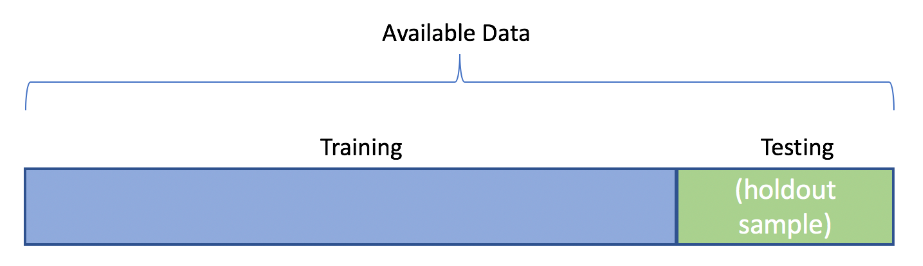
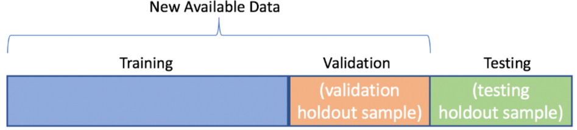

# Método de retención
Un enfoque clásico y muy utilizado para estimar el rendimiento de generalización de los modelos de aprendizaje automático es el **método de retención**. En este método dividimos nuestro conjunto de datos inicial en **conjunto de datos de entrenamiento y de prueba** separados: el primero se utiliza para el entrenamiento del modelo y el segundo se utiliza para estimar su rendimiento de generalización.

Sin embargo, en las aplicaciones típicas de aprendizaje automático, también nos interesa ajustar y comparar diferentes configuraciones de parámetros para mejorar aún más el rendimiento a la hora de realizar pronósticos sobre datos no vistos. Este proceso se denomina **selección del modelo**, y hace referencia a un problema de clasificación determinado para el que queremos seleccionar los valores óptimos de los parámetros de ajuste, también llamados **hiperparámetros**.

Por desgracia, si reutilizamos el mismo conjunto de datos de prueba una y otra vez durante la selección del modelo, se convertirá en parte de nuestros datos de entrenamiento y, por tanto, será más probable que el modelo se sobreajuste. A pesar de este problema, mucha gente sigue utilizando el conjunto de datos de prueba para la selección del modelo, pero no es una buena práctica de aprendizaje automático.

Una forma más conveniente de utilizar el método de retención para la selección del modelo es separar los datos en tres partes: un conjunto de datos de entrenamiento, un **conjunto de datos de validación** y un conjunto de datos de prueba. El conjunto de datos de entrenamiento se utiliza para ajustar los diferentes modelos, y el rendimiento del conjunto de datos de validación se utiliza para la selección del modelo. 

La ventaja de contar con un conjunto de datos de prueba que el modelo no ha visto antes durante los pasos de entrenamiento y selección del modelo es que podemos obtener una estimación menos sesgada de su capacidad de generalización a los nuevos datos.