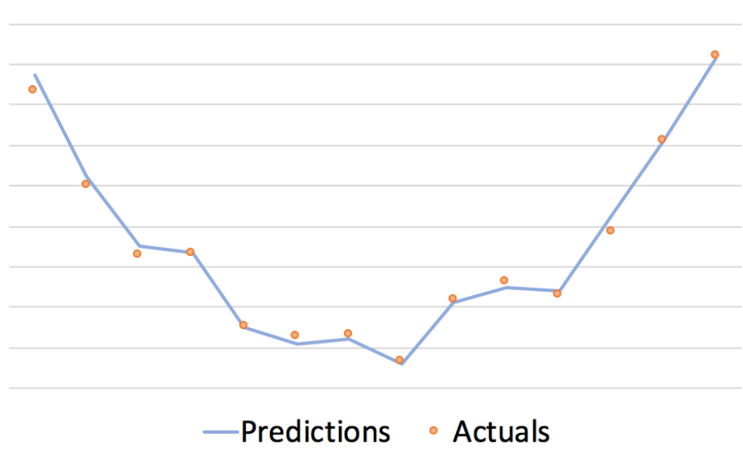
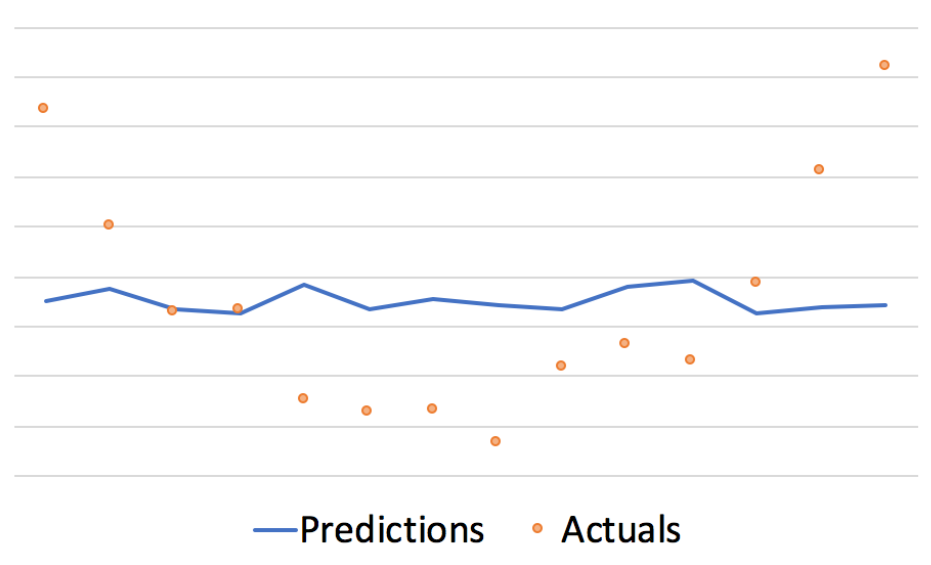

# Introducción
La **validación de un modelo** consta de varios pasos y procesos que garantizan que un modelo funciona como se espera cuando recibe nuevos datos. La forma más común de hacer esto es probar la precisión de un modelo en datos que nunca antes había visto (llamado **conjunto de prueba**). Si la precisión del modelo es similar para los datos con los que se entrenó y para los datos de prueba, se puede afirmar que el modelo está validado. Sin embargo, la validación del modelo también puede consistir en elegir el modelo correcto, los mejores parámetros e incluso la mejor **métrica** de precisión. El objetivo final de la validación de modelos es obtener el modelo con el mejor rendimiento posible, que logre una alta precisión en los datos nuevos. 

## Sobreajuste
Normalmente, los modelos funcionan mucho mejor con datos que han visto antes, ya que los datos no vistos pueden tener rasgos o características que no fueron expuestas en el modelo. Si los errores de entrenamiento y prueba son muy diferentes, puede ser una señal de que el modelo está **sobreajustado** (*overfitting*). Usaremos la validación del modelo para asegurarnos de obtener el mejor error de prueba posible.

El sobreajuste ocurre cuando nuestro modelo comienza a darle significado al ruido en los datos de entrenamiento. En el siguiente gráfico, se puede ver la forma cuadrática natural de los puntos naranjas. Sin embargo, la línea de predicción azul se ajusta demasiado a los datos y probablemente no se extendería bien a nuevos puntos naranjas. 

## Subajuste
Si, por el contrario, obtenemos unos errores altos, tanto de entrenamiento como de prueba, puede ser que estemos ante un caso en el que el modelo no ha conseguido encontrar los patrones de relación entre los datos. En este caso nuestro modelo estaría **subajustado** (*underfitting*).

El subajuste ocurre cuando el modelo no pudo encontrar los patrones subyacentes disponibles en los datos. Esto podría suceder si no tenemos nuestro modelo subyacente no tiene la suficiente complejidad. La siguiente imagen muestra un ejemplo de modelo subajustado para el conjunto de datos anterior.

