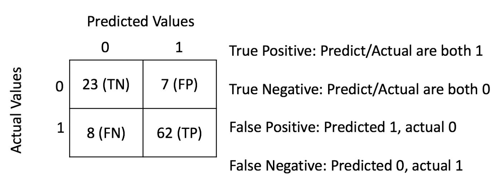
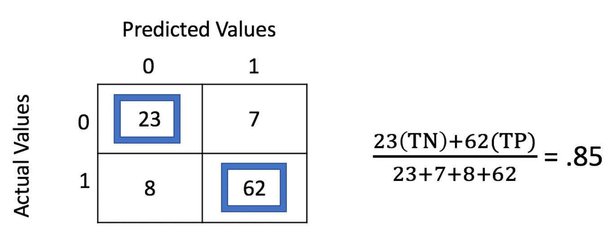
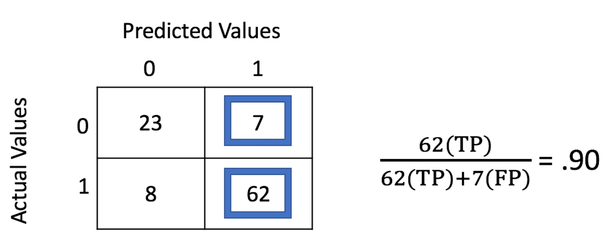
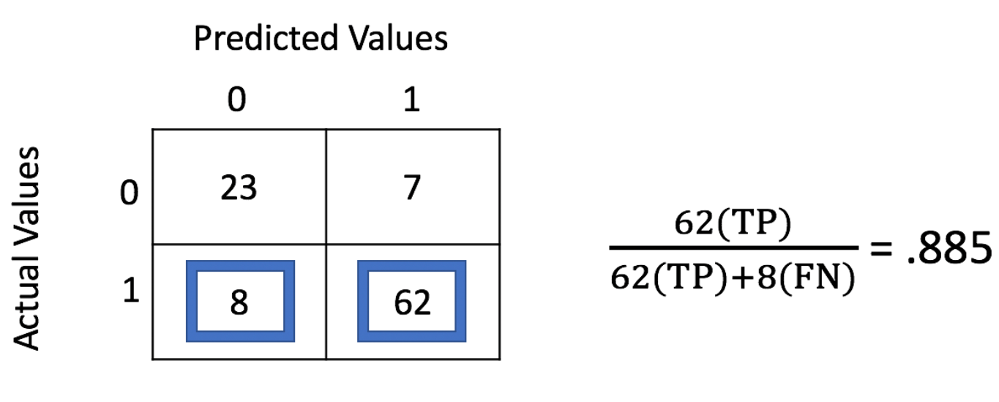

# Métricas para modelos de clasificación
Las métricas de precisión de la clasificación son bastante diferentes a las de regresión. Como se ha comentado anteriormente, los modelos de clasificación predicen en qué categoría cae una observación. Hay muchas métricas de precisión disponibles: precisión, sensibilidad, exactitud, puntuación F1, etc.

Nos centraremos en la precisión, la recuperación y la exactitud. Ya que cada uno de estos es fácil de entender y tiene aplicaciones muy prácticas. Una forma de calcular estas métricas es utilizar los valores de una matriz de confusión.

## Matriz de confusión
Al hacer predicciones, especialmente si la clasificación es binaria, la **matriz de confusión** (*confusion matrix*) es uno de los resultados más útiles a revisar en primera instancia. Cuando tenemos un resultado binario, la matriz de confusión es una matriz de 2x2 que muestra cómo se ajustaron las predicciones en los dos resultados. Por ejemplo, para predicciones de 0 que en realidad fueron 0 (o verdaderos negativos), observamos la posición [0, 0] de la matriz. Todas las métricas de precisión mencionados anterioremente se pueden calcular utilizando los valores de esta matriz y es una excelente manera de visualizar los resultados iniciales de un modelo de clasificación.

La siguiente imagen muestra un ejemplo de una matriz de confusión para una clasificación binaria.

## Exactitud
La **exactitud** (*accuracy*) es la métrica más fácil de entender y representa la capacidad general de un modelo para predecir correctamente la clasificación correcta. Usando la matriz de confusión, se suman los valores que se predijeron como 0 y que en realidad son 0 (verdaderos negativos), a los valores que se predice que son 1 y que son 1 (verdaderos positivos), y luego dividimos por el número total de observaciones. En el ejemplo anterior, la exactitud es del 85%.

## Precisión
La **precisión** (*precision*) es el número de verdaderos positivos entre todos los valores positivos predichos. En el ejemplo anterior se predijeron correctamente 62 valores verdaderos pero también se predijo 7 falsos positivos. Por tanto, la precisión es 62 dividido por 69. La precisión se utiliza cuando no queremos sobrepredecir valores positivos. Si el coste de traer en avión a nuevos empleados potenciales es muy elevado, es posible que una empresa solo tenga entrevistas con personas que realmente creen que se unirán a su empresa. En los datos del ejemplo, casi 9 de cada 10 predichos se habrían unido a la empresa.

## Sensibilidad
La **sensibilidad** (*recall*) consiste en encontrar todos los valores positivos. En el anterior ejemplo se predijo correctamente 62 verdaderos positivos y se tuvo 8 falsos negativos. La sensibilidad es de 62 entre 70. La sensibilidad se utiliza cuando no podemos darnos el lujo de perder ningún valor positivo. Por ejemplo, incluso si un paciente tiene una pequeña probabilidad de tener cáncer, es posible que queramos realizarle pruebas adicionales. El coste de pasar por alto a un paciente que tiene cáncer es mucho mayor que el costo de exámenes de detección adicionales para ese paciente.

