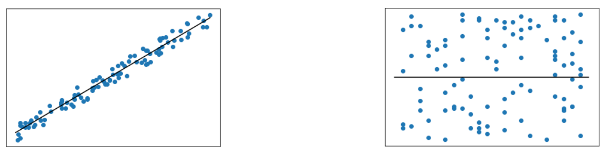

# Métricas para modelos de regresión
Los modelos de regresión se construyen para variables continuas. 

## Error absoluto medio (MAE)
Para evaluar el desempeño de un modelo de regresión, podemos utilizar el **error absoluto medio** (*Mean Absolute Error*, MAE). Es la métrica de error más simple e intuitiva y es la diferencia absoluta promedio entre las predicciones $ y_i $ y los valores reales $ \hat{y_i} $. 

$$ MAE = {\sum_{i=1}^n \lvert y_i - \hat{y}_i \rvert \over n} $$

Si un perro tuviera seis cachorros, pero hubieras predicho solo cuatro, la diferencia absoluta sería dos. Esta métrica trata todos los puntos por igual y no es sensible a los valores atípicos. Cuando se trata de aplicaciones en las que no queremos que los errores grandes tengan un impacto importante, se puede utilizar el error absoluto medio. Un ejemplo podría ser predecir la factura mensual de gasolina de un automóvil, cuando un valor atípico puede haber sido causado por un único viaje por carretera.

## Error cuadrático medio (MSE)
El siguiente es el **error cuadrático medio** (*Mean Squared Error*, MSE). Es la métrica de error de regresión más utilizada para modelos de regresión. Se calcula de manera similar al error absoluto medio, pero esta vez elevamos al cuadrado el término de diferencia. 

$$ MSE = {\sum_{i=1}^n (y_i - \hat{y}_i)^2 \over n} $$

El MSE permite que errores mayores tengan un mayor impacto en el modelo. Utilizando el ejemplo anterior del automóvil, si se supiera que una vez al año puede realizar un viaje por carretera, se puedea esperar tener de vez en cuando un error grande y se desee que el modelo se recupere de esos viajes.

También se suele utilizar la **raíz cuadrada del error cuadrático medio**, (*Root Mean Squared Error*, RMSE).

$$ RMSE = \sqrt{MSE} $$

## R cuadrado
**R cuadrado** (*R-squared*) es una métrica que cuantifica la cantidad de varianza en la variable objetivo que se explica por las características. Los valores pueden variar entre 0 y 1, donde uno significa que las características explican completamente la variación del objetivo. A continuación hay dos gráficos que visualizan el R cuadrado alto y bajo respectivamente:

