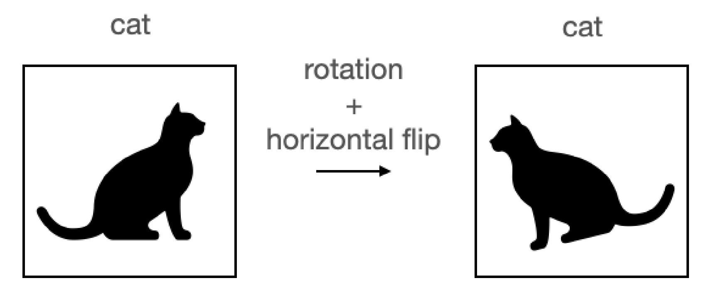
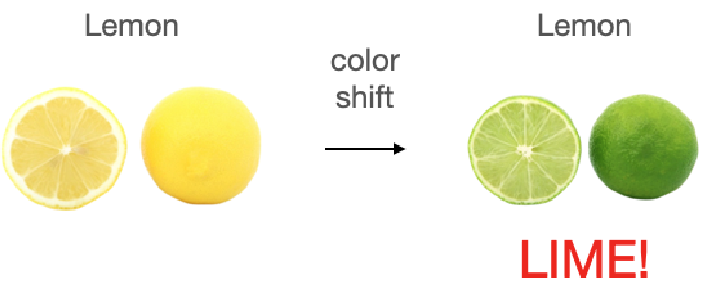
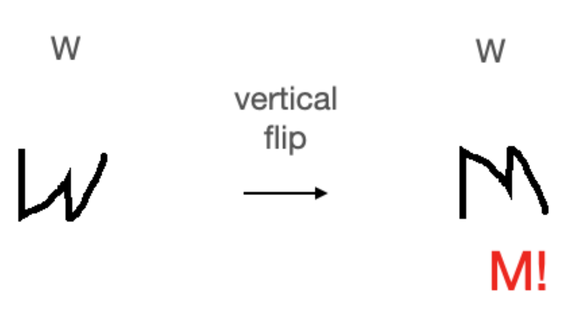

# Transformación de imágenes y aumento de datos
El aumento de datos resume un amplio conjunto de técnicas para tratar los casos en los que los datos de entrenamiento son limitados. Por ejemplo, ciertas técnicas de aumento de datos nos permiten modificar o incluso sintetizar artificialmente más datos y así potenciar el rendimiento de un modelo de aprendizaje automático o profundo reduciendo el sobreajuste.

Aunque el aumento de datos no es solo para los datos de imágenes, como el recorte de partes de una imagen, la rotación y la modificación del contraste, el brillo y la saturación. 

La siguiente figura muestra un ejemplo en el cual aplicamos algunos aumentos, por ejemplo rotación y giro horizontal, para conseguir una nueva imagen a la cual le asignamos la misma etiqueta de gato. Ambas imágenes ahora son parte del conjunto de entrenamiento. En este ejemplo, está claro que la imagen aumentada todavía representa un gato y puede proporcionar al modelo información útil. Sin embargo, este no es siempre el caso.

<figure style="align: center;">
    
    <figcaption>Ejemplo de aumento de datos correcto</figcaption>
</figure>

Imaginemos que estamos clasificando frutas y decidimos aplicar un aumento de cambio de color a una imagen de un limón. La imagen aumentada seguirá etiquetada como limón, pero en realidad se parecerá más a una lima.

<figure style="align: center;">
    
    <figcaption>Ejemplo de aumento de datos incorrecto</figcaption>
</figure>

Otro ejemplo sería en una tarea de clasificación de caracteres escritos a mano. Si aplicamos el giro vertical a la letra "W" se verá como la letra "M". Pasarlo al modelo etiquetado como "W" confundirá al modelo e impedirá el entrenamiento. Estos ejemplos muestran que, a veces, determinados aumentos pueden afectar el rendimiento del modelo. Para los últimos ejemplos podríamos haber aplicado un giro vertical al limón o un cambio de color a la letra “W” sin introducir ruido en las etiquetas.

<figure style="align: center;">
    
    <figcaption>Ejemplo de aumento de datos incorrecto</figcaption>
</figure>