# Redes neuronales convolucionales profundas
## Introducción
Las redes neuronales densas vistas hasta ahora no son aptas para la visión por computador. Imaginemos que tenemos una imagen en escala de grises de 256x256px. Esto nos daría aproximadamente una capa de aproximadamente 65000 entradas. Si utilizamos a continuación una capa lineal de 1000 neuronas (que no es demasiado) obtendríamos unos 65 millones de parámetros a ajustar, tan solo en la 1ª capa. Si la imagen fuese en color tendríamos 3 veces más entradas, por lo que deberían ajustarse unos 200 millones de parámetros.

<figure style="align: center;">
    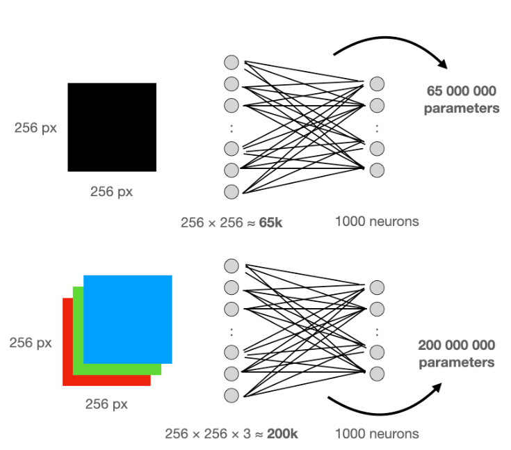
    <figcaption>Capa lineal densa</figcaption>
</figure>

Esta cantidad de parámetros ralentizaría el entrenamiento y correría el riesgo de sufrir un sobreajuste. Además, las capas lineales no reconocen patrones espaciales. La siguiente imagen muestra un ejemplo que muestra un gato en la esquina. Las neuronas conectadas linealmente podrían aprender a detectar al gato, pero el mismo gato no sería reconocido si aparece en una ubicación diferente. 

<figure style="align: center;">
    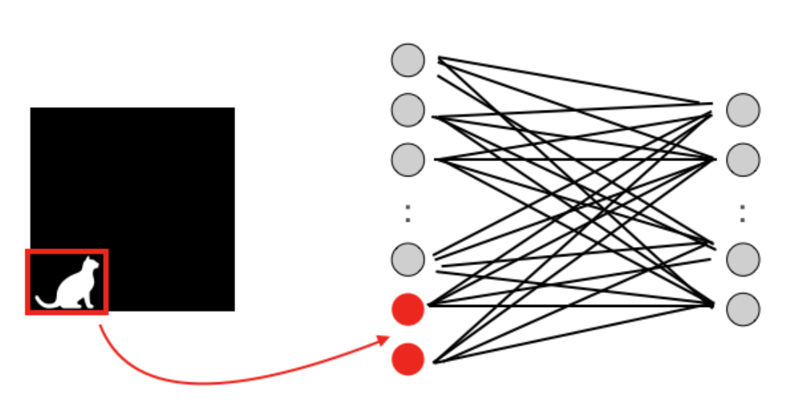
    <figcaption>Patrones espaciales</figcaption>
</figure>

Para solventar estos problemas se introdujo el uso de las capas convolucionales.

## Capas convolucionales
Las neuronas de la primera capa convolucional no están conectadas a todos y cada uno de los píxeles de la imagen de entrada sino solo a píxeles en sus campos receptivos. A su vez, cada neurona de la segunda capa convolucional está conectada solo a las neuronas ubicadas dentro de un rectángulo pequeño en la primera capa. Esta arquitectura permite a la red concentrarse en características pequeñas de bajo nivel en la primera capa oculta, juntarlas después para crear características más grandes de nivel superior en la siguiente capa oculta, y así sucesivamente. Esta estructura jerárquica es común en imágenes del mundo real, que es una de las razones por las que las redes neuronales convolucionales (CNN) funcionan tan bien para el reconocimiento de imágenes.

<figure style="align: center;">
    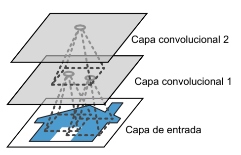
    <figcaption>Capas de una CNN con campos receptivos locales rectangulares</figcaption>
</figure>

Esta arquitectura permite a la red concentrarse en características pequeñas de bajo nivel en la primera capa oculta, juntarlas después para crear características más grandes de nivel superior en la siguiente capa oculta, y así sucesivamente. Esta estructura jerárquica es común en imágenes del mundo real, que es una de las razones por las que las redes neuronales convolucionales (CNN) funcionan tan bien para el reconocimiento de imágenes.

<figure style="align: center;">
    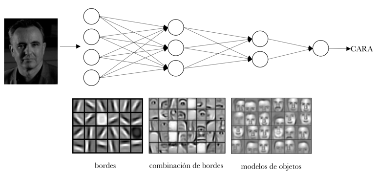
    <figcaption>Extracción de características por parte de una CNN</figcaption>
</figure>

## Convolución
La convolución es el resultado del producto escalar entre 2 matrices, la de entrada y la del **filtro** (también llamado kernel) y sumar el resultado. La convolución de un filtro a una entrada produce un **mapa de características**.

<figure style="align: center;">
    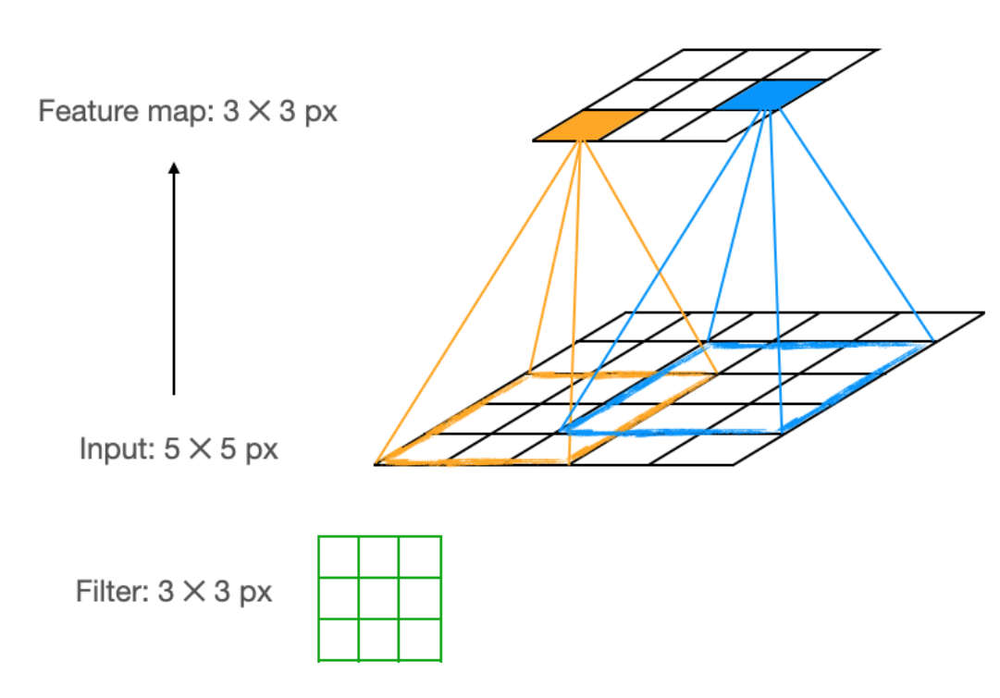
    <figcaption>Aplicación de un filtro para la obtención de un mapa de características</figcaption>
</figure>

<figure style="align: center;">
    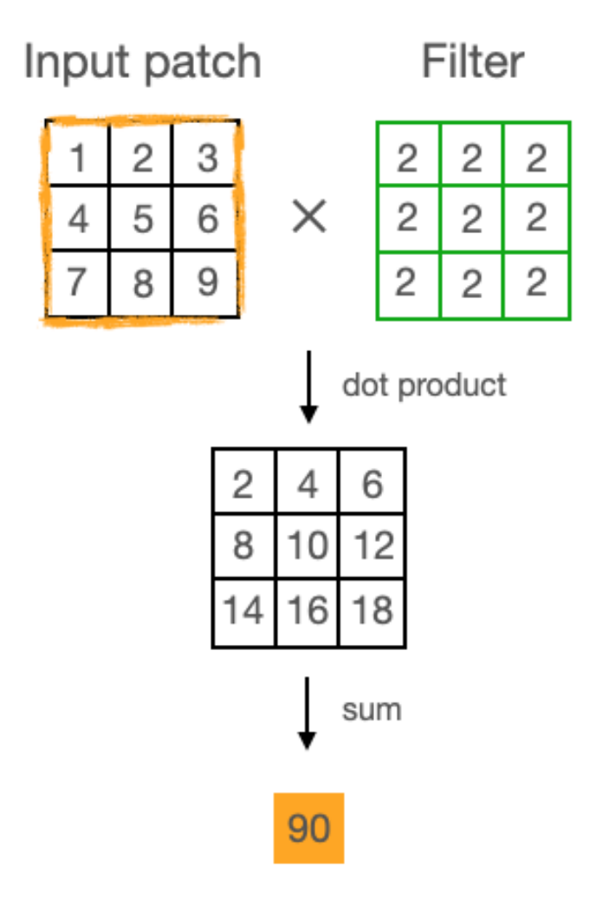
    <figcaption>Detalle de la operación de convolución</figcaption>
</figure>

Para obtener todo el mapa de características se tiene que desplazar el filtro a lo largo de toda la capa de entrada. El tamaño del paso horizontal y vertical del filtro se llama **stride**. También es importante establecer el **tamaño** de dicho filtro. El contenido del filtro no se establece de manera manual sino que será aprendido en el proceso de entrenamiento de la red convolucional.

Existen 2 problemas derivados de este procedimiento:

- Los píxeles de los bordes de la imagen se tendrán menos en cuenta para el mapa de características, ya que intervienen menos en el cálculo de la convolución.
- Dicho mapa de características será de un tamaño menor que el de la capa de entrada, por lo que si apilamos varias capas convolucionales podemos perder mucha información.

Por ello se utiliza el procedimiento de relleno de ceros por el borde o **padding**. Para mantener el tamaño de la capa de entrada utilizaremos un kernel de tamaño 3, un padding de 1 y un stride de 1. 

<figure style="align: center;">
    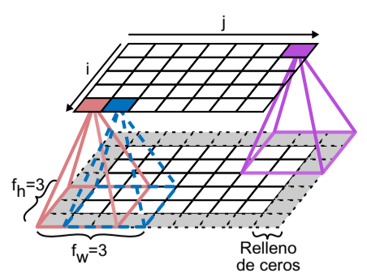
    <figcaption>Conexiones entre capas y relleno de ceros</figcaption>
</figure>

Si aplicásemos un stride de 2 reduciríamos la dimensionalidad a la mitad.

<figure style="align: center;">
    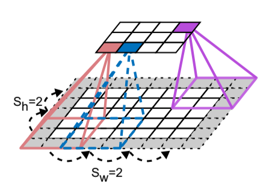
    <figcaption>Reducir la dimensionalidad utilizando un paso de avance de 2</figcaption>
</figure>

## Apilamiento de mapas de características
La siguiente figura muestra la aplicación de 2 filtros distintos a la misma imagen de entrada.

<figure style="align: center;">
    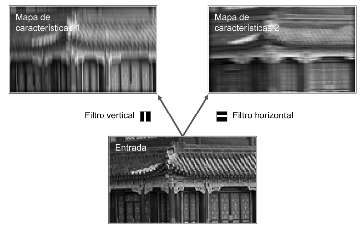
    <figcaption>Aplicación de 2 filtros diferentes para obtener 2 mapas de características</figcaption>
</figure>

Si todas las neuronas de una capa usan el mismo filtro de línea vertical, la salida de la capa será la imagen superior izquierda. Del mismo modo, la imagen superior derecha es lo que sale si todas las neuronas usan el mismo filtro de línea horizontal.

Una capa convolucional tiene múltiples filtros y genera como salida un mapa de características por filtro. La siguiente figura ejemplifica este hecho.

<figure style="align: center;">
    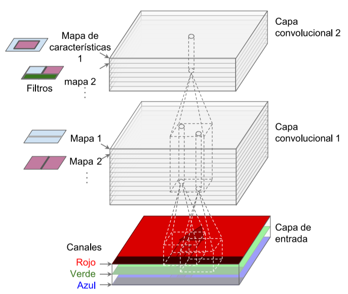
    <figcaption>2 capas convolucionales con múltiples filtros cada una, procesando una imagen en color con 3 canales de color; cada capa convolucional genera como salida un mapa de características por filtro</figcaption>
</figure>

## Capas de pooling
Las capas de pooling son capas de submuestreo que permiten reducir la imagen para disminuir la carga computacional, el uso de memoria y el número de parámetros (limitando así el riesgo de sobreajuste).

Al igual que ocurre en las capas convolucionales, cada neurona de una capa de pooling está conectada a las salidas de un número limitado de neuronas de la capa anterior, ubicadas en un campo receptivo rectangular pequeño (el filtro). Sin embargo, una neurona de pooling no tinen pesos; todo lo que hace es buscar el máximo (**max pooling**) o la media (**mean pooling**) de las entradas. El max pooling es el tipo más usado.

<figure style="align: center;">
    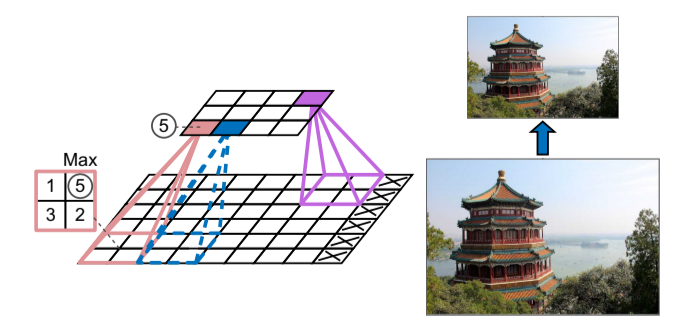
    <figcaption>Capa max pooling (kernel de pooling de 2x2, stride de 2, sin relleno</figcaption>
</figure>

Como se puede apreciar en la anterior figura, la imagen de salida tiene la mitad de altura que la imagen de entrada (redondeando hacia abajo, porque no usamos relleno).

Además de reducir los cálculos, una capa de max pooling también introduce cierto nivel de invariancia a traslaciones pequeñas de la imagen, como por ejemplo que un píxel esté desplazado hacia la izquierda o derecha. Si introducimos una capa de max pooling cada pocas capas en una CNN, es posible obtener cierto nivel de invarianza traslacional a una escala mayor. Además, el max pooling ofrece una pequeña cantidad de invarianza rotacional y una leve invarianza de escala.

## Arquitectura de una CNN
Las arquitecturas de CNN apilan unas pocas capas convolucionales (cada una de ellas seguida, por lo general, por una capa ReLU), después, una capa de pooling, a continuación, otras pocas capas convolucionales (+ReLU), luego otra capa de pooling, y así sucesivamente. La imagen va haciéndose cada vez más pequeña a medida que progresa a través de la red, pero, por lo general, también va haciéndose cada vez más profunda (es decir, con más mapas de características), gracias a las capas convolucionales. En la parte superior de la pila, se añade una red neuronal densa tradicional, compuesta por capas completamente conectadas (+ReLU) y la capa final genera como salida la predicción (por ejemplo, una capa softmax que genera como salida probabilidades de clases estimadas).

<figure style="align: center;">
    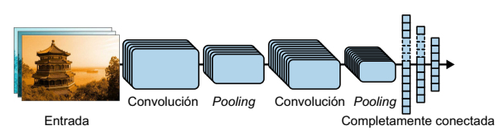
    <figcaption>Arquitectura típica de una CNN</figcaption>
</figure>

<figure style="align: center;">
    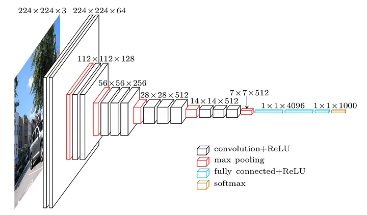
    <figcaption>Tamaño de las capas de una CNN</figcaption>
</figure>

