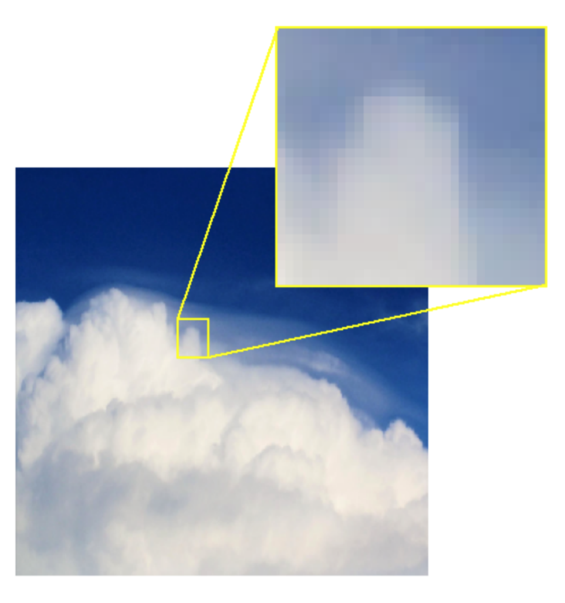

# Introducción a la visión por computador
En esta unidad trataremos las distintas tareas por resolver dentro del campo de la visión por computador.

La visión por computador ha experimentado un gran avance estos últimos años gracias al desarrollo de las técnicas dentro del deep learning y el aumento de la capacidad de computación de los sistemas hardware actuales.

Dentro de las tareas de visión por computador nos podemos encontrar con problemas de clasificación de imágenes, detección de objetos, segmentación de imágenes, estimación de profundidad y generación de imágenes.

En los siguientes apartados entraremos en detalle en cada una de estas tareas, junto a las arquitecturas de redes neuronales utilizadas para resolverlas.

Antes de ello repasaremos los conceptos básicos sobre imagen digital.

## Imagen digital
Las imágenes digitales se componen de píxeles. Un píxel es la unidad más pequeña de la imagen. Es un pequeño cuadrado que representa un solo punto. Si ampliamos esta imagen de la nube, podemos ver los píxeles. 

<figure style="align: center;">
    
    <figcaption>Imagen ampliada</figcaption>
</figure>

Cada píxel contiene información numérica sobre su color. En una imagen en escala de grises, cada píxel representa un tono de gris diferente, que va del negro al blanco, lo que sería un número entero entre 0 y 255, respectivamente. Un valor de 30, por ejemplo, representa el siguiente tono de gris.

<figure style="align: center;">
    
    <figcaption>Pixel en escala de grises</figcaption>
</figure>

En las imágenes en color, cada píxel suele describirse mediante tres números enteros, que denotan las intensidades de los tres canales de color: rojo, verde y azul. Por ejemplo, un píxel con rojo de 52, verde de 171 y azul de 235 representa el siguiente tono de azul.

<figure style="align: center;">
    
    <figcaption>Pixel en color</figcaption>
</figure>
