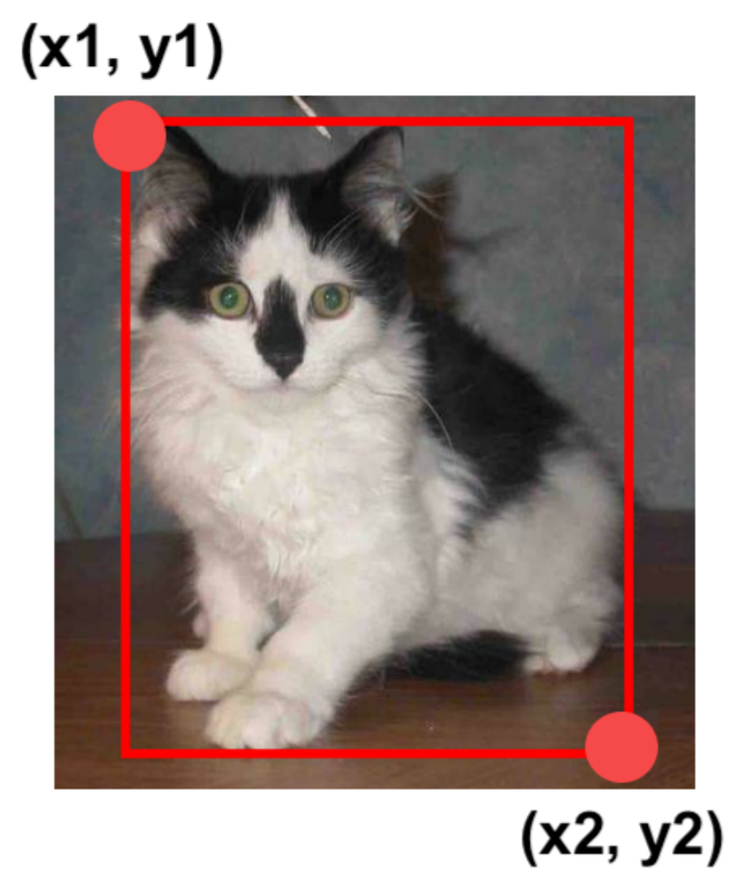
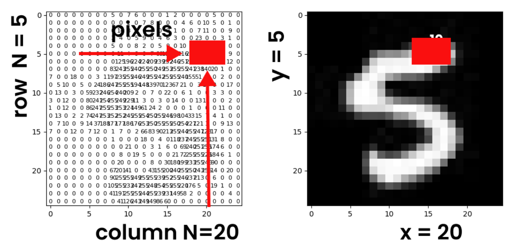
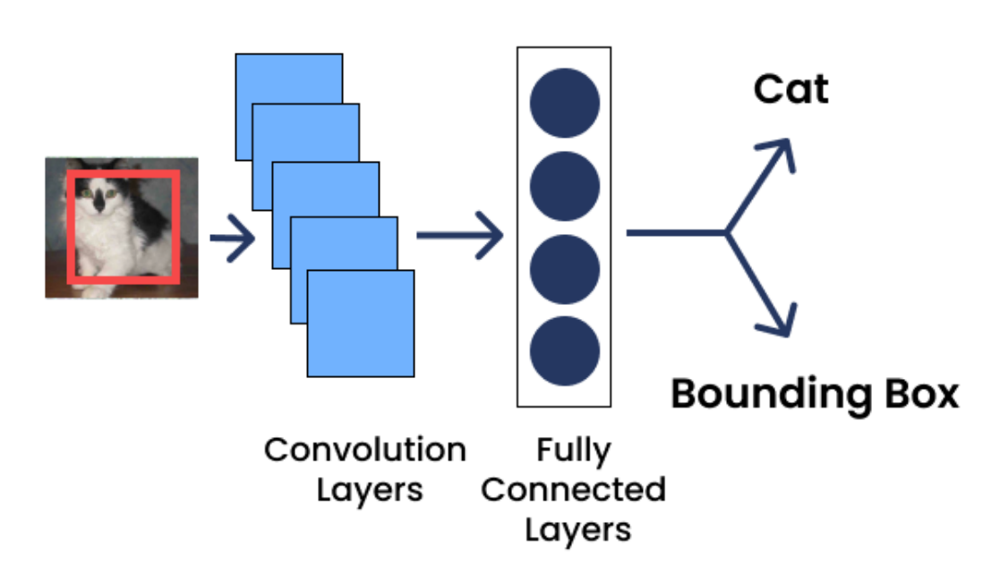
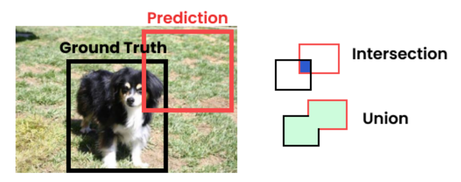
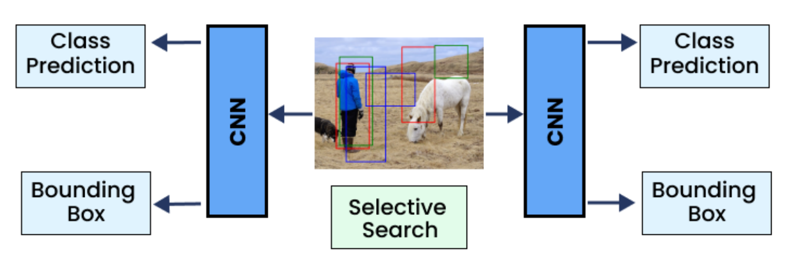

# Reconocimiento de objetos
El reconocimiento de objetos identifica objetos en imágenes. Un ejemplo podría ser el caso de un coche autónomo. Sus sistemas necesitan identificar la ubicación de todos los objetos en la carretera, como otros automóviles y peatones. Normalmente, esto se logra dibujando cuadros delimitadores alrededor de los objetos. Luego, todos los objetos localizados deben identificarse con su etiqueta de clase. El reconocimiento de objetos se utiliza en muchas aplicaciones, como vigilancia, diagnóstico médico, gestión del tráfico o análisis deportivo.

## Cuadros delimitadores
Un **cuadro delimitador** (*bounding box*) describe la ubicación espacial de un objeto dentro de la imagen. Los cuadros delimitadores se utilizan para anotar datos de entrenamiento. También son el resultado de los modelos de reconocimiento de objetos. Un cuadro delimitador describe con precisión la ubicación de un objeto dentro de una imagen.

Un cuadro delimitador normalmente se describe por sus coordenadas superior izquierda e inferior derecha. Estos cuatro números: x1, y1, x2 e y2 definen cada cuadro delimitador. A veces, el uno y el dos se denominan mínimo y máximo, respectivamente, de modo que x1 es x_min, x2 es x_max y lo mismo ocurre con las coordenadas y.

<figure style="align: center;">
    
    <figcaption>Coordenadas de un bounding box</figcaption>
</figure>

Una imagen consta de píxeles. Los píxeles proporcionan una forma de especificar la ubicación, el tamaño y los límites del objeto dentro de una imagen. Cada píxel está definido por el número de columna o la coordenada x y el número de fila o la coordenada y. El origen de la imagen (el primer píxel) tiene las coordenadas x es igual a cero e y es igual a cero y está en la esquina superior izquierda. Por ejemplo, el píxel de la columna veinte y la fila cinco corresponde a x e y iguales a veinte y cinco, respectivamente.

<figure style="align: center;">
    
    <figcaption>Coordenadas de un pixel</figcaption>
</figure>

## Clasificación y localización
La tarea de reconocimiento de objetos podría verse como una unión de 2 tareas: clasificación y localización de un objeto.

Para la clasificación del objeto se utilizaría un enfoque similar al que hemos visto anteriormente en la unidad.

La localización del objeto en una imagen puede expresarse como una tarea de regresión. Deberían predecirse las cuatro coordenadas del cuadro delimitador. Esto supondría añadir una segunda capa de salida densa con cuatro unidades. 

<figure style="align: center;">
    
    <figcaption>Arquitectura de un modelo de reconocimiento de objetos</figcaption>
</figure>

Para la tarea de localizacón el modelo podría entrenarse utilizando la función de pérdida **MSE**. En cambio, el MSE no es la mejor métrica para evaluar lo bien que puede producir el modelo los cuadros delimitadores. La métrica más utilizada en estos casos es la **intersección sobre unión** (**IoU**); que calcula el área de solapamiento entre el cuadro delimitador predicho y el cuadro delimitador objetivo, dividida entre el área de su unión.

<figure style="align: center;">
    
    <figcaption>Coordenadas de un pixel</figcaption>
</figure>

Un IoU de 0 significa que no hay solapamiento, mientras que un valor de 1 significa que hay un solapamiento perfecto. Se considera que un valor > 0.5 es una buena predicción.

## Detección de objetos
La **detección de objetos** es la tarea de clasificar y localizar múltiples objetos en una imagen. 

Uno de los modelos más conocidos es **Faster R-CNN**. En este modelo la imagen pasa a través de una CNN y, después, la salida se pasa a una red de propuestas de región (*region proposal network*, **RPN**) que propone cuadros delimitadores que tienen más probabilidades de contener un objeto; entonces, se ejecuta un clasificador para cada cuadro delimitador, basado en la salida recortada de la CNN.

<figure style="align: center;">
    
    <figcaption>Arquitectura de Faster R-CNN</figcaption>
</figure>

