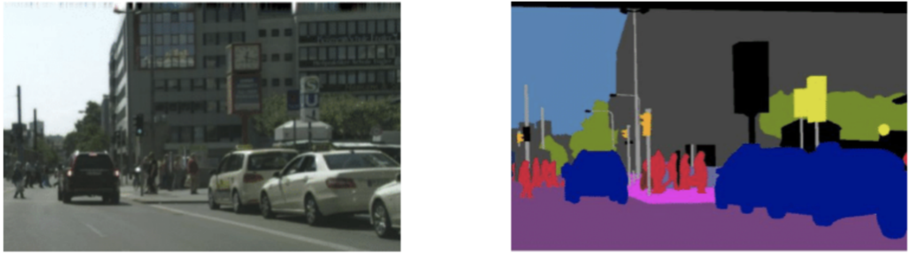
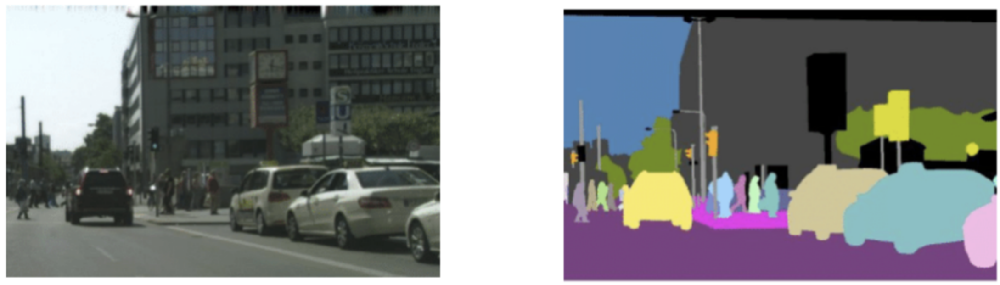

# Segmentación de imágenes
La segmentación de imágenes es una tarea de visión por computador que implica dividir la imagen en múltiples segmentos o áreas con la imagen, al nivel de píxeles. Esto significa que cada píxel en una imagen se asigna a un segmento particular. Existen tres tipos de segmentación: semántica, instancia y panóptica y cada uno de ellos requiere una arquitectura de modelo diferente. 

## Segmentación semántica
En la segmentación semántica, cada píxel en la imagen se clasifica en una clase o categoría predefinida. Todos los píxeles que pertenecen a la misma clase se tratan por igual, y no hay distinción entre diferentes instancias de la misma clase. En una escena de la calle, todos los píxeles pertenecientes a los automóviles están marcados como azul oscuro, todos los píxeles que pertenecen a las carreteras están marcados como morados, etc., sin distinguir entre autos individuales o secciones de carreteras.

<figure style="align: center;">
    
    <figcaption>Segmentación semántica</figcaption>
</figure>

## Segmentación de instancias
La segmentación de instancias va un paso más allá de la segmentación semántica no solo clasificando cada píxel sino también distinguiendo entre diferentes instancias de la misma clase. En la misma escena de la calle, a cada automóvil se le asignaría una etiqueta única que se muestra con un color único, para que diferentes autos puedan diferenciarse entre sí, a pesar de que pertenecen a la misma clase "automóvil". Dado que el enfoque principal de la segmentación de instancias es identificar y segmentar instancias de objetos individuales en la imagen, el fondo como el camino o el cielo generalmente no se segmentan.

<figure style="align: center;">
    
    <figcaption>Segmentación de instancias</figcaption>
</figure>

## Segmentación panóptica
La segmentación panóptica combina los conceptos de segmentación semántica y segmentación de instancias. Asigna una etiqueta única a cada instancia de un objeto al tiempo que clasifica las regiones de fondo (como el cielo, la carretera o el césped) a nivel de píxeles. En la escena de la calle, cada automóvil obtendría una etiqueta única como en la segmentación de instancias (cada automóvil se muestra en diferente color). Al mismo tiempo, áreas como el camino, el cielo y los árboles están etiquetados a nivel de píxel sin diferenciación de instancias como en la segmentación semántica. Todo el camino es morado, todo el cielo es azul, y así sucesivamente.

<figure style="align: center;">
    
    <figcaption>Segmentación panóptica</figcaption>
</figure>