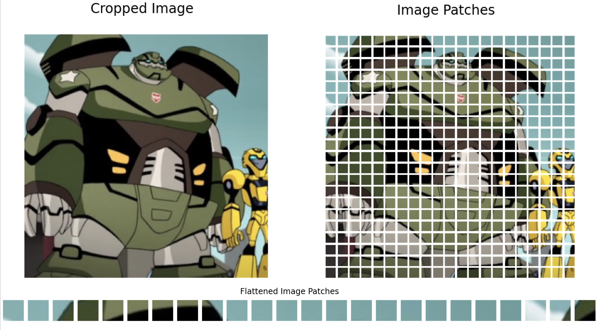
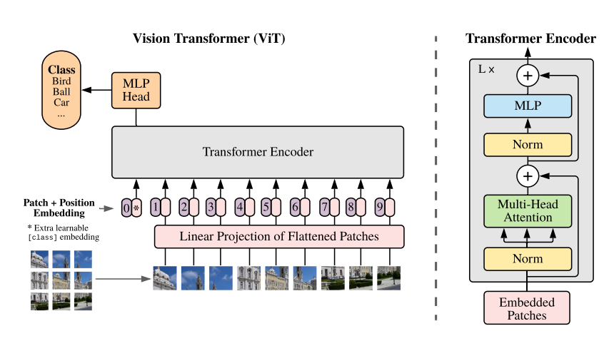

# Transformadores de visión
Uno de los conceptos claves de un transformador es el mecanismo de atención.

Una de las primeras aplicaciones de los mecanismos de atención más allá de la traducción automática neuronal fue la generación de pies de fotos para imágenes utilizando la atención visual; primero una CNN que procesa la imagen y genera como salidas algunos mapas de características y, después, una RNN decodificadora equipada con un mecanismo de atención genera el pie de foto, palabra por palabra.

En cada paso de tiempo el decodificador (es decir, cada palabra), el decodificador utiliza el modelo de atención para centrarse en la parte adecuada de la imagen. Por ejemplo, para la siguiente figura se ha generado el pie de foto "Una mujer está lanzando un frisbee en el parque". Se puede observar que cuando el decodificador estaba a punto de generar la palabra "frisbee" se ha centrado su atención en la parte de la imagen donde aparece el "frisbee".

<figure style="align: center;">
    
    <figcaption>Mecanismo de atención visual</figcaption>
</figure>

Los transformadores empezaron a volverse un poco más visuales cuando en 2020 se propuso una arquitectura híbirda CNN-transformador para la detección de objetos. De nuevo, la CNN procesa primero las imágenes de entrada y genera como salida un conjunto de mapas de características; después, esos mapas de características se convierten en secuencias y se introducen en un transformador, que genera como salida predicciones del delimitador. Aún así, la mayoría del trabajo visual lo realiza la CNN.

A finales de 2020, unos investigadores de Google publicó un artículo que introducía un modelo de visión basado por completo en Transformer, llamado transformador de visión (*vision transformer*, ViT). La idea es sorprendentemente simple: solo hay que recortar la imagen en pequeños cuadrados de 16x16 y tratar la secuencia de cuadrados como si fuese una secuencia de representaciones de palabras. Para ser más precisos, primero se aplanan los cuadrados en vectores de 16x16x3=768 dimensiones (3 por el número de canales RGB) y, después, estos vectores pasan por una capa lineal que los aplana como *patches*.

<figure style="align: center;">
    
    <figcaption>Patches ViT</figcaption>
</figure>

La secuencia resultante de vectores puede tratarse después como una secuencia de *embeddings* de palabras: eso significa añadir *embeddings* de posición y pasar el resultado al transformador. 

<figure style="align: center;">
    
    <figcaption>Arquitectura del ViT</figcaption>
</figure>

Este modelo superaba a los de última generación de clasificación de imágenes, pero como contrapartida se tuvo que utilizar alrededor de 300 millones de imágenes adicionales para el entrenamiento. Esto es debido a que los transformadores no tienen tantos sesgos inductivo como las redes neuronales convolucionales, así que se necesitan datos extra solo para aprender cosas que las CNN asumen de manera implícita.

Un sesgo inductivo es una suposición implícita hecha por el modelo, debido a su arquitectura. Por ejemplo, las CNN asumen de forma implícita que es probable que los patrones aprendidos en una ubicación resulten útiles también en otras ubicaciones. Las RNN asumen implícitamente que las entradas están ordenadas y que los *tokens* recientes son más importantes que los antiguos.
