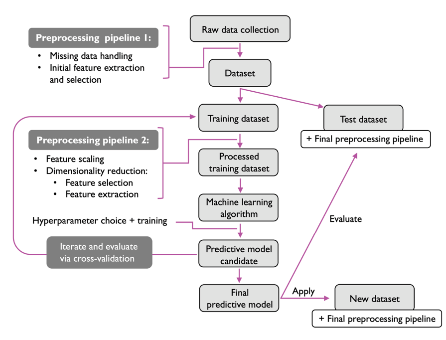

# Introducción
La siguiente figura muestra un flujo de trabajo típico para un sistema de aprendizaje automático. Esta figura nos servirá de ayuda para detallar las distintas fases necesarias en este tipo de sistema cara a crear finalmente un modelo predictivo.

