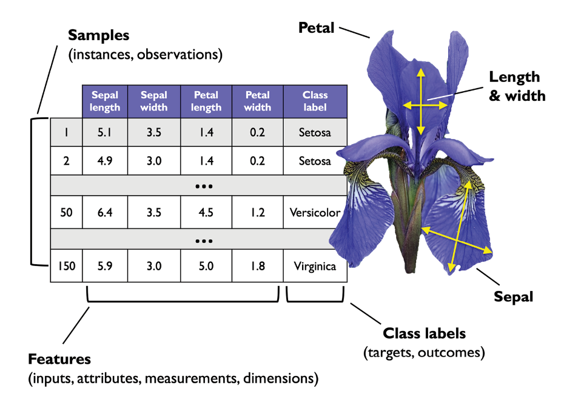

# Preprocesamiento: cómo dar forma a los datos
Los datos en bruto rara vez se presentan en la forma y el formato necesarios para el rendimiento óptimo de un algoritmo de aprendizaje. Por ello, el preprocesamiento de los datos es uno de los pasos más importantes en cualquier aplicación de aprendizaje automático.

El dataset Iris es un ejemplo clásico en el campo de aprendizaje automático (se puede encontrar más información en [https://archive.ics.uci.edu/dataset/53/iris](https://archive.ics.uci.edu/dataset/53/iris). El dataset Iris contiene las medidas de 150 flores de iris de tres especies diferentes: setosa, versicolor y virginica.
Aquí, cada ejemplo de flor representa una fila en nuestro conjunto de datos, y las medidas de la flor en centímetros se almacenan en columnas, a las que también llamaremos “características del dataset”.

Si tomamos como ejemplo el conjunto de datos de las flores Iris, podemos pensar en los datos brutos como una serie de imágenes de flores de las queremos extraer características significativas. Las características útiles podrían centrarse en el color de las flores, o en su altura, su longitud o su anchura.

Muchos algoritmos de aprendizaje automático también requieren, para un rendimiento óptimo, que las características seleccionadas estén en la misma escala, lo que a menudo se consigue transformando las características en el rango [0, 1], o en una distribución normal estándar con media cero y varianza unitaria.

Algunas de las características seleccionadas pueden estar muy correlacionadas y, por tanto, ser redundantes hasta cierto punto. En estos casos, las técnicas de reducción de la dimensionalidad son útiles para comprimir las características en un subespacio de menor dimensión. La reducción de la dimensionalidad de este espacio de características tiene la ventaja de que se necesita menos espacio de almacenamiento y el algoritmo de aprendizaje puede funcionar mucho más rápido. En ciertos casos, la reducción de la dimensionalidad puede mejorar el rendimiento predictivo de un modelo si el conjunto de datos contiene un gran número de características irrelevantes (o ruido); es decir, si el conjunto de datos tiene una baja relación señal-ruido.

Para determinar si nuestro algoritmo de aprendizaje automático no solo funciona bien con el conjunto de datos de entrenamiento, sino que también se generaliza bien a nuevos datos, tendremos que dividir aleatoriamente el conjunto de datos en conjunto de datos de entrenamiento y de prueba separados. Utilizamos el conjunto de entrenamiento para entrenar y optimizar nuestro modelo de aprendizaje automático, y reservamos el conjunto de datos de prueba hasta el final para evaluar el modelo definitivo.

