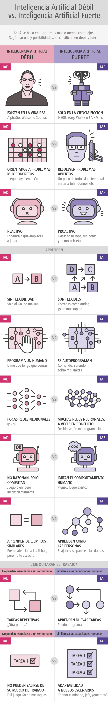

--- 
title: Posible clasificación
summary: Se puede casificar por diferentes criterios, en muchas casos filosóficos y poco contrastables, pero la clasificación otorga un dominio ficticio sobre el conocimiento.
authors:
    - Revisión autorizada
    - Jose Robledano
date: 2024-10-01
---
# Clases de inteligencia artificial.
Se escriben muchas exageraciones acerca de la inteligencia artificial en los medios de comunicación. Una de las razones es que con "inteligencia artificial" se expresan muchas cosas, pero podríamos destacar dos de ellas, dos ideas separadas que se refieren a cosas muy diferentes.

Por un lado, casi todo el progreso que estamos viendo en la inteligencia artificial se agrupa en lo que se denomina **inteligencia artificial débil** (*Narrow Artificial Intelligence*). Pero con inteligencia artificial también nos referimos a un segundo concepto, nombrado **inteligencia artificial fuerte** (*General Artificial Intelligence*). Este tipo de inteligencia es aquella que considera que las máquinas pueden hacer cualquier cosa que un humano pueda hacer, o ser superinteligentes y hacer incluso más cosas.

Si bien hay muchos progresos en el área de la inteligencia artificial débil, no hay casi ninguno en lo que se refiere a la inteligencia artificial fuerte. Pero el rápido progreso en la inteligencia artificial débil, que es increíblemente valioso, ha hecho que los medios de comunicación a veces concluyan que hay mucho progreso también en la fuerte, lo cual no es cierto en estos momentos. La inteligencia artificial fuerte es un ámbito en el que los investigadores pueden trabajar, pero en el que se está aún muy lejos de conseguir un gran conocimiento; pueden pasar décadas o cientos de años, quién sabe.

Un ejemplo. Incluso un niño de tres años puede aprender cosas de una manera que las computadoras también pueden hacer por ahora; una niño de tres años en realidad domina la física intuitivamente. Por ejemplo, sabe perfectamente que cuando tira una bola al aire esta caerá. O cuando derrama algunos líquidos espera el desastre resultante. Sus padres no necesitan enseñarle las leyes de Newton, o hablarle de las ecuaciones diferenciales que definen la trayectoria de los objetos; este niño descubre todas estas cosas solo, pero supervisado por los eventos que ocurren en su contexto y ha percibido con sus sentidos durante esos 5 años de vida.

Ahora bien, hay autores que consideran que incluso sólo con la inteligencia artificial débil nos dirigimos rápidamente hacia una situación en la que los sistemas informáticos tomarán decisiones por nosotros, y piden que nos preguntemos qué sucederá cuando esos sistemas dejen de lado la estrategia humana en favor de algo totalmente desconocido para nosotros.

## El test de Turing.
El matemático británico Alan Turing (1912-1954) es considerado uno de los padres de las Ciencias de la Computación. Entre muchas de sus contribuciones formuló la prueba que lleva su nombre. Según este investigador, un ordenador que fuese capaz el test de Turing se podría considerar inteligente.

El test de Turing consiste en hacer que una persona hable a través de una pantalla y un teclado simultáneamente con un grupo de individuos entre los que se esconde un ordenador. A la vista de las respuestas que recibe de cada uno de ellos, esta persona debería ser capaz de saber quién es el ordenador y quiénes son los seres humanos. Si el ordenador no es descubierto, se podría considerar que ha pasado el test de Turing. Dado que la conversación se lleva a cabo en forma de texto, a través de un teclado y un monitor, no es necesario que la máquina sea capaz de transformar el texto en voz, aunque estoy hoy en día ya es posible. Esta prueba no evalúa conocimientos, dado que un ser humano no lo sabe todo, sino que lo que mide es la capacidad de una máquina de conversar como lo haría un ser humano.

Ya han pasado más de 70 años desde que se enunciara el test de Turing y hay máquinas que han conseguido superarla.

Eres tu capaz de saber si este texto lo ha escrito un humano, o ha sido dictado por una máquina.