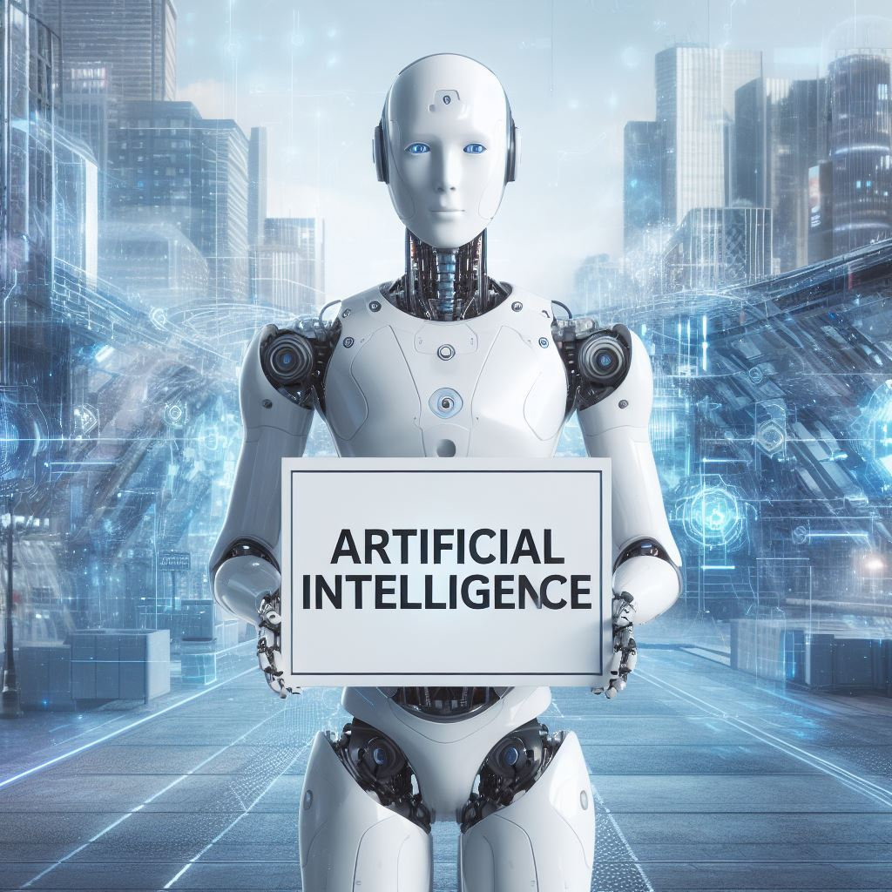

--- 
title: Qué es la inteligencia
summary: Qué es Inteligencia Artificial y que no lo es.
authors:
    - Revisión autorizada
    - Jose Robledano
date: 2024-10-01
---
# Definición de inteligencia artificial. 
La Inteligencia Artificial (IA), al igual que la humana, es un concepto complejo de definir. Aún no existe una definición formal y universalmente aceptada.

La Comisión Europea la define como sistemas de software (y posiblemente también de hardware) diseñados por humanos que, ante un objetivo complejo, actúan en la dimensión física o digital:

- Percibiendo su entorno, a través de la adquisición e interpretación de datos estructurados o no estructurados.
- Razonando sobre el conocimiento, procesando la información derivada de estos datos y decidiendo las mejores acciones para lograr el objetivo dado.

Los sistemas de IA pueden usar **reglas simbólicas** o **aprender un modelo numérico**. También pueden adaptar su comportamiento al **analizar cómo el medio ambiente** se ve afectado por sus acciones previas.

La inteligencia artificial (IA) es un campo de la informática que se enfoca en crear sistemas que puedan realizar tareas que normalmente requieren inteligencia humana, como el **aprendizaje**, el **razonamiento** y la **percepción**.
Estos sistemas pueden percibir su entorno, razonar sobre el conocimiento, procesar la información derivada de los datos y tomar decisiones para lograr un objetivo dado.

