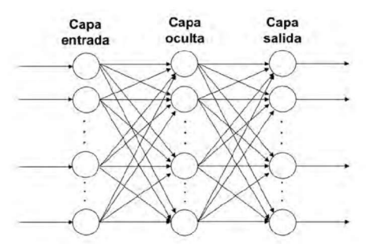
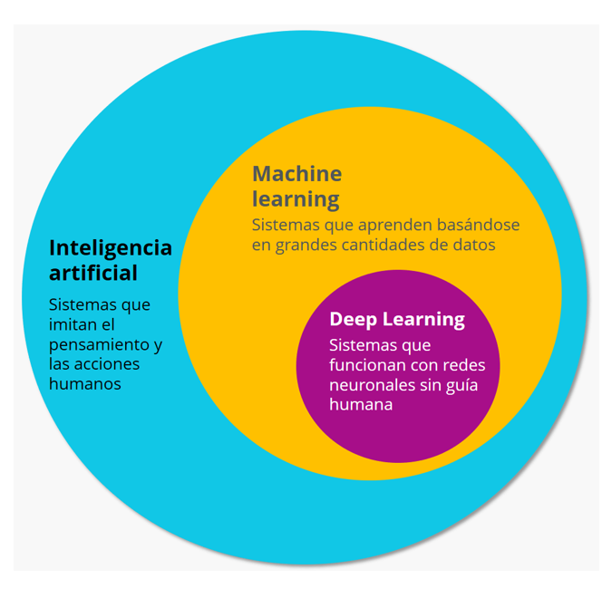

# Sistemas de aprendizaje automático. Machine Learning
El *Machine Learning*, traducido al castellano como **aprendizaje automático**, es la ciencia de programar ordenadores para que aprendan a partir de datos. Esto otorga a los ordenadores la capacidad de aprender sin ser programados de manera explícita.

Se dice que un programa de ordenador aprende de la experiencia **E**, con respecto a una tarea **T** y una medida de rendimiento **R**, si su rendimiento en **T**, medido por **P**, mejora con la experiencia **E**.

El filtro de *spam* es un programa de *machine learning* que, al recibir ejemplos de correo basura (marcados por los usuarios) y ejemplos de correos corrientes (que no sean *spam*, también llamados “*ham*”), puede aprender a marcar el *spam*. Los ejemplos que el sistema utiliza para aprender se llaman **conjunto de entrenamiento**. Cada ejemplo de entrenamiento se llama **instancia de entrenamiento** (o muestra). La parte de un sistema de *machine learning* que aprende y realiza predicciones se denomina **modelo**. Las **redes neuronales** y los ***random forests*** son ejemplos de modelos.

En este caso, la tarea T es marcar el *spam* para los correos nuevos, la experiencia E son los datos de entrenamiento y la medida del rendimiento tiene que definirse; por ejemplo, podemos utilizar la proporción de correos clasificados correctamente.

## Deep Learning
Como hemos mencionado anteriormente las redes neuronales son un modelo dentro de los sistemas de *Machine Learning*. Estas redes neuronales artificiales pretenden imitar en cierta manera la actividad de las capas de neuronas en la neocorteza del cerebro humano donde ocurre el pensamiento. Estas redes neuronales artificiales se organizan jerárquicamente en **capas de procesamiento** (construidas con neuronas artificiales). Una red neuronal se considera Deep Learning cuando tiene una o más capas ocultas.

Los grandes avances en reconocimiento de voz, procesado de lenguaje natural o visión por computador, son debidos en gran parte a los avances del *Deep Learning* en esta última década.

