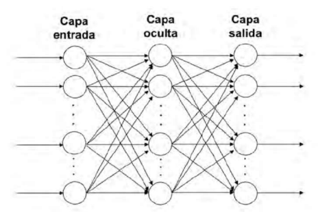
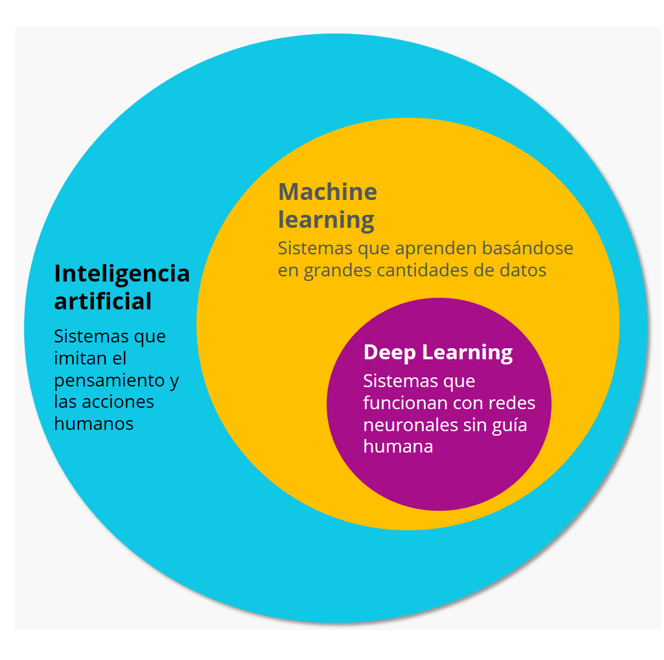

# Machine Learning: Aprendizaje Automático

## Definición

El **Machine Learning** (aprendizaje automático) es un subcampo de la inteligencia artificial dedicado a desarrollar algoritmos y modelos matemáticos que permiten a las máquinas aprender patrones a partir de datos sin necesidad de programación explícita. El proceso se basa en entrenar modelos con ejemplos, de modo que aprenden a generalizar a nuevos casos por sí mismos.

Formalmente, se dice que un programa aprende de la experiencia **E** respecto a una tarea **T** con medida de rendimiento **R**, si su desempeño en **T** mejora con **E**.

## Complejidad

El Machine Learning abarca desde técnicas muy sencillas hasta modelos altamente sofisticados:
- **Nivel básico:** Regresión lineal para relaciones directas
- **Nivel intermedio:** Árboles de decisión para clasificación
- **Nivel avanzado:** Redes neuronales para predicción del tiempo, análisis de series temporales y reconocimiento de voz

## Aprendizaje Supervisado y No Supervisado

El Machine Learning se divide en dos grandes ramas:
- **Supervisado:** El modelo se entrena con datos etiquetados para tareas de clasificación o regresión
- **No supervisado:** Trabaja con datos sin etiquetar para descubrir patrones, agrupaciones o anomalías de forma autónoma

## Conceptos Clave

| Término | Definición |
|---------|-----------|
| **Conjunto de entrenamiento** | Datos utilizados para que el modelo aprenda |
| **Instancia de entrenamiento** | Cada ejemplo individual del conjunto |
| **Modelo** | Componente que aprende y realiza predicciones |

## Ejemplo: Filtro de Spam

Un filtro de spam aprende diferenciando entre:
- Correos basura (*spam*): ejemplos negativos
- Correos válidos (*ham*): ejemplos positivos

**Componentes del ejemplo:**
- **Tarea (T):** Clasificar nuevos correos como spam o legítimos
- **Experiencia (E):** Datos de entrenamiento etiquetados (miles de correos clasificados)
- **Rendimiento (R):** Porcentaje de clasificaciones correctas

**Funcionamiento:**
1. El modelo analiza características del correo: remitente, asunto, palabras clave, enlaces, formato
2. Durante el entrenamiento, identifica patrones típicos de spam (palabras como "oferta", "urgente", direcciones sospechosas)
3. Calcula probabilidades para cada correo nuevo basándose en los patrones aprendidos
4. Clasifica el correo si la confianza supera un umbral definido

**Resultados esperados:**
- Precisión: 95-98% en datos de prueba
- Reducción de falsos positivos (correos legítimos marcados como spam)
- Mejora continua mediante realimentación: si el usuario marca incorrectamente un correo, el modelo se reajusta

## Deep Learning
## Definición

El **Deep Learning** (aprendizaje profundo) es una rama del Machine Learning que utiliza redes neuronales artificiales con múltiples capas ocultas para aprender representaciones complejas de datos. Permite al modelo descubrir automáticamente los patrones y características necesarias para realizar tareas como clasificación, predicción y reconocimiento sin intervención humana explícita.

### Redes Neuronales

Las **redes neuronales artificiales** modelan la estructura del cerebro humano mediante **capas de procesamiento** jerárquicamente organizadas.

Una red se considera **Deep Learning** cuando contiene una o más capas ocultas.

### Impacto

El Deep Learning ha revolucionado:
- Reconocimiento de voz
- Procesamiento de lenguaje natural
- Visión por computador

