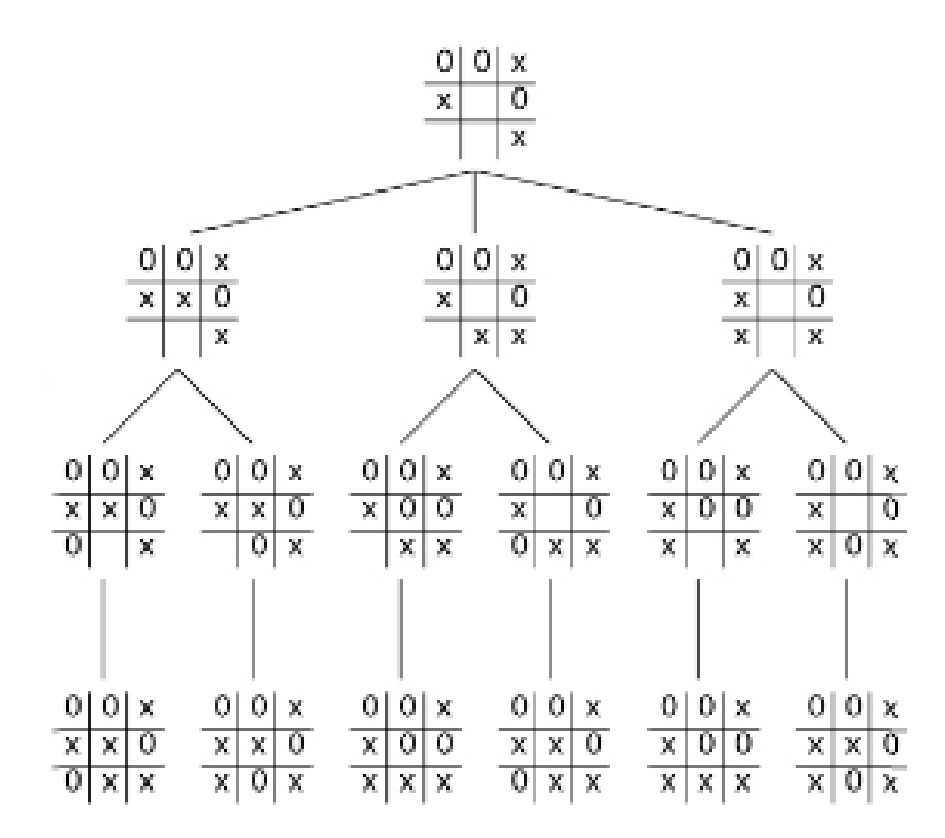
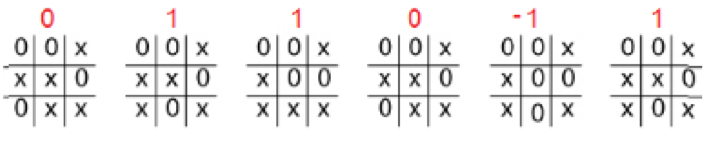
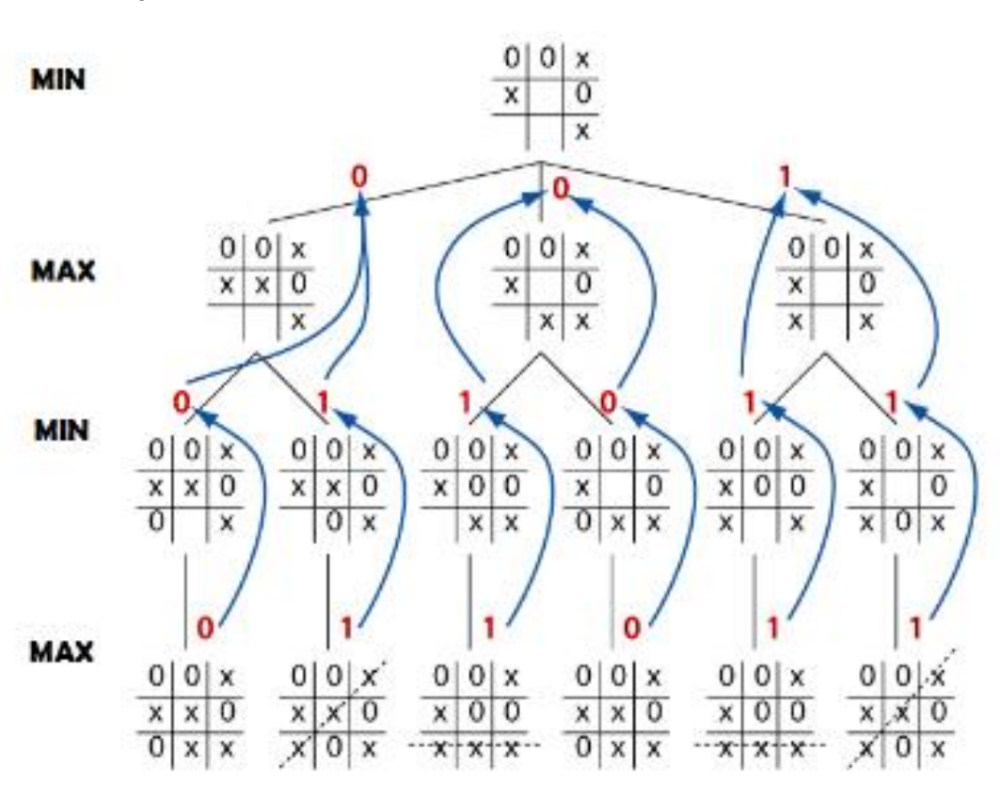

# Sistemas de resolución de problemas
Todo sistema de resolución de problemas debe ser capaz de evolucionar hasta alcanzar una de las posibles soluciones del problema.

Los sistemas de resolución de problemas tienen como objetivo alcanzar alguno de los estados en los que el problema se puede considerar resuelto. A la hora de formular que el sistema sea capaz de alcanzar la solución, es necesario que el medio donde éste se formula cumpla una serie de características:

- En primer lugar, que sea **observable** para el sistema de resolución de problemas. Es decir, que de alguna forma este sistema pueda reconocer y explorar el medio en su totalidad.
- En segundo lugar, resulta conveniente que el medio sea **finito** y **determinista**, entendiendo como tal que ejercer la misma acción sobre el medio, conduzca siempre al mismo resultado.

Así, si el medio es observable, finito y determinista, la resolución de cualquier problema consistirá en la ejecución de un número finito de pasos.

El proceso mediante el que, haciendo uso de una secuencia de acciones, el sistema de resolución de problemas alcanza el objetivo, se denomina **búsqueda**.

Este tipo de sistemas disponen de los siguientes componentes:

- **Estado inicial**: se trata del estado desde el que se comenzará el proceso de búsqueda.
- **Acciones que se pueden ejecutar**: en función del problema con el que se esté trabajando, el sistema dispondrá de una serie de posibles acciones que le permitirán pasar de un estado a otro.
- **Modelo de transición**: explica lo que hará cada una de esas acciones.
- **Espacio de estados del problema**: se trata del conjunto de todas las posibles situaciones a las que se puede llegar a partir del punto de partida.
- **Verificación de que se ha alcanzado el objetivo**, que determina si la posición lograda es una de las posiciones objetivo.
- **Coste de ejecución**: en muchos casos, puede resultar de interés el saber cuánto cuesta ejecutar cada una de las acciones que son necesarias para llegar al objetivo.

## Ejemplo. Juego de varios competidores: tres en raya
Vamos a ver un problema clásico de la IA: los juegos. La situación más sencilla, en la que nos centraremos en aras de la claridad, son los juegos de dos jugadores de información perfecta, como el tres en raya y el ajedrez.

### Árboles de juego
Los distintos estados del juego se representan mediante nodos en el árbol de juego. En el árbol de juego, los nodos están dispuestos en niveles que se corresponden con los turnos de cada jugador, de forma que el nodo «raíz» del árbol (normalmente representado en la parte superior del diagrama) es la posición inicial en el juego. En el tres en raya, sería la cuadrícula vacía, sin X ni O. Debajo de la raíz, en el segundo nivel, se representan los estados que pueden derivarse de los primeros movimientos de los jugadores, ya sea X o O. Nos referimos a estos nodos como los «hijos» del nodo raíz.

A su vez, cada nodo del segundo nivel tendrá como nodos hijos los estados que pueden resultar de él en función de los movimientos del jugador contrincante. Esta situación prosigue, nivel a nivel, hasta alcanzar estados en los que el juego finaliza. En el tres en raya, esto significa que uno de los jugadores consigue colocar tres fichas en línea y gana, o que el tablero está completo y el juego termina en empate.

### Valor mínimizante y maximizante
Para desarrollar un método de IA que trate de ganar el juego, asignamos un valor numérico a cada resultado final posible. A las posiciones del tablero en las que hay tres X en raya de forma que Max gana les asignamos el valor +1, y, del mismo modo, a las posiciones en que Min gana con tres O en raya les asignamos el valor -1. Para las posiciones en que el tablero está lleno y ninguna de las jugadoras gana, utilizamos el valor neutral 0 (realmente no importa cuáles sean los valores mientras sigan este orden, de forma que Max intente maximizar el valor y Min, minimizarlo).

### Crecimiento del árbol. Ramificación y poda
Un problema común es el rápido crecimiento del árbol de estados. ¡En el problema del tres en raya, el espacio de estados es 9! (factorial de 9), o lo que es lo mismo 9x8x7x6x5x4x3x2x1=362.880 jugadas posibles.

En el caso del ajedrez, se considera que cada jugada tiene un nivel de multiplicación de 35, es decir, 35 alternativas por cada estado. En dos niveles, sería 35x35=1.225 movimientos posibles. En 5 niveles tendríamos 52.521.875 movimientos. En 10 niveles más de 2.700 millones de jugadas.

Por muy rápido que sea el sistema informático, la posibilidad de explorar todo el árbol de decisión es prácticamente imposible.

Hace falta algún tipo de algoritmo que limite la búsqueda en el espacio de estados. Algunos de estos algoritmos serían el de poda alfa-beta o el de poda heurística.