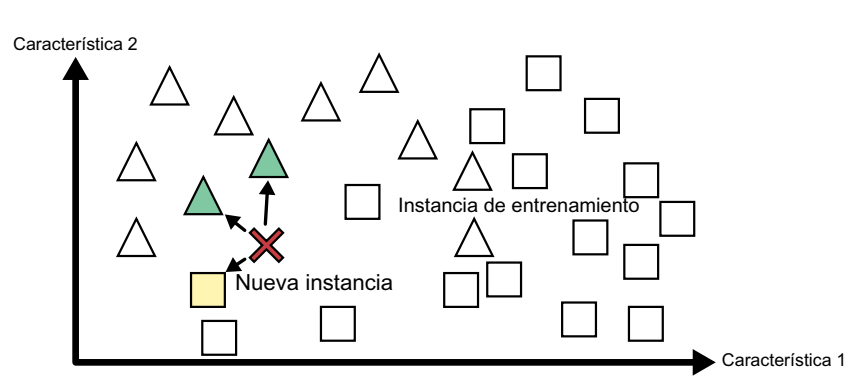

# Aprendizaje basado en instancias frente a aprendizaje basado en modelos
Otra manera de categorizar los sistemas de *machine learning* es fijarse en cómo generalizan. La mayoría de las tareas de *machine learning* tienen que ver con hacer predicciones. Eso significa que, si se le da a un sistema una cantidad de ejemplos de entrenamiento, este tiene que ser capaz de hacer buenas predicciones para (generalizar a) ejemplos que nunca ha visto antes. Tener una buena medida del rendimiento en los datos de entrenamiento está bien, pero no es suficiente; el verdadero objetivo es tener un buen rendimiento en instancias nuevas.

Hay dos enfoques principales para la generalización: el aprendizaje basado en instancias y el aprendizaje basado en modelos.

## Aprendizaje basado en instancias
Una forma de aprendizaje bastante sencilla implica la memorización pura y simple. Imaginemos que creamos un filtro de *spam* de esta manera: simplemente marcaría como spam cualquier correo electrónico idéntico a los que los usuarios previamente hayan señalado como *spam*. Si bien esta no es la peor solución, ciertamente no es la más efectiva.

En lugar de limitarse a marcar correos idénticos a los conocidos como *spam*, el filtro podría programarse para identificar también correos que compartan muchas similitudes con correos previamente etiquetados como *spam*. Para lograrlo, se requiere medir la similitud entre dos correos. Una medida de similitud bastante básica podría ser contar la cantidad de palabras en común. El sistema etiquetaría un correo como *spam* si comparte muchas palabras con un correo de *spam* previamente registrado.

Este enfoque se conoce como "aprendizaje basado en instancias". El sistema aprende ejemplos y los almacena en memoria, y luego generaliza para clasificar nuevos casos utilizando una medida de similitud que los compara con los ejemplos aprendidos (o un subconjunto de ellos). Por ejemplo, en la siguiente figura, la nueva instancia se clasificaría como un triángulo porque comparte una mayor similitud con ejemplos previos de esa clase.

## Aprendizaje basado en modelos
Otra forma de generalizar a partir de un conjunto de ejemplos es crear un modelo de esos ejemplos y, después, utilizarlo para hacer predicciones. Esto se denomina “aprendizaje basado en modelos”.

