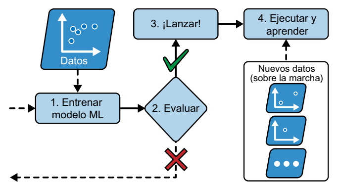

# Aprendizaje por lotes frente a aprendizaje *online*
Otro criterio utilizado para clasificar sistemas de *machine learning* es si el sistema puede o no aprender de manera gradual a partir de un flujo de datos entrantes.

## Aprendizaje por lotes
En el enfoque de aprendizaje por lotes, el sistema no tiene la capacidad de aprender de forma incremental; en su lugar, debe ser entrenado utilizando todos los datos disponibles. Por lo general, este proceso requiere un tiempo significativo y recursos computacionales considerables, por lo que suele realizarse de manera *offline*. Inicialmente, se entrena el sistema, y una vez completado este proceso, se pone en producción y ejecuta sin continuar aprendiendo; simplemente aplica lo que ha aprendido. A este método se le conoce como aprendizaje *offline*.

Sin embargo, uno de los desafíos del aprendizaje por lotes es que con el tiempo, el rendimiento del modelo tiende a decaer gradualmente debido a que el mundo sigue evolucionando mientras el modelo permanece estático. Este fenómeno se denomina "*data drift*" o deriva de datos. La solución a este problema implica reentrenar regularmente el modelo con datos actualizados. La frecuencia de reentrenamiento varía según el caso de uso: por ejemplo, si el modelo clasifica imágenes de gatos y perros, su rendimiento se deteriorará lentamente, mientras que en aplicaciones financieras, donde los datos cambian rápidamente, el deterioro puede ser más rápido.

Si deseamos que un sistema de aprendizaje por lotes se adapte a nuevos datos, como un nuevo tipo de correo no deseado, debemos entrenar una versión completamente nueva del sistema desde cero, utilizando el conjunto de datos completo (tanto los datos nuevos como los antiguos), y luego reemplazar la versión anterior. Afortunadamente, el proceso completo de entrenamiento, evaluación y lanzamiento de un sistema de aprendizaje automático puede automatizarse con relativa facilidad, lo que permite que incluso los sistemas de aprendizaje por lotes se adapten a los cambios. Solo debemos actualizar los datos y reentrenar el sistema con la frecuencia requerida.

Sin embargo, este enfoque presenta algunos desafíos. El proceso de entrenamiento en el conjunto de datos completo puede ser intensivo en cuanto a recursos, lo que implica un gasto significativo de recursos computacionales (CPU, memoria, espacio en disco, E/S de disco, E/S de red, etc.). Si los datos son abundantes y automatizamos el proceso de entrenamiento desde cero a diario, el costo puede ser considerable. En casos en los que la cantidad de datos es enorme, incluso puede resultar imposible utilizar un algoritmo de aprendizaje por lotes.

Por último, si nuestro sistema necesita aprender de manera continua y opera con recursos limitados, como una aplicación móvil o un rover en Marte, llevar grandes conjuntos de datos de entrenamiento y destinar una gran cantidad de recursos para entrenar durante varias horas al día puede ser un problema crítico. En estos casos, una opción más adecuada es utilizar algoritmos que sean capaces de aprender de forma incremental.

## Aprendizaje *online*
En el aprendizaje *online*, entrenamos el sistema de datos de forma gradual al introducir instancias de datos de manera secuencial, ya sea individualmente o en grupos pequeños llamados minilotes. Cada paso del aprendizaje es rápido y barato, así que el sistema puede aprender acerca de datos nuevos sobre la marcha, según llegan.

El enfoque de aprendizaje online resulta beneficioso para sistemas que requieren una rápida adaptación al cambio, como, por ejemplo, aquellos destinados a la detección de patrones emergentes en el mercado de valores. También se presenta como una excelente opción en situaciones en las que los recursos computacionales son limitados, como en el caso del entrenamiento de modelos en dispositivos móviles.

Además, los algoritmos de aprendizaje *online* permiten el entrenamiento de sistemas en conjuntos de datos de gran magnitud que no caben en la memoria principal de una máquina. Este enfoque se denomina aprendizaje "*out of core*" o "fuera del núcleo". El algoritmo carga una porción de los datos, realiza un paso de entrenamiento con esos datos y repite el proceso hasta que ha procesado todos los datos disponibles.

Un aspecto crucial en los sistemas de aprendizaje *online* es la velocidad con la que deben adaptarse a los datos cambiantes, lo que se conoce como la "tasa de aprendizaje". Si configuramos una tasa de aprendizaje alta, el sistema se ajustará rápidamente a los nuevos datos, pero también corre el riesgo de olvidar con rapidez los datos anteriores. Este último aspecto no es deseable, especialmente en casos como la detección de *spam*, donde no queremos que el sistema se centre solo en los tipos más recientes de spam que ha encontrado. Por otro lado, si optamos por una tasa de aprendizaje baja, el sistema aprenderá de manera más lenta, pero también será menos susceptible al ruido de los nuevos datos o a secuencias de datos atípicos.

Uno de los desafíos principales del aprendizaje *online* radica en la posibilidad de que, si se introducen datos de mala calidad en el sistema, su rendimiento pueda degradarse, posiblemente de manera significativa (esto depende de la calidad de los datos y de la tasa de aprendizaje). Esto es particularmente problemático en sistemas en funcionamiento, ya que los clientes pueden notar rápidamente el impacto negativo en su experiencia. Los datos de baja calidad pueden originarse a partir de fallas técnicas, como sensores defectuosos en un robot, o de intentos de manipulación del sistema, como el bombardeo de spam en un motor de búsqueda para aumentar su visibilidad en los resultados. Para mitigar este riesgo, es esencial monitorear de cerca el sistema y desactivar el aprendizaje de manera inmediata si se detecta una disminución en el rendimiento. También es importante establecer mecanismos de monitoreo de los datos de entrada y responder a las señales de datos anómalos, lo que puede lograrse mediante el uso de algoritmos de detección de anomalías.