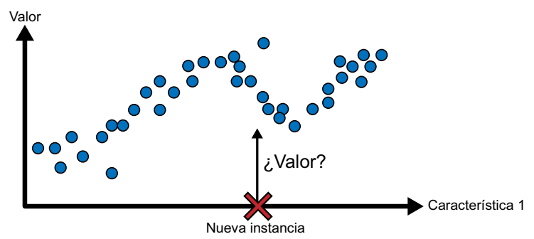
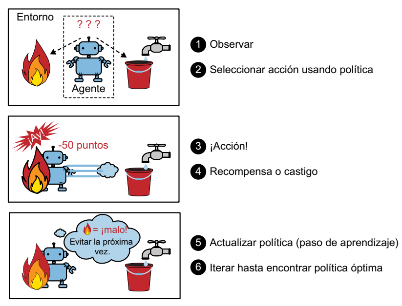

# Supervisión del entrenamiento
Los sistemas de *machine learning* pueden clasificarse según la cantidad y el tipo de supervisión que tengan durante el entrenamiento.
## Aprendizaje supervisado
En el aprendizaje supervisado, el conjunto de entrenamiento que introducimos en el algoritmo incluye las soluciones deseadas, denominadas “etiquetas”.

Una tarea común en el aprendizaje supervisado es la **clasificación**. Un ejemplo ilustrativo es el filtro de correo no deseado (*spam*): se entrena utilizando una gran cantidad de correos electrónicos de muestra junto con su categorización (*spam* o legítimo), y debe aprender a clasificar nuevos correos electrónicos.

Otra tarea frecuente implica predecir un valor numérico objetivo, como el precio de un automóvil, cuando se proporciona un conjunto de características (kilometraje, antigüedad, marca, etc.). Este tipo de tarea se conoce como **regresión**. Para entrenar el sistema en esta tarea, se le proporcionan numerosos ejemplos de automóviles, junto con sus características y sus respectivos objetivos (es decir, sus precios).

Es importante destacar que algunos modelos de regresión pueden utilizarse igualmente para la clasificación, y viceversa. Por ejemplo, la regresión logística suele emplearse en tareas de clasificación, ya que puede generar una salida que corresponde a la probabilidad de pertenecer a una clase específica (por ejemplo, un 20% de probabilidad de ser *spam*).

## Aprendizaje no supervisado
En el aprendizaje no supervisado, como podrás suponer, los datos de entrenamiento no están etiquetados. El sistema intenta aprender sin profesor.

Supongamos que disponemos de una gran cantidad de datos sobre los visitantes de nuestro blog. En este escenario, podemos aplicar un **algoritmo de agrupamiento** con el fin de detectar grupos de visitantes que tengan características similares. No es necesario proporcionar al algoritmo información sobre a qué grupo pertenece cada visitante, ya que el algoritmo descubrirá estas conexiones por sí mismo. Por ejemplo, podría identificar que el 40% de los visitantes son adolescentes amantes de los cómics que suelen leer el blog después de la escuela, mientras que el 20% son adultos aficionados a la ciencia ficción y visitan el blog durante los fines de semana. Utilizando un algoritmo de agrupamiento jerárquico, también podría subdividir estos grupos en subgrupos más pequeños. Esta información resulta útil para adaptar nuestras publicaciones a cada grupo de visitantes.

Los **algoritmos de visualización** son otro ejemplo de aprendizaje no supervisado. Al proporcionarles datos complejos y sin etiquetas, estos algoritmos generan representaciones 2D o 3D de los datos que se pueden visualizar fácilmente. Su objetivo principal es preservar la estructura de los datos tanto como sea posible, evitando que los grupos separados en el espacio de entrada se superpongan en la visualización. Esto nos permite comprender cómo se organizan los datos y, en ocasiones, identificar patrones que no habíamos percibido.

Una tarea relacionada es la **reducción de la dimensionalidad**, que busca simplificar los datos sin perder información esencial. Esto se logra fusionando características correlacionadas en una sola. Por ejemplo, el algoritmo de reducción de la dimensionalidad podría combinar el kilometraje y la edad de un automóvil en una sola característica que represente el desgaste del vehículo. A esto se le llama "extracción de características".

Otra tarea importante en el aprendizaje no supervisado es la **detección de anomalías**. Esto implica identificar eventos inusuales, como transacciones sospechosas en tarjetas de crédito para prevenir el fraude, detectar defectos en productos de fabricación o eliminar automáticamente valores atípicos de un conjunto de datos antes de utilizarlos en otros algoritmos de aprendizaje. Durante el entrenamiento, se presentan principalmente instancias normales al sistema, permitiéndole aprender a reconocerlas. Luego, cuando se le presenta una nueva instancia, puede determinar si es una instancia normal o si es probable que sea una anomalía. Una tarea relacionada es la **detección de novedades**, que busca identificar instancias nuevas que son significativamente diferentes de las del conjunto de entrenamiento. Para lograrlo, el conjunto de entrenamiento debe estar "limpio", es decir, libre de instancias que se consideren novedades.

Por último, otra tarea común en el aprendizaje no supervisado es el aprendizaje de **reglas de asociación**. Aquí, el objetivo es explorar grandes volúmenes de datos y descubrir relaciones interesantes entre los atributos. Por ejemplo, si gestionamos un supermercado, aplicar un algoritmo de reglas de asociación a los registros de ventas podría revelar que las personas que compran salsa barbacoa y patatas fritas suelen también adquirir bistecs. Esta información nos ayudaría a colocar estos productos cerca uno del otro en la tienda.

## Aprendizaje semisupervisado
Dado que etiquetar datos suele ser una tarea laboriosa y costosa, a menudo nos encontramos con un conjunto de datos que contiene muchas instancias sin etiquetar y solo algunas que están etiquetadas. En este escenario, se emplea lo que se conoce como aprendizaje semisupervisado.

Un ejemplo destacado de esto lo encontramos en algunos servicios de almacenamiento de fotos, como Google Fotos. Cuando subimos nuestras fotos familiares a este servicio, se lleva a cabo automáticamente el reconocimiento de personas. El sistema identifica que una persona (A) aparece en las fotos 1, 5 y 11, mientras que otra persona (B) aparece en las fotos 2, 5 y 7. Esta es la parte no supervisada del algoritmo, que se encarga del agrupamiento. Lo único que necesitamos hacer es proporcionar etiquetas para identificar a esas personas. Basta con asignar una etiqueta a cada individuo, y el sistema será capaz de etiquetar a todos en todas las fotos, lo que resulta muy conveniente para realizar búsquedas de imágenes.

La mayoría de los algoritmos de aprendizaje semisupervisado son combinaciones de técnicas no supervisadas y supervisadas. Por ejemplo, se puede emplear un algoritmo de agrupamiento para agrupar instancias similares y, posteriormente, asignar a cada instancia no etiquetada la etiqueta más común de su grupo. Una vez que se ha etiquetado todo el conjunto de datos, es posible utilizar cualquier algoritmo de aprendizaje supervisado.

## Aprendizaje por refuerzo
El aprendizaje por refuerzo representa un enfoque completamente distinto. En este contexto, el sistema de aprendizaje, conocido como "agente", tiene la capacidad de observar su entorno, tomar decisiones y llevar a cabo acciones, y a cambio recibe "recompensas" (o, en algunos casos, castigos en forma de recompensas negativas). El agente debe aprender de manera autónoma cuál es la estrategia óptima, conocida como "política", que le permitirá obtener la máxima recompensa a lo largo del tiempo. La política define qué acción debe seleccionar el agente cuando se encuentra en una situación particular.

Un ejemplo destacado de esto es la implementación del aprendizaje por refuerzo en muchos robots que buscan aprender a caminar. El programa AlphaGo de DeepMind también representa un excelente ejemplo de aprendizaje por refuerzo. Este programa saltó a la fama en mayo de 2017 al derrotar a Ke Jie, quien en ese momento era el número uno del mundo en el juego de go. AlphaGo desarrolló su política ganadora al analizar millones de partidas y luego jugar numerosas partidas contra sí mismo. Es importante señalar que durante las partidas contra el campeón, el aprendizaje estaba desactivado; AlphaGo simplemente aplicaba la política que había aprendido. Como veremos más adelante, este enfoque se conoce como aprendizaje *offline*.