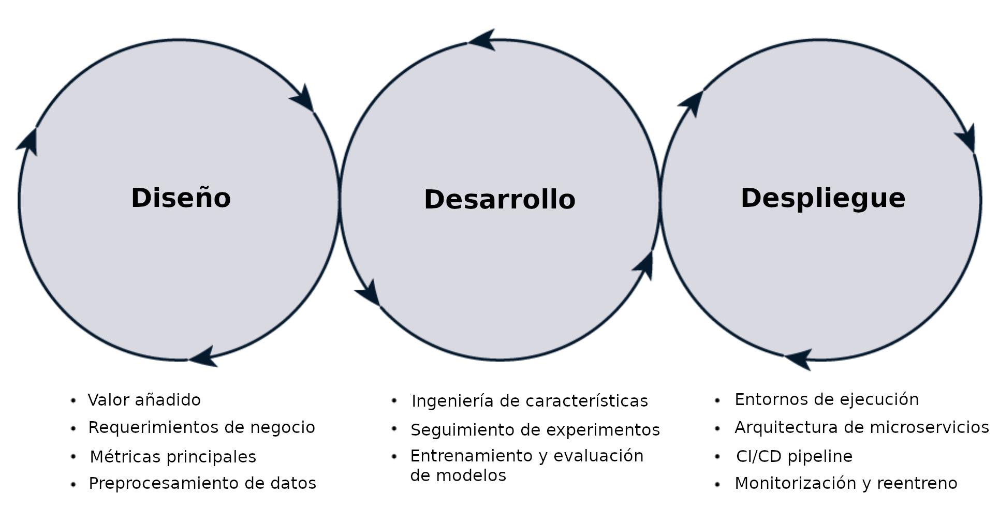

# Ciclo de vida de MLOps
El ciclo de vida del aprendizaje automático es uno de los conceptos fundamentales en MLOps. Consta de tres fases amplias: **diseño**, **desarrollo** e **implementación**. Este es un proceso iterativo y cíclico en el que no es raro ir y venir entre fases. Es importante dedicar tiempo a cada fase, ya que todas desempeñan un papel importante en el ciclo de vida completo. Durante cada fase, es importante evaluar constantemente con las partes interesadas si el proyecto de aprendizaje automático debe continuar. Podría ser que descubramos durante la fase de diseño que solo tenemos datos limitados o que solo podemos aplicar el problema a un grupo pequeño. Esto reduce el valor añadido y, por tanto, requiere una evaluación adicional por parte de las partes interesadas.

La siguiente imagen muestra las tareas que se realizan en cada una de las fases que componen el ciclo de vida MLOps. 

<figure style="align: center;">
    
    <figcaption>Fases de MLOps</figcaption>
</figure>

