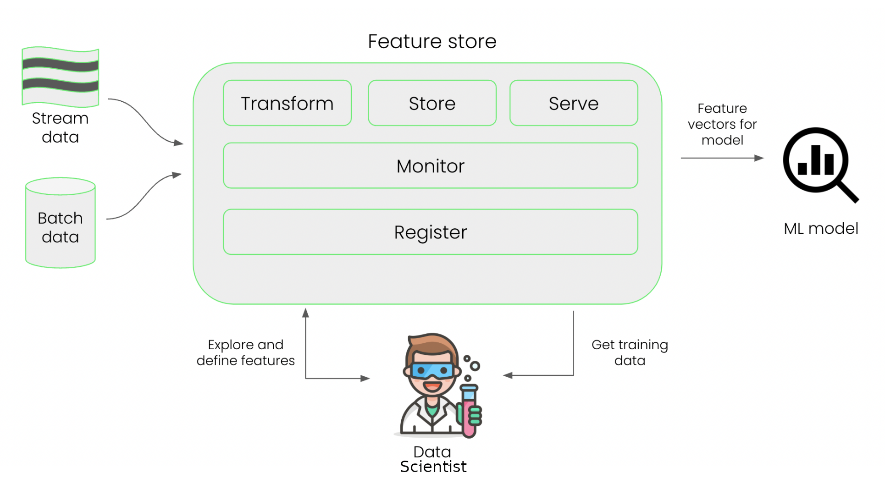

# Fase de desarrollo
En la fase de desarrollo, nos centramos en desarrollar el modelo de aprendizaje automático. Hacemos esto experimentando con una combinación de datos, algoritmos e hiperparámetros de acuerdo con el diseño de implementación. Durante el experimento, entrenamos y evaluamos uno o más modelos para encontrar el más adecuado. El objetivo de la fase de desarrollo es terminar con el modelo de aprendizaje automático más adecuado y listo para su implementación.

## Ingeniería de características
La ingeniería de características es el proceso de seleccionar, manipular y transformar datos sin procesar en características. Una característica es una variable, como una columna de una tabla. La forma en que creamos características a partir de los datos es una parte importante del desarrollo del aprendizaje automático. Podemos usar las características tal como aparecen en los datos sin procesar, pero también podemos crear las nuestras propias. Por ejemplo, a partir de las características *número de pedidos* y *total de gasto*, para un cliente dado, podríamos obtener una nueva característica que fuese su *media de gasto*.

Un punto importante en la ingeniería de características es cuándo continuar con este proceso o cuándo detenerlo. Realizar una ingeniería de características integral puede producir un modelo muy preciso o lograr más estabilidad. Sin embargo, realizar una ingeniería integral de características también tiene un coste, lo que puede afectar el éxito de nuestro proyecto de aprendizaje automático. Más características pueden ser más costosas, ya que esto puede requerir costosos pasos de preprocesamiento. Más características también requieren más mantenimiento. Y, por último, más funccaracterísticas también pueden generar ruido o ingeniería excesiva.

### Almacén de características
Un **almacén de características** (*feature store*) es un sistema centralizado donde se pueden administrar las características. Al utilizar un almacén de características, un científico de datos puede encontrar las características adecuadas para su proyecto, definir nuevas características y utilizarlas para entrenar el modelo. También es el lugar donde se pueden monitorear las características. Al mismo tiempo, al utilizar un almacén de características, nos aseguramos de que las características estén listas para usarse como entrada para el modelo de aprendizaje automático en producción cuando lleguen nuevas muestras.

<figure style="align: center;">
    
    <figcaption>Almacén de características</figcaption>
</figure>

No es obligatorio utilizar una tienda de características al desarrollar un modelo de aprendizaje automático. En algunos casos, puede resultar redundante utilizar una tienda de características. Los factores a considerar cuando se decide utilizar una tienda de características son el coste computacional de las características. A veces, las características estarán listas como entrada para el modelo de aprendizaje automático tal como están. El uso de una tienda de características también depende de la cantidad de proyectos que tengamos. Las respuestas a estas preguntas determinarán si el desarrollo actual del aprendizaje automático se beneficia de una tienda de características o no.

## Seguimiento de experimentos
Parte del desarrollo del modelo de aprendizaje automático consiste en realizar experimentos de aprendizaje automático. En un experimento de aprendizaje automático, entrenamos y evaluamos múltiples modelos de aprendizaje automático para encontrar el mejor. Como en cualquier experimento, probamos diferentes configuraciones para ver cuál funciona mejor.

Durante los experimentos de aprendizaje automático, podemos configurar diferentes modelos de aprendizaje automático, por ejemplo, regresión lineal o redes neuronales profundas. Podemos alterar los hiperparámetros del modelo, como el número de capas en una red neuronal. Podríamos utilizar diferentes versiones de los datos y diferentes scripts para ejecutar el experimento. También podemos usar diferentes archivos de configuración de entorno por experimento, como qué versión de Python o R se usa y qué bibliotecas. Al alterar cada uno de estos factores durante los experimentos, la cantidad de configuraciones diferentes puede volverse enorme. Cada experimento también tiene un resultado diferente. Por eso es una buena idea realizar un seguimiento de las configuraciones y los resultados de cada experimento.

Además de rastrear todas las diferentes configuraciones de experimentos, el seguimiento de experimentos puede ayudar a comparar y evaluar experimentos, reproducir resultados de experimentos anteriores, colaborar con desarrolladores y partes interesadas e informar sobre los resultados a las partes interesadas.

Dependiendo de la madurez de nuestro desarrollo de aprendizaje automático, existen diferentes opciones para realizar un seguimiento de los experimentos. Podríamos empezar utilizando una hoja de cálculo en Excel, donde anotamos los detalles de cada experimento en cada fila. Si hacemos muchos experimentos, esto requerirá mucho trabajo manual. También podríamos crear nuestra propia plataforma de experimentos que rastree automáticamente el experimento durante el entrenamiento del modelo. Tener nuestra propia plataforma nos permite crear una solución personalizada para nuestro proceso específico. Sin embargo, esto puede costar tiempo y esfuerzo. Esto se puede resolver mediante el uso de herramientas modernas de seguimiento de experimentos, ya que están diseñadas para la mayoría de los casos de uso de seguimiento de experimentos. El coste económico de utilizar estas herramientas puede puede ser elevado. 

## Entrenamiento y evaluación de modelos
Durante la fase de desarrollo, los científicos de datos utilizaron datos de entrenamiento para desarrollar un modelo de aprendizaje automático.

El desarrollo se lleva a cabo en el entorno de desarrollo, que suele ser el ordenador local de un científico de datos o un ordenador virtual que se puede controlar de forma remota, por ejemplo, en la nube.