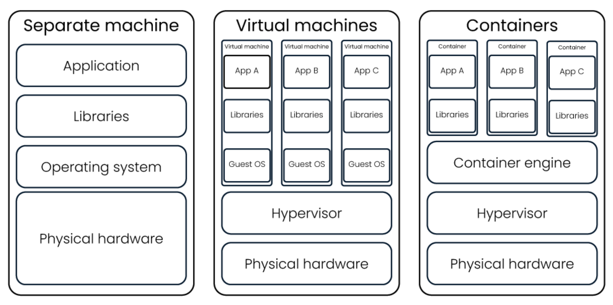
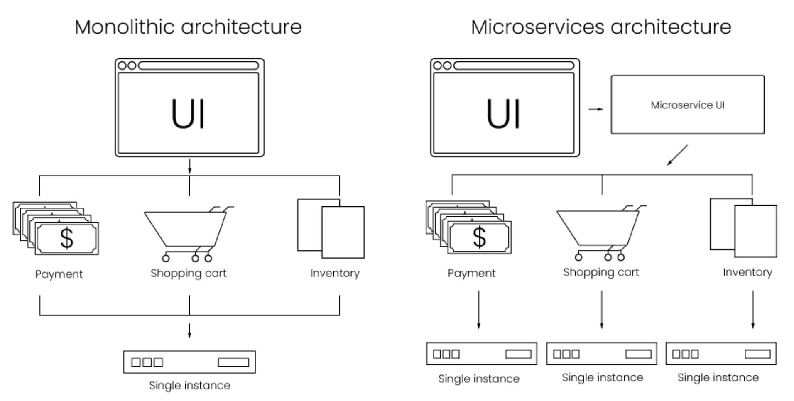
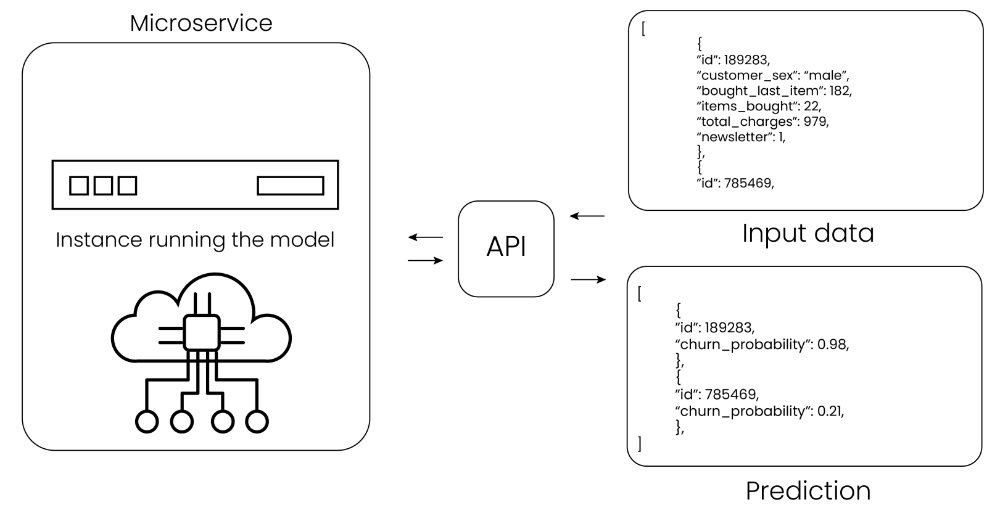
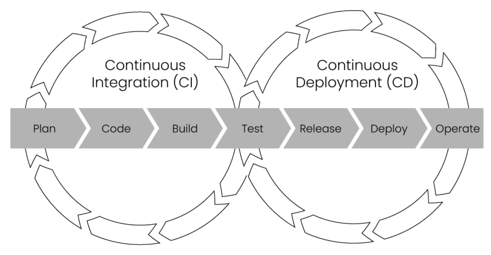
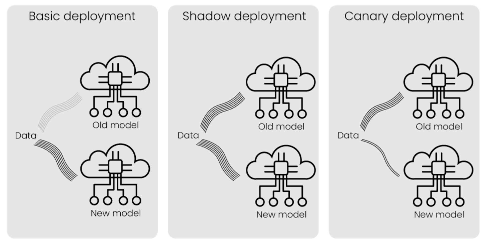

# Fase de despliegue
En la fase de despliegue, integramos el modelo de aprendizaje automático que desarrollamos anteriormente en el proceso comercial. Esto podría implicar la creación de un microservicio a partir del modelo de aprendizaje automático. Un microservicio es una pequeña aplicación que incluye el modelo de aprendizaje automático de modo que podamos integrarlo fácilmente en el proceso de negocio. También pretendemos establecer un seguimiento del modelo de aprendizaje automático. Podemos configurar alertas cuando encontremos una desviación de datos o cuando nuestro modelo ya no genere una predicción. La deriva de datos ocurre cuando nuestros datos cambian, lo que afecta el modelo de aprendizaje automático.

## Entornos de producción
Una vez que se desarrolla el modelo de aprendizaje automático, debemos trasladarlo al entorno de producción. En el entorno de producción, el modelo de aprendizaje automático hará predicciones basadas en datos entrantes reales. Una vez implementado, el modelo está activo y creará un impacto empresarial real.

Sin embargo, implementar un modelo en el entorno de producción no es tan sencillo porque están configurados en diferentes entornos de ejecución respecto a los utilizados en la fase de desarrollo. En un entorno de ejecución de desarrollo, podemos usar diferentes versiones de Python y de ciertas librerías. Esto puede causar problemas ya que es posible que el mismo código no funcione en diferentes entornos de ejecución o produzca resultados diferentes.

Para mitigar el hecho de tener diferentes entornos, podemos utilizar **máquinas separadas** pero configuradas de forma idéntica. Esto es similar a utilizar una computadora normal, con su hardware físico, el sistema operativo, las librerías y la aplicación. Las librerías y la aplicación contienen el entorno de producción y el modelo de aprendizaje automático. Esta es una solución sencilla, pero difícil de mantener y no escalable. Con cada actualización, tenemos que actualizar toda la máquina.

También podemos usar una o más **máquinas virtuales** en una máquina separada. Cada máquina virtual es como una versión virtual de una computadora física normal con un sistema operativo, librerías y la aplicación. Una computadora que ejecuta máquinas virtuales tiene un hipervisor. Esto ayuda a distribuir los recursos, el hardware de la computadora, entre diferentes máquinas virtuales. Esto es más fácil de mantener pero requiere muchos recursos, porque necesitamos una computadora virtual para cada aplicación.

Por último, podríamos usar **contenedores**. Esto nos permite ejecutar múltiples aplicaciones en una máquina. Los contenedores utilizan menos recursos que una máquina virtual y son más portátiles que las aplicaciones en una máquina virtual. Pueden verse como una versión más ligera de una máquina virtual. La implementación del modelo de aprendizaje automático como contenedor es actualmente el estándar para MLOps. 

<figure style="align: center;">
    
    <figcaption>Entornos de producción</figcaption>
</figure>

El uso de contenedores proporciona numerosos beneficios. En primer lugar, son más fáciles de mantener. En segundo lugar, los contenedores son muy portátiles, ya que sólo tenemos que construirlos una vez y luego podemos ejecutarlos en cualquier lugar. Por último, los contenedores se inician rápidamente, ya que solo contienen la aplicación requerida y no un hipervisor o un sistema operativo virtualizado, como necesitaríamos en una máquina virtual o separada. Sin embargo, estos beneficios no significan que cada aplicación deba implementarse como un contenedor. Si la aplicación ha funcionado bien en una máquina virtual y no sufre problemas de diferentes entornos, es posible no utilizar contenedores.

## Arquitectura de microservicios
Una vez que nos hayamos ocupado de los diferentes entornos de producción, debemos pensar en cómo implementar el modelo de aprendizaje automático. Esto también implica que debemos pensar en cómo configuramos la arquitectura.

Imaginemos que tenemos una tienda web con un servicio de pago, un servicio para el carrito de compras y un servicio para el inventario. Podemos ejecutar cada servicio en el mismo ordenador. En el desarrollo de software tradicional, las aplicaciones a menudo se creaban en una **arquitectura monolítica**. Esto significa que despliega como una única aplicación que incluye todos los servicios.

Una aproximación diferente es utilizar una **arquitectura de microservicios**. La arquitectura de microservicios es, a diferencia de la arquitectura monolítica, una colección de servicios más pequeños que se pueden implementar de forma independiente.

Si una aplicación falla en una arquitectura de microservicios, solo falla el servicio por separado, mientras que en una arquitectura monolítica, fallará toda la aplicación. Una aplicación monolítica puede volverse compleja ya que todos los servicios están entrelazados y no son independientes. Esto también hace que sea más difícil escalar. El uso de una arquitectura de microservicios depende de la aplicación. Si nuestra aplicación es muy pequeña, tener un microservicio separado para cada parte puede resultar costoso porque cada servicio requiere potencia de cálculo y debe mantenerse de forma independiente.

<figure style="align: center;">
    
    <figcaption>Arquitectura molítica vs Arquitectura de microservicios</figcaption>
</figure>

Una práctica común es implementar el modelo de aprendizaje automático como un microservicio. Esto nos permite utilizar el modelo de aprendizaje automático para hacer predicciones basadas en datos nuevos e invisibles. Este proceso también se llama **inferencia**. Es el proceso en el que enviamos nuevos datos de entrada, por ejemplo, los datos de entrada de un cliente, para los cuales el modelo de aprendizaje automático inferirá un resultado. En este caso, el resultado es una predicción que contiene la probabilidad de que un cliente abandone.

Para proporcionar comunicación entre microservicios, se utiliza una interfaz de programación de aplicaciones (o API). Una API es un conjunto de combinaciones de entrada y salida predefinidas que permite que diferentes servicios se comuniquen.

<figure style="align: center;">
    
    <figcaption>Inferencia</figcaption>
</figure>

Una vez que el modelo se ha implementado como un microservicio y la API nos permite inferir el modelo, se requiere un último paso. El último paso es **integrar** el modelo dentro del proceso de negocio. Esto es diferente para cada negocio, pero la mayoría de las veces implica conectar la API con el sistema que ya está implementado. Antes de utilizar el modelo de aprendizaje automático en producción, es una práctica común probar primero el modelo con una muestra de los datos para asegurarnos de que todo funcione como se esperaba.

## CI/CD pipeline
El uso de procesos de **integración continua y desarrollo continuo** (o **CI/CD**) es un concepto importante dentro del desarrollo de software. CI/CD se originó en DevOps y se centra en automatizar la implementación de código. Es una serie de pasos para desarrollar, probar e implementar el código. Al utilizar una ***pipeline* CI/CD**, los desarrolladores de software pueden realizar fácilmente cambios incrementales y luego impulsar estos cambios al entorno de producción. Estos mismos principios se pueden aplicar al desarrollo e implementación de código para modelos de aprendizaje automático.

La **integración continua** es la práctica en la que los cambios de código se integran continuamente de forma rápida y frecuente. Cada cambio se prueba automáticamente cuando se confirman y fusionan. De esta manera, podemos identificar errores y fallos fácilmente y asegurarnos de que muchos desarrolladores puedan trabajar juntos en el mismo código.

El **desarrollo continuo** funciona junto con la integración continua al automatizar la publicación del código que se validó durante el proceso de integración continua. El objetivo de la práctica del desarrollo continuo es tener siempre código listo para producción.

Configurar una pipeline de CI/CD puede resultar tedioso al principio, pero puede acelerar enormemente el proceso de implementación.

<figure style="align: center;">
    
    <figcaption>CI/CD pipeline</figcaption>
</figure>

### Estrategias de despliegue
Una vez que un modelo de aprendizaje automático está listo para implementarse, podemos elegir diferentes estrategias de despliegue. Cada estrategia tiene una forma diferente de reemplazar el antiguo modelo de aprendizaje automático por el nuevo modelo de aprendizaje automático. Analizaremos tres estrategias de despliegue: implementación básica, paralela y canary.

En una estrategia de **despliegue básico** (*basic deployment*), simplemente reemplazamos el modelo antiguo con el nuevo modelo en producción. Todos los datos de entrada nuevos se enviarán al nuevo modelo en lugar del modelo anterior.

En el **despliegue en paralelo** (*shadow deployment*), enviamos nuevos datos tanto al modelo nuevo como al modelo anterior. Todavía utilizamos el modelo antiguo en producción. Se probará el resultado de ambos modelos para garantizar que el nuevo modelo funcione como se espera.

Al utilizar el **despliegue canary** (*canary deployment*), utilizamos el nuevo modelo en producción, pero solo para una pequeña parte de los nuevos datos entrantes. De esta manera, utilizamos el nuevo modelo de inmediato, pero en caso de que falle, solo un pequeño número de usuarios se verá afectado.

La implementación básica es la más fácil de implementar y utiliza la menor cantidad de recursos porque el nuevo modelo reemplaza completamente al anterior. Esto conlleva un alto riesgo en caso de que el modelo no funcione como se esperaba. La implementación paralela es similar en términos de implementación, pero utiliza más recursos ya que ejecutamos completamente ambos modelos en lugar de reemplazar uno por el otro. No hay riesgo cuando el modelo no funciona como se esperaba. La implementación canary es un poco más difícil de implementar pero utiliza menos recursos que tener dos modelos completamente implementados. Sin embargo, el riesgo es ligeramente mayor cuando el nuevo modelo no funciona como se esperaba.

<figure style="align: center;">
    
    <figcaption>Estrategias de despliegue</figcaption>
</figure>

## Monitorización y reentreno
La monitorización y el reentrenamiento de los modelos de aprendizaje automático es la última parte de la fase de despliegue.

### Monitorización del modelo
Podemos monitorizar el modelo observando los datos de entrada y la salida del modelo, sus predicciones. A esto se le llama **monitorización estadística**. Por ejemplo, podríamos monitorizar la probabilidad prevista de que un cliente se de de baja de nuestro servicio.

También podemos analizar métricas más técnicas del modelo. A esto se le llama **monitorización computacional**. Podría ser la cantidad de solicitudes entrantes que se realizan, el uso de red o la cantidad de recursos que utiliza un servidor para mantener el modelo en ejecución.

Posteriormente, descubriremos si ese cliente realmente se ha dado de baja de nuestro servicio. De esta manera podemos averiguar si el modelo funciona como se esperaba o si la calidad del modelo se deterioró con el tiempo. Este ciclo en el que comparamos el resultado del modelo con la verdad fundamental se llama **ciclo de retroalimentación**. El circuito de retroalimentación es una parte crucial para mejorar el modelo de aprendizaje automático. Utilizando el circuito de retroalimentación, podemos descubrir cuándo y por qué el modelo estaba equivocado. Podríamos, por ejemplo, ver que el modelo hace una predicción errónea para grupos de clientes concretos.

### Reentreno del modelo
Algo inherente a los datos es que estos cambian con el tiempo. Es un hecho que el mundo está cambiando y, dado que nuestro modelo de aprendizaje automático depende de los datos, estos cambios también afectan el modelo. Esta es también la razón por la que un modelo podría necesitar reentrenamiento. Con el reentrenamiento utilizamos nuevos datos para desarrollar una nueva versión del modelo de aprendizaje automático, de modo que aprenda y se ajuste a nuevos patrones.

La frecuencia con la que se debe volver a entrenar depende de varios factores. El primero es el entorno empresarial. Un entorno empresarial puede estar más sujeto a cambios que otros. En segundo lugar, la frecuencia con la que se debe volver a reentrenar también depende del coste de este. Entrenar un modelo requiere recursos. Dependiendo de la complejidad del modelo, el reentreno requiere más recursos y, por tanto, más dinero. Por último, los requisitos comerciales influyen en la frecuencia con la que se vuelve a entrenar el modelo. Si se requiere que el modelo tenga siempre una precisión superior al 90% y un pequeño cambio en los datos hace que la precisión disminuya por debajo de ese umbral, será necesario volver a entrenar el modelo con más frecuencia. La rapidez con la que disminuye la precisión del modelo también se denomina **degradación del modelo**.

Cuando volvemos a entrenar, se obtiene un nuevo modelo utilizando nuevos datos. Podríamos usar un modelo que solo use datos nuevos, de modo que haya un modelo separado entrenado con datos antiguos y un modelo entrenado con datos nuevos. También podríamos combinar datos nuevos y antiguos para desarrollar un nuevo modelo. Esto también dependerá del dominio, el coste y el rendimiento del modelo requerido.

Dependiendo de la madurez del aprendizaje automático dentro de la empresa, también podríamos aplicar un reentrenamiento automático una vez que se detecte cambios en los datos. Por ejemplo, cuando detectamos que la edad media de los clientes está cambiando.