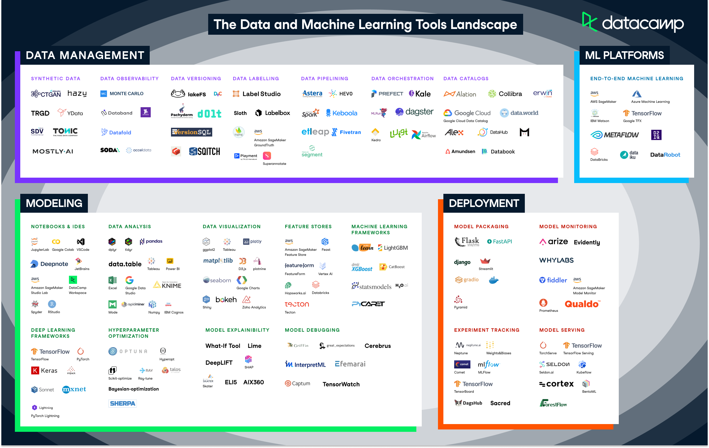

# Herramientas
Desde la aparición de MLOps, se han desarrollado muchas herramientas que pueden mejorar la eficiencia y confiabilidad de los procesos de aprendizaje automático. Algunas de estas herramientas son de código abierto.

Para el almacén de características, hay varias herramientas disponibles, como **Feast** y **Hopsworks**. Feast es una almacén de características de código abierto. Feast es una almacén de características autoadministrada, lo que significa que tenemos que administrarla nosotros mismos, lo que requiere más trabajo pero también proporciona más flexibilidad en comparación con otras almacenes de características. Hopsworks también es una almacén de características de código abierto, que forma parte de la plataforma más grande Hopsworks. 

Para el seguimiento de experimentos, podemos utilizar **MLFlow**, **ClearML** y **Weights and Biases**, entre otros. MLFlow y ClearML ofrecen herramientas para el ciclo de vida del aprendizaje automático, incluido el seguimiento de experimentos. MLFlow se especializa en el desarrollo de aprendizaje automático, mientras que ClearML también proporciona herramientas para implementar modelos. Weights and Biases se centra principalmente en rastrear y visualizar los resultados de los experimentos.

Para la contenedorización, **Docker** es la herramienta más popular para contener una aplicación. **Kubernetes** se utiliza para ejecutar la aplicación en contenedores, lo que permite la implementación y escalabilidad automáticas. Además de estas herramientas de código abierto, los proveedores de nube **AWS**, **Azure** y **Google Cloud** también ofrecen sus propias herramientas para ejecutar aplicaciones en contenedores.

Para proporcionar CI/CD pipelines existen herramientas como **Jenkins** y **GitLab**. Jenkins es una herramienta de CI/CD de código abierto, mientras que GitLab no lo es. Ambas herramientas permiten a los desarrolladores trabajar juntos en el código utilizando un repositorio. Para cada proyecto, suele haber un repositorio independiente, que podemos ver como un directorio que contiene todo el código del proyecto.

Existe una amplia gama de herramientas para monitorear proyectos de aprendizaje automático. Podemos distinguir herramientas que se centran en el seguimiento del modelo de aprendizaje automático y herramientas que monitorean los datos. Tanto **Fiddler** como **Great Expectations** proporcionan herramientas de monitorización. Fiddler se centra en el rendimiento del modelo, por ejemplo, qué tan bien están funcionando las predicciones de nuestro modelo. Great Expectations se centra en la monitorización de datos, por ejemplo, cuántos datos faltan en una determinada columna.

También hay herramientas disponibles que proporcionan una plataforma completa del ciclo de vida del aprendizaje automático. Cada proveedor de nube, AWS, Azure y Google, tiene uno. Se llaman **AWS Sagemaker**, **Azure Machine Learning** y **Google Cloud AI Platform**. Las herramientas que abarcan todo el ciclo de vida del aprendizaje automático proporcionan herramientas para cada tarea del ciclo de vida. Esta podría ser una herramienta para realizar exploración y procesamiento de datos, pero también un almacén de características y una herramienta de capacitación de modelos.

<figure style="align: center;">
    
    <figcaption>Herramientas MLOps</figcaption>
</figure>