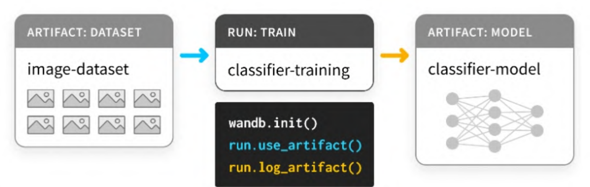
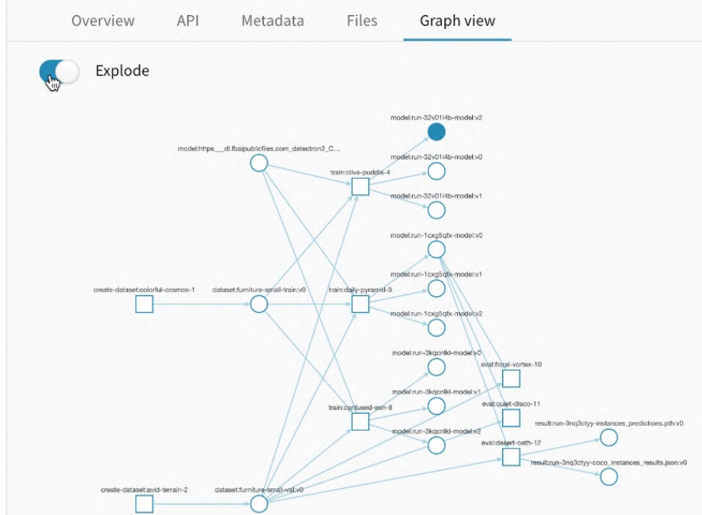
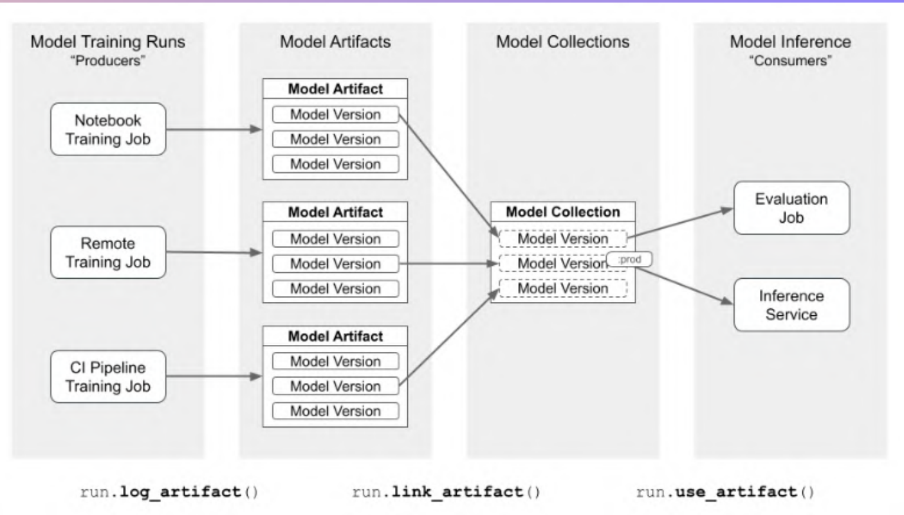
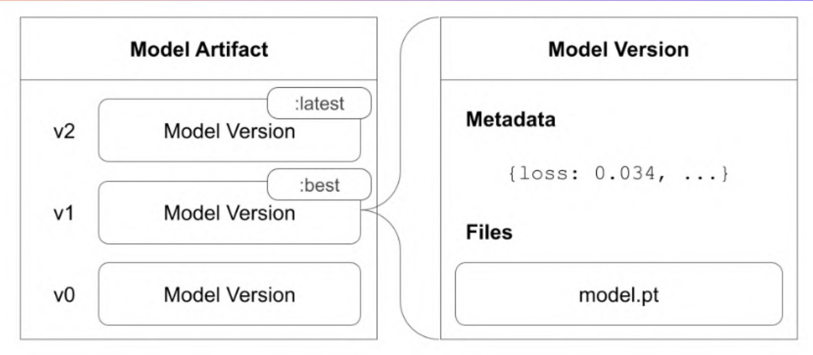

# Weight & Biases
Es una herramienta de MLOps con la que podemos:

* Realizar el seguimiento de nuestros experimentos en tiempo real.
* Versionar conjuntos de datos y modelos.
* Ajustar hiperparámetros de forma eficiente.
* Reproducir el entrenamiento de un modelo.
* Visualizar resultados.
* Crear informes y colaborar con otros ingenieros.

## Artifacts
Los Artifacts son los objetos que nos permiten hacer un seguimiento de los conjuntos de datos, modelos, dependencias y resultados en cada paso en nuestra pipeline.
En W&B, los artifacts pueden ser:

* Una entrada de una run o experimento
* Una salida de esa run o experimento

<figure style="align: center;">
    
    <figcaption>Artifacts</figcaption>
</figure>

W&B combina los artifacts con las runs para crear un *Directed Acyclic Graph* **DAG** automáticamente, de forma que la salida de un run puede ser la entrada de otra. La plataforma nos permite visualizar este gráfico y ver todas las relaciones entre nuestro experimentos, datasets, etc. en nuestro proyecto.

<figure style="align: center;">
    
    <figcaption>DAG</figcaption>
</figure>

Podemos pensar que un artifact es el equivalente a un directorio de datos. Cada vez que se modifica el contenido de este directorio automáticamente se crea una nueva versión de este artifact. De esta forma, podemos volver a una versión anterior si fuera necesario. El funcionamiento sería similar a un sistema de control de versiones, como git.

## Model registry
El **model registry** de W&B es un sistema central donde podemos guardar nuestros mejores modelos. Podemos:
* Versionar modelos para una tarea, catalogar cambios y comparar los modelos
* Documentar y reproducir la pipeline de entrenamiento y evaluación.
* Gestionar el proceso desde que el modelo pasa por el entrenamiento a staging y finalmente a producción.
  
Un **model artifact** está compuesto por una secuencia de versiones de un modelo. Cada **versión de un modelo** es un paquete de datos y metadatos que lo describe. Un **modelo registrado** es una selección de versiones de modelos conectados que normalmente representa todos los modelos candidatos a una tarea.

<figure style="align: center;">
    
    <figcaption>Model artifact</figcaption>
</figure>

<figure style="align: center;">
    
    <figcaption>Model artifact</figcaption>
</figure>

Podemos acceder al modelo registrado como si de un artifact se tratara. También hace de **colección** donde cada versión de un
modelo registrado es un enlace a una versión de un modelo que pertenece a un artifact del mismo tipo. Una versión de un modelo
puede vincularse a cualquier número de modelos registrados.

<figure style="align: center;">
    
    <figcaption>Model registry</figcaption>
</figure>

La separación de artifacts y modelos registrados permite producir un gran número de artefactos durante nuestros experimentos y únicamente seleccionar los mejores modelos y vincularlos al modelo registrado. De esta manera se mejora la colaboración y la gestión de modelos.