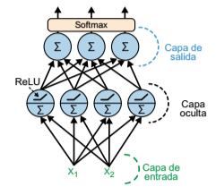

# Redes neuronales multicapa de clasificación
Las RNM pueden ser utilizarse para tareas de clasificación. Para un problema de clasificación binaria, solo necesitamos una neurona de salida con la función de activación sigmoide: la salida será un número entre 0 y 1, que podemos interpretar como la probabilidad estimada de la clase positiva. La probabilidad estimada de clase negativa es igual a uno menos ese número.

Las RNM también pueden manejar con facilidad tareas de clasificación binaria multietiqueta. Por ejemplo, podríamos tener un sistema de clasificación de correo que prediga si cada mensaje es "bueno" o es *spam*, y al mismo tiempo prediga si es un correo urgente o no. En este caso, necesitaríamos dos neuronas de salida, ambas con la función de activación sigmoide: la salida de la primera sería la probabilidad de que el correo sea *spam*, y la de la segunda si es urgente. Hablando en términos generales, decicaríamos una neurona de salida a cada clase positiva. En este caso la suma de las probabilidades de salida no suman necesariamente 1. Esto permite al modelo producir cualquier combinación de etiquetas: correo no urgente, correo urgente, *spam* no urgente e incluso *spam* urgente (aunque seguramente sería un error).

Si cada instancia puede pertenecer solo a una clase de tres o más clases posibles (por ejemplo, de 0 a 9 para clasificación de imágenes de dígitos), necesitaremos tener una neurona de salida por clase y deberíamos usar la función de activación **softmax** para la capa de salida completa. La función de softmax garantizará que todas las probabilidades estimadas estén entre 0 y 1 y que sumen 1, ya que las clases son exclusivas.

<figure style="align: center;">
    
    <figcaption>Red neuronal multicapa moderna (que incluye ReLU y softmax) para clasificación</figcaption>
</figure>

En cuanto a la función de pérdida, puesto que estamos prediciendo distribuciones de probabilidad, la **pérdida de entropía cruzada** (también llamada pérdida logística) suele ser una buena opción.

La siguiente tabla resume la arquitectura típica de una RNM de clasificación.

| Hiperparámetro | Clasificación binaria | Clasificación binaria multietiqueta | Clasificación multiclase |
| -------------- | --------------------- | ----------------------------------- | ------------------------ |
| Nº de neuronas de salida | 1 | 1 por etiqueta binaria | 1 por clase |
| Función de activación de salida | Sigmoide | Sigmoide | Softmax |
| Función de pérdida | Entropía cruzada | Entropía cruzada | Entropía cruzada |