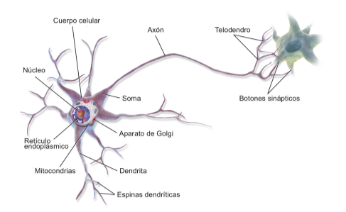

--- 
title: Redes Neuronales
summary: Fundamentos y evolución de las redes neuronales.
authors:
    - Reproducción autorizada
    - Jose Robledano
date: 2026-02-11
---
# Introducción a las redes neuronales artificiales
## Concepto de red neuronal artificial
Una red neuronal artificial (RNA) imita el comportamiento de las neuronas biológicas. Las neuronas biológicas son células nerviosas del cerebro interconectadas que participan en el procesamiento y en la transmisión de señales químicas y eléctricas.

<figure style="align: center;">
    
    <figcaption>Neurona biológica</figcaption>
</figure>

Warren McCulloch y Walter Pitts describieron en 1943 una célula nerviosa de este tipo como una simple puerta lógica con salidas binarias; a las dentritas llegan múltiples señales, que se integran en el cuerpo celular y, si la señal acumulada supera un determinado umbral, se genera una señal de salida que será transmitida por el axón.

!!! alert "Neuronas sintéticas"
    
    Este modelo permitía ser aplicado a una neurona artificial. 
    McCulloch y Pitts demostraron que incluso con un modelo simplificado es posible construir una red de neuronas artificiales que pueda calcular cualquier proposición lógica. 
    
    En el contexto del *aprendizaje supervisado* y de la clasificación, se podría utilizar para pronosticar si un nuevo punto de datos pertenece a una clase o a otra (dependiendo si se activa o no una neurona).

