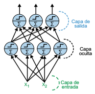
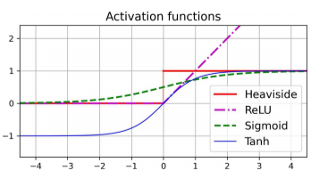

# Redes neuronales multicapa
## Perceptrón multicapa
Las limitaciones de los perceptrones se pueden eliminar apilando varios. La RNA resultante es un perceptrón multicapa (PMC).

Un PMC consta de una capa de entrada, una o varias capas de ULU, llamadas **capas ocultas**, y una última capa de ULU, que es la capa de salida. Las capas cercanas a la de entrada suelen llamarse **capas inferiores**, y la más próximas a la de salida, **capas superiores**. Cada entrada correspondería a una característica de nuestro conjunto de datos.

<figure style="align: center;">
    
    <figcaption>Perceptrón multicapa con dos entradas, una capa oculta de cuatro neuronas y tres neuronas de salida</figcaption>
</figure>

Cuando una **red neuronal multicapa** (RNM) contiene una pila profunda de capas ocultas, se habla de una **red neuronal profunda** (RNP). De los RNP surge el término de **aprendizaje profundo** (*deep learning*).

## Retropropagación
El algoritmo de aprendizaje de una RNP varía respecto al del descenso de gradiente clásico. Esto se debe a la gran cantidad de parámetros existentes, por lo que se buscó un algoritmo que realizase el ajuste de los parámetros de manera más eficiente. 

En 1970, Seppo Linnainmaa, propuso una técnica para calcular todos los gradientes de forma automática y eficiente. Este algoritmo se conoce ahora como **diferenciación automática inversa**. En solo dos pasos por la red (uno hacia delante y uno hacia atrás), es capaz de calcular los gradientes del error de la red neuronal con respecto a cada uno de los parámetros del modelo. Dicho de otro modo, puede averiguar cómo deberían ajustarse cada peso y cada sesgo para reducir el error de la red neuronal. Después, estos gradientes pueden utilizarse para realizarse un paso de descenso de gradiente. Si se repite este proceso de calcular los gradientes de forma automática y tomar un paso de descenso de gradiente, el error de la red neuronal irá disminuyendo de forma gradual hasta que, al final, llegue a un mínimo. Esta combinación de diferenciación automática inversa y descenso de gradiente se llama **retropropagación**. El proceso de la retropropagación se puede dividir en los siguientes pasos:

- Trabaja con **minilotes** de uno en uno (por ejemplo, cada uno con 32 instancias) y pasa por todo el conjunto de entrenamiento varias veces (número de épocas). 
- Cada minilote entra en la red a través de la capa de entrada. Entonces el algoritmo calcula la salida de todas las neuronas de la primera capa oculta, para todas las instancias del minilote. El resultado pasa a la siguiente capa, se calcula su salida y pasa a la siguiente capa, y así sucesivamente hasta llegar a la salida de la última capa, la capa de salida. Este es el paso hacia delante: es exactamente como hacer predicciones, salvo porque todos los resultados intermedios se mantienen porque se necesitan para el paso hacia atrás.
  
- A continuación, el algoritmo mide el error de salida de la red (es decir, utiliza una función de pérdida que compara la salida deseada con la salida real de la red y devuelve alguna métrica de error).
- Entonces calcula cuánto han contribuido cada sesgo de salida y cada conexión a la capa de salida al error.
- El algoritmo mide entonces cuántas de estas contribuciones al error procedían de cada conexión de la capa de debajo, trabajando hacia atrás hasta llegar a la capa de entrada.
- Por último, el algoritmo realiza un paso de descenso de gradiente para ajustar todos los pesos de conexión en la red, usando los gradientes de error que acaba de calcular.

Es muy importante estandarizar las características de la entrada ya que este algoritmo no converge bien cuando las características tienen escalas muy diferentes.

## Funciones de activación
El PMC empleaba una función de activación escalonada. Esta función no podía aplicarse correctamente con la diferenciación automática inversa. Por ello aparecieron otras funciones de activación:

- **Función logística** (*sigmoid*). Tiene forma de S y su valor de salida varía entre 0 y 1.
- **Función tangente hiperbólica** (*tanh*). Tiene forma de S y su valor de salida varía entre -1 y 1.
- La **función de unidad lineal rectificada** (*ReLU*). No tiene forma de S y en la práctica funciona bien y se computa deprisa, así que se ha convertido en la predeterminada. No tiene un valor de salida máximo.

La siguiente figura representa el aspecto de estas funciones de activación.

<figure style="align: center;">
    
    <figcaption>Funciones de activación</figcaption>
</figure>

### Tarea 