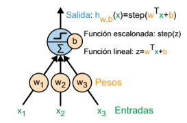
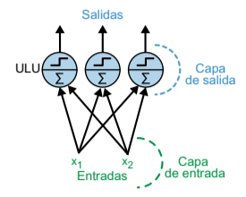
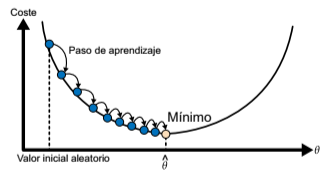
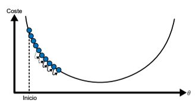
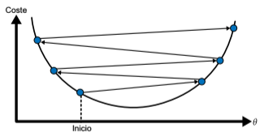
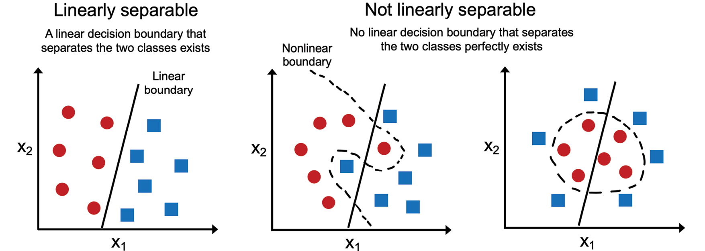

# El perceptrón
El **perceptrón** es una de las arquitecturas RNA más sencillas, creada en 1957 por Frank Rosenblatt. Se basa en una neurona artificial llamada **unidad lógica de umbral** (ULU). Las entradas y salidas son números (en lugar de valores binarios activada/desactivada) y cada conexión de entrada está asociada a un peso $ w $. La ULU calcula una función lineal de sus entradas: $ z = w_1 x_1 + w_2 x_2 + ... + w_n x_n + b $. $ b $ es el sesgo y permite ajustar cuándo se activará el perceptrón. Después se aplica una función escalonada al resultado. Una función escalonada típica es la **Heaviside** que asumiendo el umbral en 0, se calcula de la siguiente manera:

$$
Heaviside(z) = \begin{cases} 
1  &\text{si } z \geq 0 \\\ 
0&\text{si } z < 0 
\end{cases} 
$$

<figure style="align: center;">
    
    <figcaption>ULU</figcaption>
</figure>

Una sola ULU puede servir para clasificaciones binarias lineales simples. Calcula una función lineal de sus entradas y, si el resultado supera un umbral, da como salida la clase positiva. En caso contrario, genera la clase negativa. Podríamos usar una sola ULU para clasificar iris basándonos en la longitud y la anchura del pétalo. Entrenar una ULU así requeriría encontrar los valores adecuados para $ w_1, w_2 $ y $ b $.

Un perceptrón consta de una o más ULU organizadas en una sola capa, donde todas las ULU se conectan a todas las entradas. Una capa así se denomina **capa completamente conectada** o **densa**. Las entradas constituyen la capa de entrada. Y, como la capa de ULU produce las salidas finales, se denomina la capa de salida. La siguiente figura muestra un perceptrón con dos entradas y tres salidas. Este perceptrón puede clasificar instancias simultáneamente en tres clases binarias diferentes, lo que lo convierte en un clasificador multietiqueta. También puede usarse para la clasificación multiclase.

<figure style="align: center;">
    
    <figcaption>Arquitectura de un perceptrón con dos entradas y tres neuronas de salida</figcaption>
</figure>

## Aprendizaje del perceptrón
El algoritmo de aprendizaje del perceptrón es bastante sencillo. Se inicializa los pesos y el sesgo aleatoriamente. Posteriormente el perceptrón recibe las instancias de entrenamiento de una en una y hace sus predicciones para cada instancia. Por cada neurona de salida que produce una predicción errónea, actualiza el sesgo y refuerza los pesos de conexión a partir de las entradas que habrían contribuido a la predicción correcta.

La idea del algoritmo a la hora de actualizar los pesos es intentar minimizar lo que se denomina **función de pérdida**. En un problema de clasificación esta función determinaría la cantidad de errores cometidos. De esta manera podemos ver el algoritmo como un proceso de **descenso de gradiente** típico en búsqueda del valor mínimo de la función de pérdida.

En este descenso de gradiente el algoritmo realizará un número de iteraciones por el conjunto de datos para actualizar estos valores. Al número de pasadas se le denomina **épocas** (*epochs*).

<figure style="align: center;">
    
    <figcaption>Descenso de gradiente</figcaption>
</figure>

Un hiperparámetro clave del algoritmos es la **tasa de aprendizaje**. Este valor determina cuánto se actualizarán el valor de los pesos para minimizar la función de coste, y por tanto el tamaño del paso de aprendizaje en cada una de las épocas.

Si la tasa de aprendizaje es demasiado pequeña, entonces el algoritmo tendrá que pasar por muchas iteraciones para converger, lo cual llevará mucho tiempo.

<figure style="align: center;">
    
    <figcaption>Tasa de aprendizaje demasiado pequeña</figcaption>
</figure>

Por otro lado, si la tasa de aprendizaje es demasiado alta, puede que salte por encima del valle y acabes al otro lado, posiblemente más alto de lo que estabas antes. Esto podría hacer que el algoritmo diverja, con valores cada vez más grandes, y no consiga encontrar una buena solución.

<figure style="align: center;">
    
    <figcaption>Tasa de aprendizaje demasiado alta</figcaption>
</figure>

Es importante señalar que la convergencia del perceptrón solo está garantizada en problemas donde se puede establecer una frontera de decisión lineal. 

<figure style="align: center;">
    
    <figcaption>Ejemplos de clases linealmente separables y linealmente no separables</figcaption>
</figure>

